# Introduction to HTML

## What is HTML?
HTML, which stands for HyperText Markup Language, is the standard language used to create and design documents on the World Wide Web. As the backbone of all web pages, HTML allows us to structure content with elements such as headings, paragraphs, lists, links, and images. Unlike programming languages that provide logic and functionality, HTML is a markup language that defines the structure and layout of web content.

### Brief History of HTML and Its Evolution
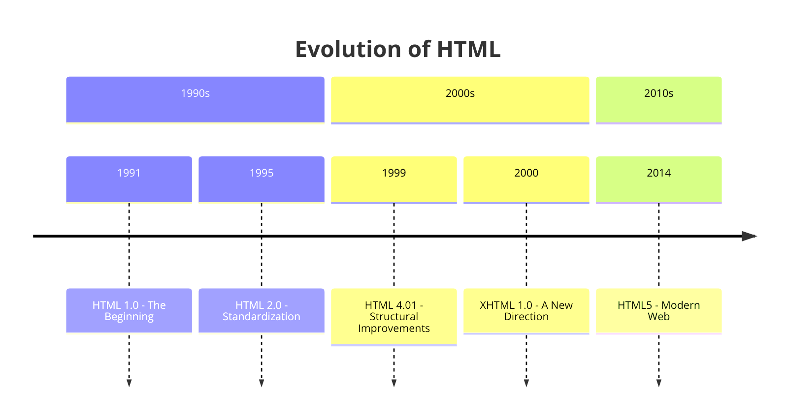
The journey of HTML began in the early 1990s, devised by Tim Berners-Lee, a physicist at the CERN research facility in Switzerland. Initially created to facilitate information sharing between scientists across different universities and institutes, HTML has evolved significantly over the years. Key milestones include:

- HTML 2.0 (1995): The first standard version, which set the core features of HTML.
- HTML 4.01 (1999): Introduced more robust features for modern web design.
- XHTML (2000): A hybrid between HTML and XML, offering more strict syntax rules.
- HTML5 (2014): The latest major version, bringing enhanced support for multimedia, graphics, and mobile-friendly features.

These developments were guided by organizations such as the World Wide Web Consortium (W3C) and the Web Hypertext Application Technology Working Group (WHATWG), playing pivotal roles in standardizing HTML.

### Understanding the Role of HTML in Web Development

HTML is a key component of the web development ecosystem, used in conjunction with Cascading Style Sheets (CSS) and JavaScript. While HTML lays out the structure of the page, CSS is used for styling, and JavaScript for adding interactivity and dynamic content. This combination is essential in creating a diverse range of web applications, from simple static websites to complex interactive platforms.

### Overview of Web Browsers and How They Interpret HTML

Web browsers like Google Chrome, Mozilla Firefox, Safari, and Microsoft Edge are the tools through which users interact with HTML documents. Each browser interprets HTML code to display web pages. Understanding how different browsers parse and render HTML is crucial for developers to ensure consistency and compatibility across the web. This section can delve into the concept of browser rendering engines, cross-browser compatibility issues, and the importance of following web standards to minimize inconsistencies.

#### Example: Basic HTML Structure
Below is an example of a basic HTML document structure:
```html
<!DOCTYPE html>
<html lang="en">
<head>
    <meta charset="UTF-8">
    <meta name="viewport" content="width=device-width, initial-scale=1.0">
    <title>My First HTML Page</title>
</head>
<body>
    <h1>Hello, World!</h1>
    <p>This is my first HTML page.</p>
</body>
</html>
```
This code demonstrates a simple HTML page structure with the essential elements: `<!DOCTYPE html>`, `<html>`, `<head>`, and `<body>`.

## Setting Up the Environment

### Installing and Configuring a Text Editor
Before diving into HTML coding, it's essential to choose and set up a text editor - a basic tool where you will write and edit your HTML code. There are several popular editors suited for web development, each with its unique features and advantages:

- **Visual Studio Code (VS Code)**: A versatile and widely-used editor by Microsoft, known for its extensive extension library, integrated terminal, and Git control.
- **Sublime Text**: Known for its speed and efficiency, Sublime Text offers a distraction-free coding environment with a vast array of keyboard shortcuts.
- **Atom**: Developed by GitHub, Atom is a highly customizable editor with a friendly interface, ideal for beginners and experienced developers alike.

#### Installing Your Chosen Editor
- Provide step-by-step instructions for downloading and installing the chosen text editor.
- Highlight the importance of familiarizing oneself with the basic features and user interface of the editor.

### Understanding the File Structure for Web Projects

Organizing files and folders properly is crucial in web development. A basic project might include separate HTML, CSS, and JavaScript files, along with a directory for images and other media.

Proper organization of web project files is crucial for maintainability and scalability. A typical HTML project might include:

- **HTML Files**: The core files with a .html extension where the HTML code is written.
- **CSS Files**: Separate files (usually with a .css extension) for styling.
- **JavaScript Files**: Files containing JavaScript code, usually with a .js extension.
- **Images and Multimedia**: A folder dedicated to storing images, videos, and other media assets.
- **Miscellaneous Files**: Other files like fonts, icons, or third-party libraries.

#### Setting Up a Basic File Structure
- Guide on creating a basic directory and file structure for a simple HTML project.
- Emphasize the importance of consistent naming conventions and organization.

#### Example: Setting Up a Basic HTML File Structure
Imagine you're creating a simple website. Here's how you might set up the files and folders:

1. **Create a Project Folder**: name it `MyFirstWebsite`.
2. **Add HTML, CSS, and JavaScript Files**: inside the folder, create three files:
   - `index.html` (for HTML content)
   - `styles.css` (for CSS styles)
   - `script.js` (for JavaScript code)

3. **Create Project Structure**: in your preferred text editor, like this one below:

```
MyFirstWebsite/
│
├── index.html
├── styles.css
└── script.js
```

4. **Write Basic HTML Code**: in `index.html`, you can start with a simple structure:
```html
<!DOCTYPE html>
<html>
<head>
    <title>My First Website</title>
    <link rel="stylesheet" href="styles.css">
</head>
<body>
    <h1>Welcome to My Website</h1>
    <p>This is a paragraph on my first webpage.</p>
    <script src="script.js"></script>
</body>
</html>
```

5. **Add Some Styles**: in `styles.css`, add some basic styling:

```css
body {
    font-family: Arial, sans-serif;
}

h1 {
    color: navy;
}
```

6. **Include a JavaScript File**: in `script.js`, write a simple script:

```javascript
document.addEventListener('DOMContentLoaded', function() {
    console.log("Welcome to My First Website!");
});
```

### Basics of Document Object Model (DOM)
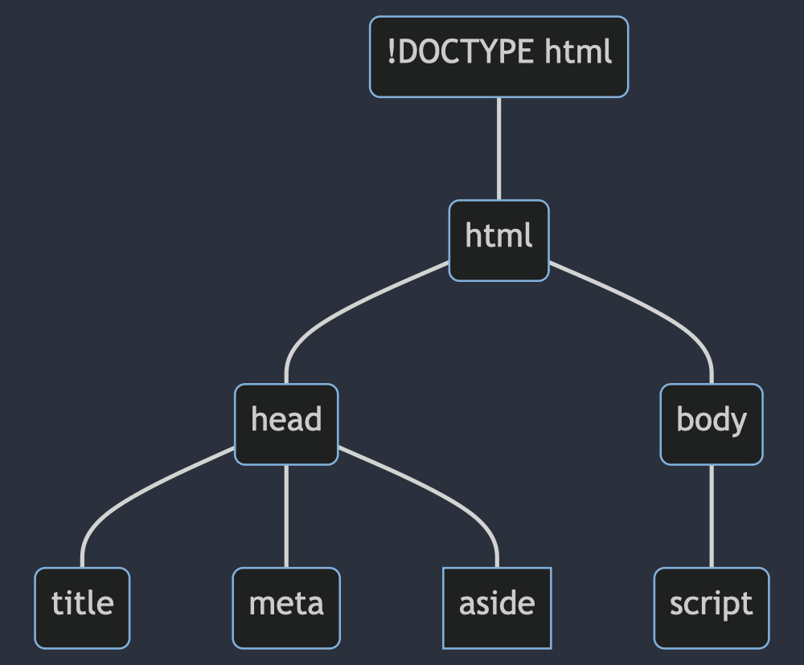
Understanding the Document Object Model (DOM) is fundamental in web development. It's a programming interface for HTML and XML documents that defines the logical structure of documents and the way a document is accessed and manipulated.

- **What is the DOM?**: An explanation of how the DOM represents a web page as a tree-like structure.
- **Interacting with the DOM**: An overview of how browsers create the DOM and how it can be manipulated with JavaScript to dynamically change HTML and CSS.

#### Exploring the DOM in a Browser:
- Instructions on how to inspect the DOM using browser developer tools.
- Simple exercises to demonstrate the manipulation of the DOM elements.

#### Example: Exploring the DOM
Here's a simple exercise to manipulate the DOM using JavaScript:

1. **Add a Button in HTML**: in `index.html`, add a button element:
```html
<button id="changeColorButton">Change Color</button>
```

2. **JavaScript to Change Text Color**: in `script.js`, add a script to change the color of the paragraph when the button is clicked:

```javascript
document.getElementById('changeColorButton').addEventListener('click', function() {
    document.querySelector('p').style.color = 'red';
});
```

This code selects the button with the ID `changeColorButton` and adds an event listener to it. When clicked, it changes the color of the first paragraph to red.

## Basic Structure of an HTML Document
The foundation of any web page is its HTML structure. Understanding this structure is crucial for effective web development.

### Anatomy of an HTML Document
An HTML document is structured with various elements, each serving a specific purpose. The basic components include the `<!DOCTYPE>`, `<html>`, `<head>`, and `<body>` tags.

#### Example: Basic Anatomy of an HTML Document
```html
<!DOCTYPE html>
<html lang="en">
<head>
    <meta charset="UTF-8">
    <meta name="viewport" content="width=device-width, initial-scale=1.0">
    <title>Document Title</title>
    <!-- Other head elements like links to CSS files, metadata go here -->
</head>
<body>
    <!-- Webpage content goes here -->
</body>
</html>
```

### Declaration, Head, and Body Sections
Understanding each section of an HTML document is important for structuring web content correctly.

#### The `<!DOCTYPE>` Declaration
The `<!DOCTYPE>` declaration is not an HTML tag; it is an instruction to the web browser about the HTML version being used. For HTML5, it is simply declared as `<!DOCTYPE html>`.

#### The `<head>` Section
The `<head>` section contains meta-information about the document, such as its title, character set, viewport settings, links to CSS files, and other metadata.

#### The `<body>` Section
The `<body>` section encloses the actual content of the webpage, such as text, images, links, tables, lists, and other elements.

### Understanding DOCTYPE
The DOCTYPE declaration should be the very first thing in an HTML document, before the `<html>` tag. The DOCTYPE declaration is not case sensitive.

#### Example: HTML5 DOCTYPE
```html
<!DOCTYPE html>
<!-- This is the standard declaration for HTML5 documents -->
```

#### Example: Creating a Simple HTML Page

1. **Create a File**: name it `index.html`.
2. **Write Basic HTML Code**: add the following basic structure:
```html
<!DOCTYPE html>
<html lang="en">
<head>
    <meta charset="UTF-8">
    <meta name="viewport" content="width=device-width, initial-scale=1.0">
    <title>Simple Page</title>
</head>
<body>
    <h1>Hello, World!</h1>
    <p>This is a simple HTML page.</p>
</body>
</html>
```

## Essential HTML Tags
Understanding and effectively using HTML tags is fundamental to web development. This section delves deeper into some of the most commonly used HTML tags, providing detailed explanations and comprehensive code examples.

### Headings (`<h1>` to `<h6>`)
Headings are used to define the hierarchy and importance of content on a web page. The tags `<h1>` through `<h6>` represent different levels of headings, `<h1>` being the highest level.

#### Example: Using Headings
```html
<h1>Main Title of the Page</h1>
<h2>Subsection Title</h2>
<h3>Sub-subsection Title</h3>
<h4>Sub-sub-subsection Title</h4>
<h5>Sub-sub-sub-subsection Title</h5>
<h6>Sub-sub-sub-sub-subsection Title</h6>
```

### Paragraphs and Text Formatting (bold, italic, underline)
The `<p>` tag defines a paragraph. Other tags like `<strong>`, `<em>`, `<mark>`, `<small>`, and `<del>` are used for emphasizing or altering the standard presentation of text.

#### Example: Paragraphs and Formatting
```html
<p>This is a standard paragraph.</p>
<p>This paragraph contains <strong>bold text</strong>, <em>italic text</em>, <mark>highlighted text</mark>, <small>smaller text</small>, and <del>deleted text</del>.</p>
```

### Creating Lists
There are three types of lists in HTML: ordered lists (`<ol>`), unordered lists (`<ul>`), and description lists (`<dl>`).

#### Example: Lists in HTML
```html
<!-- Ordered List -->
<ol>
    <li>First item</li>
    <li>Second item</li>
</ol>

<!-- Unordered List -->
<ul>
    <li>Bullet item</li>
    <li>Another bullet item</li>
</ul>

<!-- Description List -->
<dl>
    <dt>Term 1</dt>
    <dd>Definition 1</dd>
    <dt>Term 2</dt>
    <dd>Definition 2</dd>
</dl>
```

### Hyperlinks (`<a>`)
Hyperlinks, defined with the `<a>` tag, are crucial for navigation, allowing users to jump to different pages or sections within a page or to an external site.

#### Example: Creating a Hyperlink```html
<!-- Linking to an external site -->
<a href="https://www.example.com">Visit Example.com</a>
<!-- Hyperlink opening in a new tab -->
<a href="https://www.example.com" target="_blank">Visit Example.com in a new tab</a>
<!-- Linking to an email address -->
<a href="mailto:someone@example.com">Send Email</a>
<!-- Linking to a phone number -->
<a href="tel:+1234567890">Call Us</a>

```

### Displaying Images (``)
The `` tag embeds images into your HTML document. Attributes like `src`, `alt`, `width`, and `height` play crucial roles in how the image is displayed and accessed.

#### Example: Embedding an Image
```html

<!-- Image with specified width and height -->
```

### Creating Tables (`<table>`, `<tr>`, `<td>`, `<th>`)
Tables are created with `<table>`, and their structure is defined using `<tr>` for rows, `<td>` for data cells, and `<th>` for header cells.

#### Example: A Simple Table
```html
<table border="1">
    <tr>
        <th>Header 1</th>
        <th>Header 2</th>
    </tr>
    <tr>
        <td>Data Cell 1</td>
        <td>Data Cell 2</td>
    </tr>
    <!-- Additional rows and cells can be added here -->
</table>
```

### Line Breaks (`<br>`) and Horizontal Rules (`<hr>`)
The `<br>` tag inserts a single line break, useful for content separation within the same paragraph. The `<hr>` tag creates a horizontal line, useful for thematic breaks in content.

#### Example: Using Line Breaks and Horizontal Rules
```html
<p>This is a paragraph.<br>Here is a new line in the same paragraph.</p>
<hr>
<p>This is another paragraph following a horizontal rule.</p>
```

### Summary
In this section, we have covered the foundational HTML tags necessary for structuring web content. Understanding these tags and their proper usage is key to developing well-structured and accessible web pages.

## Forms and User Input
Understanding forms in HTML is crucial for interactive web applications. This section covers the creation and management of web forms, from basic structures to advanced functionalities.

### Structure of an HTML Form
Forms are essential for user interactions on websites. They are used to collect user inputs which can be sent to a server for processing.

#### Example: Basic Form Syntax
```html
<form action="/submit-form" method="post">
    <!-- Form elements go here -->
</form>
```
- `action`: The URL where the form data is sent.
- `method`: The HTTP method (GET or POST) used when submitting the form.

### Text Inputs, Radio Buttons, Checkboxes
Text inputs, radio buttons, and checkboxes are standard elements for forms.

#### Example: Text Inputs
```html
<input type="text" name="username" maxlength="15" placeholder="Enter username">
```
- Text fields for short, freeform text input.

#### Example: Radio Buttons
```html
<input type="radio" name="gender" value="male" id="male">
<label for="male">Male</label>
<input type="radio" name="gender" value="female" id="female">
<label for="female">Female</label>
```
- For selecting one option from a set.

#### Example: Checkboxes
```html
<input type="checkbox" name="interest" value="coding" id="coding">
<label for="coding">Coding</label>
```
- For selecting multiple values from a set.

### Select Menus and Option Elements
Select menus provide a drop-down list of options.

#### Example: Creating Select Menus
```html
<select name="country">
    <option value="usa">United States</option>
    <option value="canada">Canada</option>
    <!-- Additional options -->
</select>
```

### Submit and Reset Buttons
Buttons to submit or reset the form data.

#### Example: Submit Button
```html
<input type="submit" value="Submit Form">
<!-- or -->
<button type="submit">Submit Form</button>
```

#### Example: Reset Button
```html
<input type="reset" value="Reset Form">
```

### Form Validation Basics
```html
<input type="email" name="email" required>
<input type="number" name="age" min="18" max="100">
```

### Advanced Form Features

#### Example: File Uploads
```html
<input type="file" name="document">
```

#### Example: HTML5 Input Types
```html
<input type="date" name="birthday">
```

### Styling Forms
CSS can be used to enhance the appearance of forms.

#### CSS Techniques for Forms
Styling input elements, buttons, and handling layout responsiveness.

### Best Practices in Form Design
- **UX Design**: Tips for effective layout, clear labels, and intuitive navigation.
- **Security Practices**: Emphasizing the importance of server-side validation.

#### UX Design
1. **Clarity in Form Fields**:
- **Labeling**: Every form field should have a clear and concise label. Labels should be placed close to the corresponding input field for easy scanning.
- **Placeholder Text**: Use placeholder text to provide examples or hints but not as a replacement for labels. Remember, placeholders disappear once the user starts typing.
2. **Logical Structure and Order**:
- **Grouping Related Fields**: Organize fields into logically grouped sections, if the form is lengthy. This helps users understand related fields and complete the form more efficiently.
- **Sequential Flow**: Arrange fields in a natural, predictable order (e.g., personal details followed by address information).
3. **Simplicity and Minimalism**:
- **Minimal Required Fields**: Only ask for information that is absolutely necessary. Reducing the number of fields minimizes the effort required to fill out the form.
- **Avoiding Redundancy**: Do not ask users to repeat information unless absolutely necessary (like confirming an email or password).
4. **Responsive Design**:
- Ensure that forms are easily accessible and usable across all devices, particularly on mobile screens. Input fields, labels, and buttons should adjust to various screen sizes without losing readability or functionality.
5. **Clear Action Buttons**:
- **Distinctive Submit Button**: The submit button should be prominently displayed and easily identifiable.
- **Progressive Disclosure**: For longer forms, consider using a multi-step process with a clear indication of progress (like step indicators).
6. **Providing Instant Feedback**:
- Implement real-time validation and provide immediate feedback, especially for critical fields like usernames or passwords. Indicate clearly whether the input is correct or what needs to be changed.
7. **Error Handling and Messages**:
- **Clear Error Indication**: Errors should be indicated clearly and politely, ideally next to the field in question.
- **Constructive Error Messages**: Provide helpful and specific error messages, guiding users on how to correct the mistake.
8. **Accessibility**:
- Ensure that the form is accessible to all users, including those with disabilities. This includes proper use of ARIA roles, ensuring keyboard navigability, and providing adequate contrast for readability.

#### Security Practices
1. **Client-side Validation**:
- While client-side validation improves the user experience, it should not be relied upon for security. Always validate and sanitize inputs on the server side.
2. **Sensitive Data Handling**:
- Use appropriate measures like SSL/TLS for data transmission. Be cautious with sensitive data like passwords and personal information.
3. **Cross-Site Scripting (XSS) Protection**:
- Sanitize user input to prevent XSS attacks. Do not directly embed user input in your pages without proper sanitization.
4. **Cross-Site Request Forgery (CSRF) Protection**:
- Implement anti-CSRF tokens to protect form submissions from CSRF attacks, where a malicious site can influence the interaction between a client and a server.
5. **CAPTCHA for Spam Prevention**:
- If the form is publicly accessible, consider using CAPTCHAs or similar mechanisms to prevent automated spam submissions.

#### Summary
This detailed guide covers essential best practices in form design, emphasizing user experience and security. By adhering to these practices, developers can create forms that are not only user-friendly and efficient but also secure and accessible, ensuring a positive and safe experience for all users.

### Practical Examples and Exercises
- **Building a Registration Form**: Comprehensive exercise to build a user registration form with various input types and validations.
- **Interactive Form with JavaScript**: Creating a dynamic form that updates based on user input, enhancing interactivity.

#### Step-by-Step Guide: Building a Comprehensive Registration Form
Creating a comprehensive registration form in HTML involves several steps, focusing on structuring the form, incorporating various input types, and implementing client-side validation. Below is a step-by-step guide to build such a form, complete with HTML and inline JavaScript for validation.

##### Step 1: Basic Form Structure
Start with the basic HTML structure for your form.
- **Purpose**: Establishes the foundation of the form.
- **Attributes**:
  - `action`: Specifies the server endpoint to process the form data.
  - `method`: Defines how data is sent (GET for retrieving data, POST for sending data).
```html
<form id="registrationForm" action="/submit-form" method="post">
    <!-- Form fields will be added here -->
</form>
```

##### Step 2: Adding Text Inputs
Include fields for basic user information.
- **Purpose**: Collects basic user information like name and email.
- **Attributes**:
  - `type="text"`: Standard input for text.
  - `type="email"`: Input specifically for email addresses, with built-in validation.
```html
<!-- Name Field -->
<label for="fullName">Full Name:</label>
<input type="text" id="fullName" name="fullName" required>

<!-- Email Field -->
<label for="email">Email:</label>
<input type="email" id="email" name="email" required>
```

##### Step 3: Password Field
Add a password field with complexity requirements.
- **Purpose**: Securely collects user password.
- **Attributes**:
  - `type="password"`: Hides input characters for security.
  - `pattern`: Ensures the password meets specific criteria (e.g., minimum length).
```html
<label for="password">Password:</label>
<input type="password" id="password" name="password" pattern=".{8,}" title="Must contain at least 8 or more characters" required>
```

##### Step 4: Date of Birth Field
Incorporate a date picker.
- **Purpose**: Collects date-specific data in a user-friendly format.
- **Attributes**:
  - `type="date"`: Provides a date picker for easy entry.
```html
<label for="dob">Date of Birth:</label>
<input type="date" id="dob" name="dob">
```

##### Step 5: Dropdown List for Selection
Include a selection dropdown, for example, for selecting a country.
- **Purpose**: Allows selection from predefined options in a compact form.
- **Attributes**:
  - `<select>`: Creates a dropdown list.
  - `<option>`: Defines the available options.
```html
<label for="country">Country:</label>
<select id="country" name="country">
    <option value="usa">United States</option>
    <option value="canada">Canada</option>
    <!-- Add other countries as needed -->
</select>
```

##### Step 6: Radio Buttons for Gender
Add radio buttons for gender selection.
- **Purpose**: Enables selection of a single option from a set.
- **Attributes**:
  - `type="radio"`: Defines radio buttons.
  - `name`: Groups radio buttons so only one can be selected at a time.
```html
<label>Gender:</label>
<input type="radio" id="male" name="gender" value="male">
<label for="male">Male</label>
<input type="radio" id="female" name="gender" value="female">
<label for="female">Female</label>
```

##### Step 7: Checkboxes for Interests
Include checkboxes for selecting multiple interests.
- **Purpose**: Allows multiple selections from a set of options.
- **Attributes**:
  - `type="checkbox"`: Defines a checkbox.
```html
<label>Interests:</label>
<input type="checkbox" id="coding" name="interests" value="coding">
<label for="coding">Coding</label>
<input type="checkbox" id="music" name="interests" value="music">
<label for="music">Music</label>
<!-- Add other interests as needed -->
```

##### Step 8: Terms and Conditions Checkbox
Add a required checkbox for terms and conditions.
- **Purpose**: Ensures the user agrees to terms before submitting.
- **Attributes**:
  - `required`: Makes agreement mandatory for form submission.
```html
<input type="checkbox" id="terms" name="terms" required>
<label for="terms">I agree to the Terms and Conditions</label>
```

##### Step 9: Submit Button
Include a submit button.
- **Purpose**: Submits the form data to the server.
- **Attributes**:
  - `type="submit"`: Defines a button for submitting the form.
```html
<button type="submit">Register</button>
```

##### Step 10: Client-Side Validation using JavaScript
Add inline JavaScript to enhance validation.
- **Purpose**: Enhances form validation before submission.
- **Functionality**: Uses JavaScript to ensure all required fields are filled and meet criteria. Prevents form submission if validation fails, providing immediate feedback to the user.
```html
<script>
document.getElementById('registrationForm').addEventListener('submit', function(event) {
    if (!this.checkValidity()) {
        event.preventDefault(); // Prevent form submission if validation fails
        alert('Please fill out the form correctly.');
    }
});
</script>
```

##### Conclusion
This guide outlines the steps to create a detailed registration form with various input types and client-side validation. This form can be further enhanced with CSS for styling and server-side validation for security. Remember, the action attribute in the form tag should point to a server-side script that can handle the form submission.

#### Step-by-Step Guide: Dynamic Form with JavaScript
Creating a dynamic form with JavaScript involves incorporating interactive elements that respond to user actions in real-time. Here's a step-by-step guide to building such a form:

##### Step 1: Basic HTML Structure
Start with a simple HTML form structure.
- **Purpose**: Sets up the foundational layout for the dynamic form.
- **Functionality**: Provides a container where dynamic content based on user interaction will be displayed.
```html
<form id="dynamicForm">
    <!-- Dynamic elements will be added here -->
</form>
```

##### Step 2: Adding User Choice
Let's add a dropdown that allows the user to choose an option, which will dynamically update the rest of the form.
- **Purpose**: Allows users to make a selection that determines the rest of the form's content.
- **Functionality**:
  - `<select>` Dropdown: Presents predefined options (e.g., 'Books', 'Movies').
On change, the user's choice triggers a JavaScript function to update the form dynamically.
```html
<label for="choice">Choose a Category:</label>
<select id="choice" name="choice">
    <option value="">Select...</option>
    <option value="books">Books</option>
    <option value="movies">Movies</option>
</select>

<div id="additionalFields">
    <!-- Additional fields will be populated here based on the choice -->
</div>
```

##### Step 3: JavaScript for Dynamic Interaction
Using JavaScript, we'll add event listeners to dynamically update the form.

- **Purpose**: Adds interactivity and real-time response to user selections.
- **Functionality**:
  - Event Listener: JavaScript listens for changes in the dropdown menu.
  - Conditional Rendering: Based on the user's selection (e.g., 'Books' or 'Movies'), JavaScript dynamically generates appropriate input fields (e.g., 'Author' for Books, 'Director' for Movies).
  - Inner HTML Manipulation: The script modifies the content of the `additionalFields` div, adding relevant fields in real time.
```html
<script>
document.getElementById('choice').addEventListener('change', function() {
    var value = this.value;
    var additionalFields = document.getElementById('additionalFields');

    additionalFields.innerHTML = ''; // Clear existing fields

    if (value === 'books') {
        additionalFields.innerHTML = '<label for="author">Author:</label><input type="text" id="author" name="author">';
    } else if (value === 'movies') {
        additionalFields.innerHTML = '<label for="director">Director:</label><input type="text" id="director" name="director">';
    }
});
</script>
```

##### Step 4: Submit Button
Add a submit button for the form.
- **Purpose**: Provides a mechanism to submit the form data.
- **Functionality**: When clicked, it triggers the form submission process (which would be handled by server-side code not shown in this guide).
```html
<button type="submit">Submit</button>
```

##### Explanation of the Dynamic Behavior
- **Initial Setup**: The form starts with a basic structure, including a dropdown for the user to make an initial choice.
- **User Interaction**: As the user selects an option from the dropdown, the JavaScript function is triggered.
- **Real-Time Updates**: The JavaScript function dynamically updates the form's content based on the user's selection. This update happens in the browser, without needing to reload the page, enhancing the user experience with immediate feedback.
- **Flexibility and Customization**: This approach allows for significant flexibility. For instance, different types of input fields can be added, or additional JavaScript logic can be implemented to handle more complex scenarios.
- **Final Submission**: The submit button remains constant, but the data it sends can vary depending on the user’s choices and the dynamically added fields.

##### Conclusion
This example demonstrates a dynamic form that changes based on user input, showcasing the use of HTML and JavaScript for real-time interaction. The key aspect of this form is its ability to change in real-time based on user input, making it highly responsive and user-friendly. Such forms are useful in scenarios where user input dictates subsequent options or data fields, enhancing the overall usability and efficiency of the user interface. The form can be extended with more complex logic, validations, and styled with CSS for a more polished look.

### Summary
This section provides in-depth knowledge on creating and handling forms in HTML. By mastering these elements, you can create interactive and user-friendly web applications.

## HTML5 and Semantic Elements
HTML5 introduced a range of semantic elements that provide meaningful structure to web content, making it more accessible and understandable both to browsers and developers.

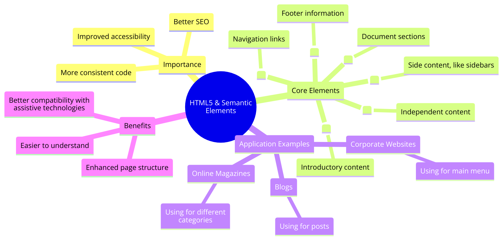

### Introduction to Semantic Elements
Semantic elements clearly describe their meaning in a human- and machine-readable way. Elements like `<article>`, `<footer>`, `<header>`, `<nav>`, and `<section>` make the structure of a document more readable and accessible.

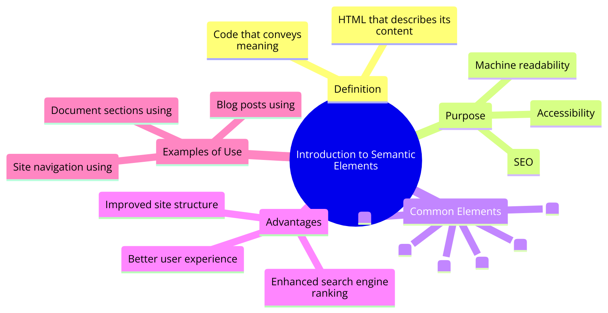

### Semantic Markup: The Backbone of the Modern Web
HTML5 semantic markup is a cornerstone of modern web development, emphasizing the importance of using HTML elements that convey the meaning of the information they encapsulate. This approach moves beyond the visual presentation to enrich the web's semantic layer, making content more understandable to both machines and humans.

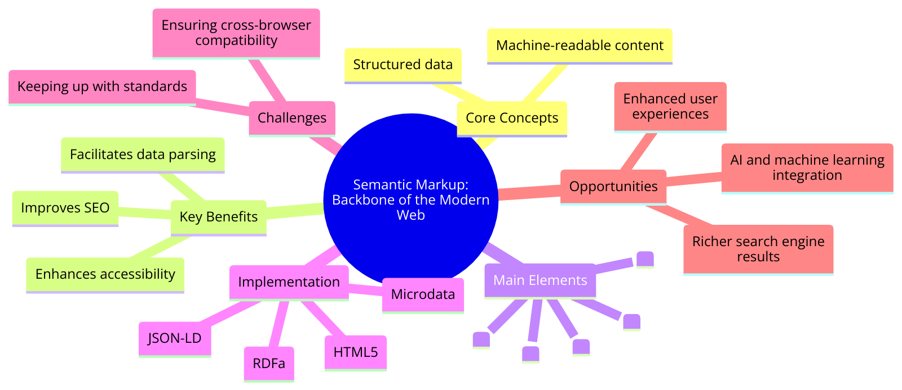
- **The Role of Context in Semantic Markup**: Every semantic element is chosen based on the context it provides to the content. This context is crucial for assistive technologies to interpret the purpose and relevance of content, enabling users with disabilities to navigate and understand web content more effectively.

### The Importance of Semantic Markup
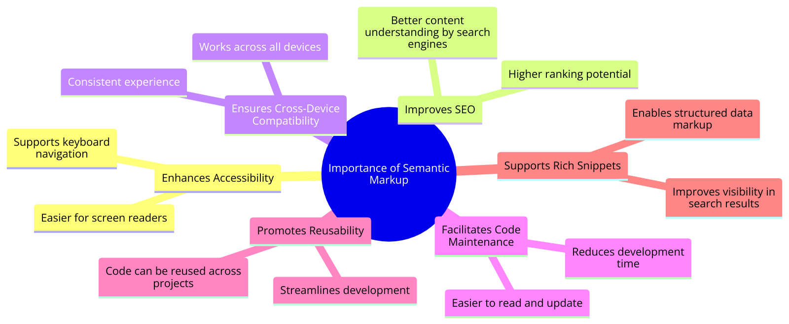
- **Accessibility**: Screen readers and other assistive technologies rely on semantic elements to provide a better experience for users with disabilities.
- **SEO**: Search engines use semantic elements to understand the structure and content of web pages more effectively, improving site visibility in search results.
- **Maintainability**: Semantic HTML makes code easier to read and maintain.

#### Enhancing Web Accessibility
The strategic use of semantic elements directly influences the accessibility of web content. These elements serve as signposts for assistive technologies, outlining the structure of web documents in a meaningful way.

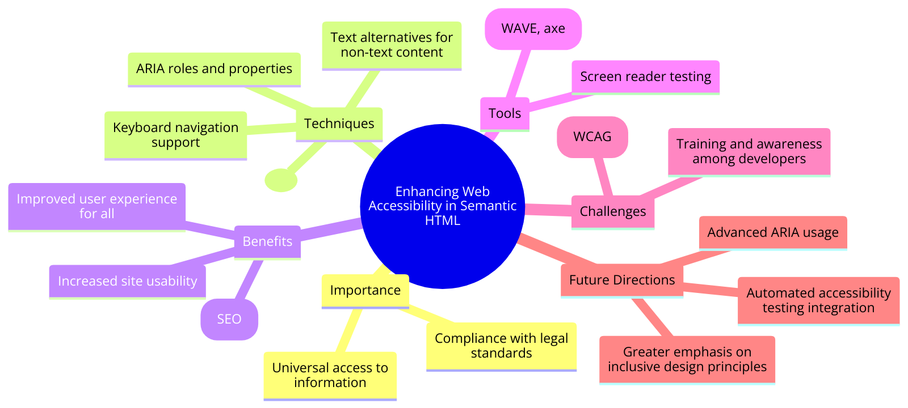
- **Semantic Landmarks for Screen Readers**: Elements like `<article>`, `<aside>`, and `<nav>` act as landmarks for screen readers, offering shortcuts to significant sections of the page, thus improving the browsing experience for visually impaired users.
- **HTML5 and ARIA Integration**: While HTML5 semantic elements naturally embody many ARIA roles, the explicit addition of ARIA attributes to these elements can provide more detailed descriptions and states of interactive components for assistive tools.

#### The SEO Advantage
Semantic HTML5 elements are pivotal in SEO strategies, as they contribute to clearer content structuring, which search engines favor when crawling and indexing web pages.


- **Semantic Elements as SEO Signals**: Elements like `<header>`, `<footer>`, and `<main>` help search engines understand the layout and hierarchy of a page, potentially boosting its ranking for relevant queries.
- **Enhancing Content Discoverability**: Properly structured content using semantic elements is more likely to be accurately indexed by search engines, improving the content's visibility and discoverability.

#### Technical Aspects and Challenges
Implementing HTML5 semantic elements involves understanding their technical aspects and addressing various challenges, from browser compatibility to the nuances of semantic integrity.

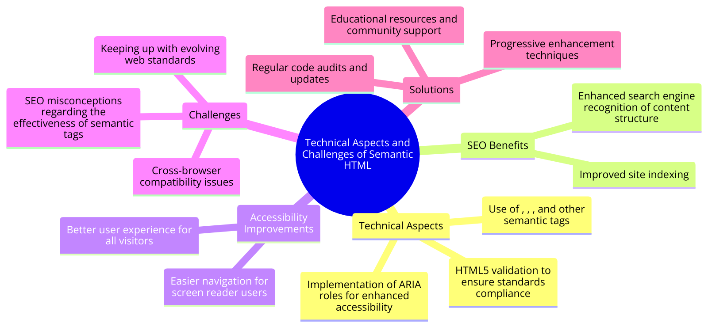
- **Browser Compatibility Considerations**: Although modern browsers have robust support for HTML5 elements, developers must implement fallback strategies for older browsers, using shivs or polyfills to ensure compatibility.
- **Maintaining Semantic Integrity**: As developers incorporate more complex JavaScript-driven interactions and dynamic content loading, maintaining the semantic integrity of the document becomes a challenge, requiring careful planning and testing.

#### Advanced Techniques and Considerations
Beyond basic usage, advanced techniques involving HTML5 semantic elements can further enhance the functionality and user experience of web applications.

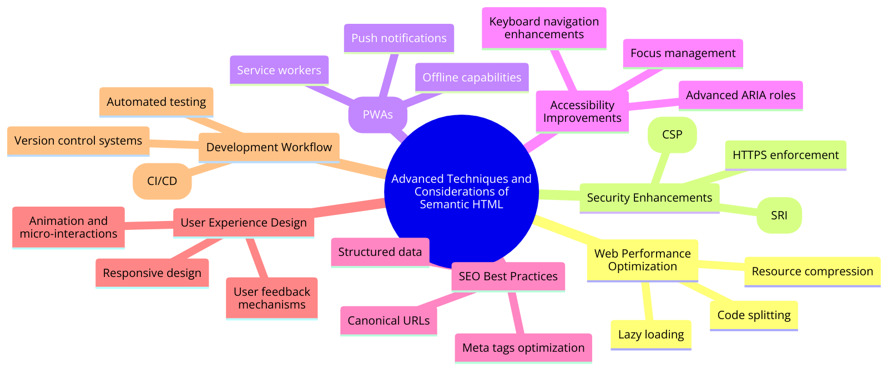
- **Dynamic Content and Semantic Elements**: Leveraging JavaScript and AJAX to dynamically update semantic elements without losing the overall semantic structure of the page requires meticulous attention to how content changes affect the document’s outline and accessibility features.
- **Semantic Elements in Web Components**: With the advent of Web Components, integrating semantic HTML5 elements within custom elements can help maintain semantic clarity and accessibility in component-based architectures.

#### Comprehensive Best Practices
Adopting comprehensive best practices for using HTML5 semantic elements is essential for developing accessible, SEO-friendly, and maintainable web applications.

- **Semantic HTML5 in Responsive Design**: Ensure that semantic elements are used consistently across different device sizes, maintaining their semantic properties in responsive layouts.
- **Accessibility Testing**: Regularly perform accessibility audits using tools and manual testing to ensure that the use of semantic elements effectively supports users with disabilities.

#### Summary
This detailed exploration into HTML5 semantic elements highlights their fundamental role in enhancing the semantic web, improving accessibility, and optimizing content for search engines. By understanding and implementing these elements thoughtfully, developers can create more meaningful, accessible, and discoverable web content. The nuanced understanding of these elements' roles, challenges, and best practices is key to leveraging the full potential of HTML5 in modern web development.

### Commonly Used Semantic Elements

#### The `<article>` Element
```html
<article>
  <h2>Article Title</h2>
  <p>Article content...</p>
</article>
```

**Usage**: Represents a self-contained composition that’s suitable for syndication. Example: a forum post, a magazine or newspaper article.

#### The `<section>` Element
```html
<section>
  <h2>Section Heading</h2>
  <p>Section content...</p>
</section>
```

**Usage**: Defines sections of a document, such as chapters, headers, footers, or any other sections of the document.

#### The `<nav>` Element
```html
<nav>
  <ul>
    <li><a href="#">Home</a></li>
    <li><a href="#">About</a></li>
    <li><a href="#">Contact</a></li>
  </ul>
</nav>
```

**Usage**: Designed for major navigation blocks, like the primary site navigation.

#### The `<header>` Element
```html
<header>
  <h1>Welcome to My Website</h1>
  <p>Your main site introduction here...</p>
</header>
```

**Usage**: Usually contains introductory content or a set of navigational links.

#### The `<footer>` Element
```html
<footer>
  <p>Contact information: <a href="mailto:someone@example.com">someone@example.com</a>.</p>
</footer>
```

**Usage**: Represents the footer of a document or a section, typically containing authorship information, copyright notices, contact information, and links to privacy policies.

### Best Practices for Using Semantic Elements
- **Use semantic elements to improve accessibility**: Screen readers use semantic elements to navigate and interpret the content structure.
- **Do not use semantic elements for styling purposes only**: Utilize semantic elements for their intended purpose rather than for visual presentation, which should be handled with CSS.
- **Nested structure**: Semantic elements can be nested within each other appropriately (e.g., an `<article>` can contain sections).

### Challenges and Considerations
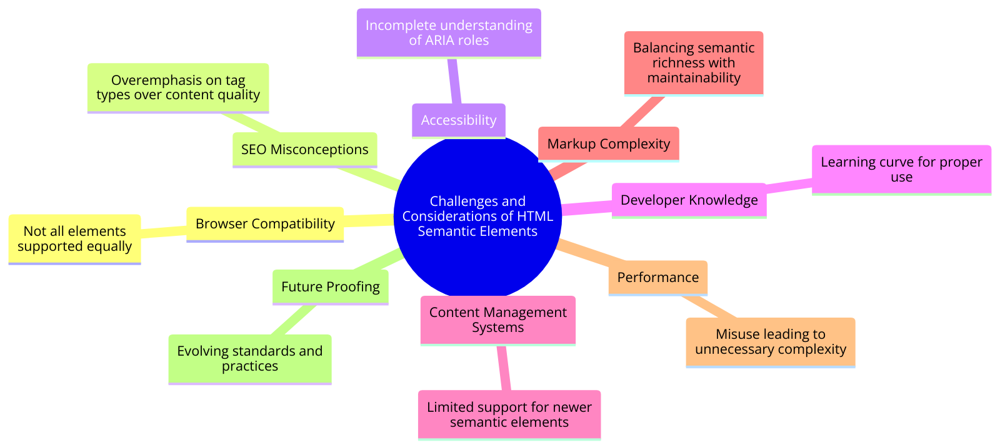
- **Browser Support**: While modern browsers support semantic elements well, some older browsers may require additional CSS or JavaScript to correctly display semantic elements.
- **Overuse**: Avoid using semantic elements unnecessarily or incorrectly, as misuse can lead to confusion and reduce the effectiveness of the document structure.

### Practical Applications and Real-World Scenarios
- **Semantic HTML in Single Page Applications (SPAs)**: Investigate the challenges and strategies for maintaining semantic integrity in SPAs where content is dynamically loaded and manipulated. This includes using ARIA roles and properties to maintain accessibility when the semantic structure is altered via JavaScript.

- **Microdata and Rich Snippets**: Dive into the implementation of microdata within semantic elements to create rich snippets. Rich snippets enhance the information presented in search results, improving click-through rates and user engagement. The synergy between microdata and semantic elements exemplifies how semantics extend beyond document structure into the realm of search engine interactions.

#### Example: Semantic SPA Structure
Creating Single Page Applications (SPAs) with semantic HTML involves ensuring that the application maintains a logical structure and accessibility standards despite the dynamic nature of its content. This can be challenging since SPAs typically load a single HTML page and dynamically update that page's content using JavaScript, which can obscure the semantic structure from search engines and assistive technologies.

Here's a basic example of how to structure an SPA with semantic HTML, incorporating ARIA roles for enhanced accessibility. This example assumes the use of a JavaScript framework like React, Angular, Vue, or similar, but the concepts are broadly applicable.
```html
<!DOCTYPE html>
<html lang="en">
<head>
    <meta charset="UTF-8">
    <title>SPA with Semantic HTML</title>
</head>
<body>

<header role="banner">
    <nav role="navigation">
        <ul>
            <li><a href="#home" onclick="loadHome()">Home</a></li>
            <li><a href="#about" onclick="loadAbout()">About</a></li>
            <li><a href="#contact" onclick="loadContact()">Contact</a></li>
        </ul>
    </nav>
</header>

<main role="main" id="mainContent">
    <!-- Dynamic content loaded here based on navigation -->
</main>

<footer role="contentinfo">
    <p>© 2024 Semantic SPA. All rights reserved.</p>
</footer>

<script src="app.js"></script>
</body>
</html>
```
In `app.js`, you might have functions that dynamically load content into the `<main>` element based on user actions:
```javascript
function loadHome() {
    document.getElementById('mainContent').innerHTML = '<h1>Welcome to Our SPA</h1><p>This is the home page content.</p>';
    // Additional scripting to enhance accessibility and SEO
}

function loadAbout() {
    document.getElementById('mainContent').innerHTML = '<h1>About Us</h1><p>Learn more about our mission and values.</p>';
    // Additional scripting to enhance accessibility and SEO
}

function loadContact() {
    document.getElementById('mainContent').innerHTML = '<h1>Contact Us</h1><p>Contact details and form.</p>';
    // Additional scripting to enhance accessibility and SEO
}
```
- **Navigation**: Use `<nav>` for navigation links. It helps screen readers and search engines understand the structure of your navigation.
- **Content Sections**: Use `<header>`, `<main>`, and `<footer>` to define areas of your page. This helps with document structure and accessibility.
- **Dynamic Content Loading**: Although the content within `<main role="main" id="mainContent">` is loaded dynamically, maintaining semantic structure within dynamically loaded content is crucial.
- **Accessibility**: Ensure that dynamic content changes are communicated to assistive technologies using ARIA roles and properties.

##### Enhancing Accessibility and SEO in SPAs:
- **ARIA Roles**: Use ARIA roles to explicitly define the roles of different parts of your SPA. This helps assistive technologies understand the structure of your application.
- **Dynamic Content Loading**: When loading content dynamically, ensure that the focus is managed appropriately for keyboard and screen reader users. For example, setting focus to newly loaded content or providing skip links.
- **Progressive Enhancement**: Consider server-side rendering (SSR) or static site generation (SSG) as part of your SPA architecture. This ensures that the initial load of your SPA contains semantic HTML content, which is beneficial for both SEO and users with JavaScript disabled.
- **History API**: Use the History API to manage browser history and URLs in your SPA. This ensures users can bookmark and share URLs, and also helps with SEO by maintaining consistent URLs for different views of your application.

This example demonstrates a basic SPA structure that incorporates semantic HTML and ARIA roles to maintain accessibility and improve SEO. While SPAs are heavily reliant on JavaScript for rendering content, applying these principles helps ensure that the application remains accessible and discoverable.

#### Example: Article with Microdata for Rich Snippets
Microdata and rich snippets enhance the information presented in search results, making content more attractive and informative to users. By embedding microdata within HTML content, you provide additional context to search engines, which can then display this data as rich snippets.

Here's an example of how to use microdata in an HTML document to define an article, incorporating elements that search engines can use to generate rich snippets.
```html
<!DOCTYPE html>
<html lang="en">
<head>
    <meta charset="UTF-8">
    <title>Microdata Example: Article</title>
</head>
<body>

<article itemscope itemtype="http://schema.org/Article">
    <header>
        <h1 itemprop="headline">Exploring the Stars: The Future of Space Travel</h1>
        <p><time itemprop="datePublished" datetime="2024-05-04">May 4, 2024</time></p>
        <p>By <span itemprop="author">Alex Johnson</span></p>
    </header>

    

    <p itemprop="articleBody">As humanity looks towards the stars, the future of space travel seems more exciting than ever. With advancements in technology, what was once science fiction is becoming reality...</p>

    <footer>
        <p>Categories: <span itemprop="articleSection">Science, Space Exploration</span></p>
        <p itemprop="publisher" itemscope itemtype="http://schema.org/Organization">
            Published by: <span itemprop="name">AstroMag</span>
        </p>
    </footer>
</article>

</body>
</html>
```
- **`itemscope` and `itemtype`**: These attributes specify that the content within the `<article>` element relates to a particular type (Article) defined in the Schema.org vocabulary.
- **`itemprop`**: This attribute assigns values to properties of the item. For example, `itemprop="headline"` assigns the heading text to the headline property of the Article.
- **`datetime`**: The `<time>` element with a `datetime` attribute provides a machine-readable date, which is crucial for events, publications, and other time-sensitive content.
- **Publisher Information**: Additional details about the publisher can be included using nested itemscope and itemtype attributes, further enriching the data provided to search engines.

#### Impact on SEO and User Experience
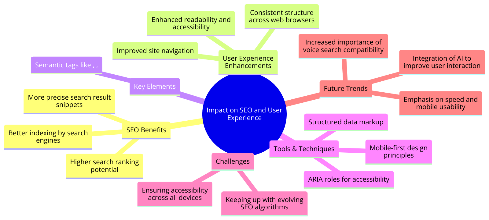
Implementing microdata like this can lead to the generation of rich snippets in search engine results, which may include:
- The title of the article.
- A thumbnail image.
- The publication date.
- The author's name.

Rich snippets stand out more in search results, potentially increasing click-through rates and providing users with more immediate information about the content of the page before they click through.

This example demonstrates how to use microdata within an HTML document to describe an article according to the Schema.org specification. By doing so, you enhance the ability of search engines to understand and display the content of your pages in search results, thereby improving SEO and enriching the user experience with more informative search results.

#### Evolution and Future Trends in HTML5 and Semantic Elements
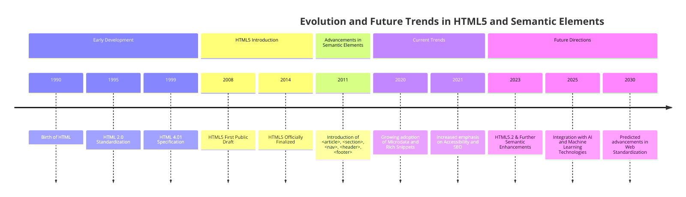
The evolution of HTML5 and its semantic elements represents a significant leap forward in web development. As we look toward the future, it's clear that the emphasis on semantics, accessibility, and machine-readable code will continue to shape the development of HTML standards and practices. In this section, we'll explore some of the current trends and future directions in the use of semantic HTML, including code examples to illustrate these concepts.

##### Increased Emphasis on Accessibility
Accessibility is becoming increasingly important in web development. Future HTML specifications are likely to introduce more semantic elements and attributes that make it easier for developers to create websites that are accessible to everyone, including people with disabilities.

##### Example: Using ARIA (Accessible Rich Internet Applications) Attributes
```html
<div role="navigation" aria-label="Main navigation">
    <ul>
        <li><a href="/home">Home</a></li>
        <li><a href="/about">About Us</a></li>
        <li><a href="/services">Services</a></li>
        <li><a href="/contact">Contact</a></li>
    </ul>
</div>
```
This code demonstrates how ARIA roles and attributes can be used alongside semantic elements to enhance accessibility. The `role` and `aria-label` attributes provide additional context for assistive technologies, making the website's navigation more accessible.

##### Semantic Elements for Complex Web Applications
As web applications become more complex, there's a growing need for semantic elements that can describe more specific parts of an application. Future developments might include new elements for components like toolbars, notifications, and more complex forms.

##### Example: Speculative `<toolbar>` Semantic Element
```html
<toolbar>
    <button aria-label="New document"></button>
    <button aria-label="Open file"></button>
    <button aria-label="Save"></button>
</toolbar>
```
Although the `<toolbar>` element doesn't exist in HTML at the time of writing, this example illustrates how future semantic elements could provide clearer meaning to common UI components in web applications.

##### Integration with Emerging Web Technologies
Semantic HTML is also likely to evolve in tandem with emerging web technologies, such as Web Components, to allow for more modular and reusable code.

##### Example: Using Custom Elements with Semantic Meaning
```html
<custom-dropdown>
    <option value="1">Option 1</option>
    <option value="2">Option 2</option>
    <option value="3">Option 3</option>
</custom-dropdown>
```
This example shows how custom elements, part of the Web Components spec, can be used to create semantically meaningful widgets that enhance the user interface while maintaining clean and understandable code.

##### Enhanced Support for Machine Learning and AI
The future of HTML5 and semantic elements might also see enhanced support for machine learning and AI directly within the browser. This could involve semantic elements that are specifically designed to be processed and understood by AI algorithms, improving the way content is indexed, searched, and interacted with.

##### Example: Speculative `<ai-content>` Element
Though hypothetical, this example showcases how future semantic elements could integrate AI functionalities directly into the markup, offering a new layer of interactivity and personalization for web content.

##### Conclusion
The evolution of HTML5 and its semantic elements is poised to continue influencing the web development landscape profoundly. By embracing accessibility, integrating with modern web technologies, and potentially incorporating AI and machine learning, future developments in HTML semantics promise to make the web more inclusive, intelligent, and interconnected. As we speculate on these future trends, it's clear that the foundational principles of semantic HTML will remain crucial for delivering meaningful, accessible, and efficient web experiences.

### SEO and Semantic HTML
Semantic HTML plays a crucial role in SEO (Search Engine Optimization) by providing search engines with structured and meaningful content. Properly structured content is more likely to rank higher in search results. Here are some code examples illustrating the use of Semantic HTML for SEO.

#### Example: Semantic Headings
```html
<!DOCTYPE html>
<html lang="en">
<head>
    <meta charset="UTF-8">
    <title>SEO and Semantic HTML</title>
</head>
<body>

<header>
    <h1>Welcome to My Blog</h1>
</header>

<main>
    <article>
        <h2>How to Optimize Your Website for SEO</h2>
        <p>Search engine optimization is crucial for online visibility...</p>
    </article>
    <article>
        <h2>The Importance of Quality Content</h2>
        <p>Creating valuable and relevant content...</p>
    </article>
</main>

<footer>
    <p>© 2024 My Blog. All rights reserved.</p>
</footer>

</body>
</html>
```
In this example, we use semantic headings (`<h1>` and `<h2>`) to structure the content. Search engines give more weight to text within headings, so using them appropriately can improve SEO.

The main content is enclosed in `<article>` elements, which provide context to search engines that this is valuable, standalone content.

#### Example: Semantic Navigation
```html
<nav>
    <ul>
        <li><a href="/home">Home</a></li>
        <li><a href="/about">About Us</a></li>
        <li><a href="/services">Services</a></li>
        <li><a href="/contact">Contact</a></li>
    </ul>
</nav>
```
In this navigation menu, we use a `<nav>` element to signify its purpose. Search engines understand that navigation menus are crucial for user experience.

Using a list (`<ul>`) for menu items and anchor tags (`<a>`) for links is not only semantically appropriate but also helps search engines recognize the structure of the navigation.

#### Benefits of Semantic HTML for SEO
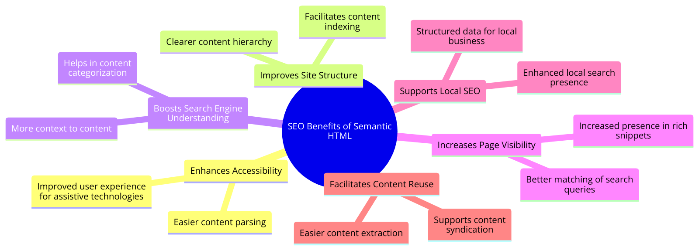
- **Improved Readability**: Semantic HTML makes your content more readable, which is not only important for users but also for search engines trying to understand your content.
- **Structured Content**: Properly structured content using semantic elements helps search engines identify the hierarchy and relationships between different parts of your webpage.
- **Keyword Optimization**: Semantic headings and tags can help you naturally incorporate relevant keywords into your content, which can improve your search engine ranking.
- **Rich Snippets**: Semantic HTML can enable rich snippets in search results, providing additional information and making your listings more attractive.

In summary, using Semantic HTML not only enhances the user experience but also boosts your website's SEO by providing clear structure and context to search engines. It's an essential practice for anyone looking to improve their website's visibility in search results.

### Accessibility Implications

#### Semantic HTML for Accessibility
Semantic HTML plays a crucial role in making web content more accessible to all users, including those with disabilities. By using semantic elements properly, you can convey meaning and structure to assistive technologies. Here are some code examples that illustrate accessibility implications:

##### Example: Proper Heading Structure
```html
<h1>Main Heading</h1>
<p>Introduction to the topic...</p>
<h2>Subheading 1</h2>
<p>Details about subtopic 1...</p>
<h2>Subheading 2</h2>
<p>Details about subtopic 2...</p>
```
- In this example, we use `<h1>` for the main heading and `<h2>` for subheadings. This creates a clear hierarchy that screen readers can interpret. Proper heading structure helps users with visual impairments understand the content's organization.

##### Example: Form Labels and Inputs
```html
<form>
    <label for="username">Username:</label>
    <input type="text" id="username" name="username" aria-describedby="username-help">
    <p id="username-help">Your username must be unique.</p>

    <label for="password">Password:</label>
    <input type="password" id="password" name="password" aria-describedby="password-help">
    <p id="password-help">Password should be at least 8 characters long.</p>

    <button type="submit">Submit</button>
</form>
```
- Labels associated with form inputs using the `for` attribute and `id` linkage ensure that screen readers announce labels when users focus on input fields.
- The `aria-describedby` attribute links form inputs to additional descriptive information, making it easier for screen reader users to understand input requirements.

##### Example: Use of `<nav>` and `<nav>` Landmarks
```html
<nav>
    <ul>
        <li><a href="/home">Home</a></li>
        <li><a href="/about">About Us</a></li>
        <li><a href="/services">Services</a></li>
        <li><a href="/contact">Contact</a></li>
    </ul>
</nav>
```
The `<nav>` element is used to represent the navigation menu. Screen readers can identify this landmark and provide shortcuts for users to navigate to the navigation content.

#### ARIA Roles and Attributes
In addition to semantic HTML elements, ARIA (Accessible Rich Internet Applications) roles and attributes can enhance accessibility. Here are some code examples demonstrating ARIA usage:

##### Example: ARIA Role for a Live Region
```html
<div role="status" aria-live="polite">
    The weather forecast for today is sunny with a high of 78°F.
</div>
```
The `role="status"` attribute signifies that this element provides live updates. The `aria-live="polite"` attribute informs screen readers to politely announce changes without interrupting the user.

##### Example: ARIA Role for a Slider
```html
<label for="slider">Select a value:</label>
<input type="range" id="slider" name="slider" min="0" max="100" step="1" value="50" aria-label="Value Selector">
```
The `role="slider"` attribute indicates that this input element behaves as a slider. This is essential for users who rely on assistive technologies to understand the purpose of the input.

#### Conclusion
These code examples showcase how HTML5's semantic elements and ARIA roles and attributes can significantly improve web accessibility. By using proper headings, labeling form elements, structuring content with semantic elements, and adding ARIA roles and attributes, web developers can create web applications that are inclusive and usable by a wide range of users, regardless of their abilities. Consideration of accessibility implications is a fundamental aspect of modern web development, ensuring that the web is accessible to all.

### Case Study: Semantic HTML in Large-Scale Web Applications
In this case study, we delve into the use of semantic HTML in the development of large-scale web applications, highlighting the benefits it brings in terms of accessibility, SEO, and maintainability. We examine a hypothetical large-scale web application — an e-commerce platform named "EcoShop". The focus is on how the application utilizes semantic HTML to improve its structure, along with code examples demonstrating practical implementations of semantic elements in complex web interfaces.

#### Background
"EcoShop" is a comprehensive e-commerce platform that offers a wide range of eco-friendly products. The platform is designed to provide an exceptional user experience, catering to users with various accessibility needs and ensuring that the content is discoverable through search engines. The development team prioritized the use of semantic HTML to achieve these goals, integrating it into the fabric of the application's frontend architecture.

#### Implementation: Homepage Structure
The homepage of "EcoShop" is structured to provide a clear hierarchy and meaning, using semantic HTML elements to delineate different sections of the page.
```html
<!DOCTYPE html>
<html lang="en">
<head>
    <meta charset="UTF-8">
    <title>EcoShop - Eco-Friendly Products</title>
</head>
<body>

<header>
    <nav>
        <ul>
            <li><a href="/products">Products</a></li>
            <li><a href="/about">About Us</a></li>
            <li><a href="/contact">Contact</a></li>
        </ul>
    </nav>
</header>

<main>
    <section id="featured-products">
        <h2>Featured Products</h2>
        <div class="product-list">
            <!-- Product items dynamically loaded here -->
        </div>
    </section>
    <section id="sustainability-goals">
        <h2>Our Sustainability Goals</h2>
        <p>At EcoShop, we are committed to reducing environmental impact...</p>
    </section>
</main>

<footer>
    <p>© 2024 EcoShop. All rights reserved.</p>
</footer>

</body>
</html>
```

#### Implementation: Product Listing with Semantic Markup
For the product listing, "EcoShop" employs `<article>` tags to semantically represent each product, improving the SEO and making the site more accessible.
```html
<article class="product-item">
    <h3>Biodegradable Bamboo Toothbrush</h3>
    <p>A sustainable alternative to plastic toothbrushes...</p>
    <footer>
        <button>Add to Cart</button>
    </footer>
</article>
```

#### Benefits of Semantic HTML
- **Accessibility**: Using semantic elements, such as `<header>`, `<nav>`, `<main>`, `<section>`, `<article>`, and `<footer>`, improves the site's accessibility. Screen readers and other assistive technologies can better understand the page structure, making it easier for users with disabilities to navigate the site.
- **SEO**: Semantic markup helps search engines understand the content and structure of web pages, improving the site's visibility in search results. For instance, product names wrapped in `<h3>` tags within `<article>` elements are more likely to be correctly indexed as important content.
- **Maintainability**: A well-structured document using semantic HTML is easier to maintain and update. Developers can quickly understand the layout and purpose of different sections, facilitating faster updates and enhancements.

#### Conclusion
The case study of "EcoShop" demonstrates the significant advantages of incorporating semantic HTML into large-scale web applications. By thoughtfully applying semantic elements, the development team was able to create a platform that is accessible, SEO-friendly, and easy to maintain. This approach not only enhances the user experience but also contributes to the broader goals of sustainability and inclusivity in the digital space. Through practical examples and real-world application, this case study underscores the importance of semantic HTML in modern web development, especially for large-scale projects where structure and meaning play a crucial role in success.

### Summary
This section has explored the critical role of semantic elements in HTML5, demonstrating their importance in creating structured, accessible, and SEO-friendly web content. Through practical examples, we've seen how to implement these elements correctly, highlighting best practices and common considerations. Embracing semantic markup is a key step in modern web development, ensuring that content is both accessible and meaningful.

## Advanced HTML Features
This section provides comprehensive explanations and code examples for each feature.

### Multimedia Integration

#### Audio Element
The `<audio>` element in HTML5 is a powerful tool for embedding audio content directly into web pages. It offers extensive customization options for controlling audio playback.
```html
<audio controls>
    <source src="audio.mp3" type="audio/mpeg">
    Your browser does not support the audio element.
</audio>
```
- The `<audio>` element is used to include audio content within a webpage.
- The `controls` attribute adds a built-in audio player with play, pause, volume, and seek controls for user interaction.
- Inside the `<audio>` element, the `<source>` element is used to specify the audio source file (src) and its type (type). This allows different formats to be provided for browser compatibility.
- The "Your browser does not support the audio element" message serves as a fallback for browsers that do not support the `<audio>` element, ensuring content accessibility.

### Video Element
The `<video>` element, similar to the `<audio>` element, enables the integration of video content with customization and control over video playback.

```html
<video controls width="400" height="300">
    <source src="video.mp4" type="video/mp4">
    Your browser does not support the video element.
</video>
```
- The `<video>` element is employed for embedding video content in web pages.
- The `controls` attribute adds a video player interface with standard controls.
- The `width` and `height` attributes determine the video's dimensions.
- Inside the `<video>` element, the `<source>` element specifies the video source file (`src`) and its type (`type`) to provide compatibility across different browsers.
- As with the audio example, the "Your browser does not support the video element" message acts as a fallback for unsupported browsers.

### Canvas for Graphics
The `<canvas>` element is a powerful tool for creating graphics and animations directly within a web page.
```html
<canvas id="myCanvas" width="400" height="200"></canvas>
```
- The `<canvas>` element provides an empty drawing area where dynamic graphics and animations can be rendered.
- The `id`, `width`, and `height` attributes are used to uniquely identify the canvas and specify its dimensions.
- JavaScript is utilized to draw and manipulate graphics within the canvas. This allows for the creation of charts, games, interactive visualizations, and more.

### Geolocation
HTML5's Geolocation API empowers web applications to access a user's geographical location, enabling location-aware features.
```html
<button onclick="getLocation()">Get Location</button>

<p id="demo"></p>

<script>
function getLocation() {
    if (navigator.geolocation) {
        navigator.geolocation.getCurrentPosition(showPosition);
    } else {
        document.getElementById("demo").innerHTML = "Geolocation is not supported by this browser.";
    }
}

function showPosition(position) {
    var latitude = position.coords.latitude;
    var longitude = position.coords.longitude;
    document.getElementById("demo").innerHTML = "Latitude: " + latitude + "<br>Longitude: " + longitude;
}
</script>
```
- The Geolocation API is accessed through JavaScript, typically initiated by user action.
- The `navigator.geolocation` object provides methods for obtaining the user's location.
- In the example, clicking the "Get Location" button triggers the `getLocation` function, which checks for geolocation support and, if available, retrieves the user's latitude and longitude.
- The obtained coordinates are displayed in the `p` element with the id "demo."

### Web Storage
Web Storage, comprising Local Storage and Session Storage, allows data to be stored locally in a user's browser, providing a valuable tool for caching, user preferences, and data persistence.

#### Local Storage
```html
<button onclick="saveData()">Save Data</button>

<script>
function saveData() {
    localStorage.setItem("username", "John");
}
</script>
```
- The `localStorage` object enables the storage of data as key-value pairs.
- In this instance, clicking the "Save Data" button invokes the `saveData` function, which stores the username "John" in local storage.
- Data stored in local storage remains accessible even after the browser is closed, offering long-term data persistence.

#### Session Storage
```html
<button onclick="saveSessionData()">Save Session Data</button>

<script>
function saveSessionData() {
    sessionStorage.setItem("theme", "light");
}
</script>
```
- `sessionStorage` functions similarly to `localStorage` but is limited to the duration of a browser session.
- In the code, clicking the "Save Session Data" button triggers the `saveSessionData` function, which stores the theme "light" in session storage.
- Session storage is useful for temporary data storage.

### Web Workers
Web Workers allow you to run JavaScript code in the background, improving performance and responsiveness in web applications.
```html
<script>
// Create a new web worker
var worker = new Worker("myworker.js");

// Handle messages from the worker
worker.onmessage = function(event) {
    document.getElementById("result").innerHTML = event.data;
};

// Start the worker
worker.postMessage("Hello from the main script!");
</script>
```
- Web Workers are typically implemented in separate JavaScript files.
- The `new Worker("myworker.js")` statement creates a new worker, which runs in the background.
- Workers can communicate with the main script using the `postMessage` method and the `onmessage` event.
- This enables tasks like data processing and heavy computations to be offloaded to a separate thread, preventing UI blocking.

### Drag and Drop
HTML5 introduced native support for drag-and-drop interactions, allowing users to drag elements and drop them into designated areas.
```html
<div id="drag" draggable="true">Drag me!</div>
<div id="drop" ondrop="drop(event)" ondragover="allowDrop(event)">Drop here</div>

<script>
function allowDrop(event) {
    event.preventDefault();
}

function drop(event) {
    event.preventDefault();
    var data = event.dataTransfer.getData("text");
    event.target.appendChild(document.getElementById(data));
}
</script>
```
- The `draggable="true"` attribute makes an element draggable.
- The `ondragover` and `ondrop` event handlers define drop behavior.
- In this example, you can drag the "Drag me!" element and drop it into the "Drop here" container.
- JavaScript functions control the behavior of the drag-and-drop interaction.

### Iframes
Iframes (Inline Frames) allow you to embed one HTML document within another. They are commonly used to include external content, such as videos, maps, or other web pages, into your own web page.
```html
<iframe src="https://www.example.com" width="800" height="600" frameborder="0" scrolling="auto"></iframe>
```
- The `<iframe>` element is used to embed external content.
- The `src` attribute specifies the URL of the external content to be displayed within the iframe.
- The `width` and `height` attributes determine the dimensions of the iframe.
- The `frameborder` attribute controls whether a border is displayed around the iframe (set to "0" for no border).
- The `scrolling` attribute defines the scroll behavior of the iframe content.

### SVG (Scalable Vector Graphics)
SVG is a powerful XML-based vector image format that can be embedded directly into HTML documents. It allows for the creation of high-quality, resolution-independent graphics and animations.
```html
<svg width="100" height="100">
    <circle cx="50" cy="50" r="40" stroke="black" stroke-width="2" fill="red" />
</svg>
```
- The `<svg>` element is used to define an SVG container.
- The `width` and `height` attributes set the dimensions of the SVG canvas.
- Inside the SVG container, various elements like `<circle>` can be used to create shapes and graphics.
- In this example, a red circle with a black border is drawn.

### Data Attributes
Data attributes allow you to store custom data private to the page or application without needing extra non-standard attributes or external data storage. They are often used for JavaScript interaction or to provide additional information about HTML elements.
```html
<div id="product" data-product-id="12345" data-product-name="Widget" data-price="19.99"></div>
```
- Data attributes are prefixed with "data-" and can store any custom data you want.
- In the example, a `div` element has three data attributes: `data-product-id`, `data-product-name`, and `data-price`, each storing specific information about a product.
- JavaScript can easily access and manipulate these data attributes, making them useful for dynamic web applications.

### Conclusion
These advanced HTML features empower web developers to create dynamic, multimedia-rich, and interactive web applications. Understanding how to utilize multimedia elements, canvas for graphics, geolocation, web storage, web workers, and drag-and-drop interactions is essential for building modern web applications that engage users and offer a richer user experience.

## CSS Integration with HTML
Cascading Style Sheets (CSS) serve as a cornerstone of web development, allowing developers to control the presentation and layout of HTML elements. In this section, we will dive deeper into various methods of integrating CSS with HTML for crafting visually appealing and responsive web pages.

### Basics of Cascading Style Sheets (CSS)
Cascading Style Sheets (CSS) are a fundamental aspect of web development, allowing developers to control the presentation and layout of HTML elements. This section explores the core concepts of CSS, including selectors, properties, values, and the box model.

#### Selectors
Selectors target HTML elements to apply styling. They can target elements based on their type, class, ID, attributes, or relationships with other elements.
```css
/* Element Selector */
p {
    color: blue;
}

/* Class Selector */
.title {
    font-size: 24px;
}

/* ID Selector */
#header {
    background-color: gray;
}
```
- The `p` selector targets all `<p>` elements, setting their text color to blue.
- The `.title` selector targets elements with the class "title," applying a font size of 24 pixels.
- The `#header` selector targets the element with the ID "header," giving it a gray background color.

#### Properties and Values
CSS properties define the visual characteristics of HTML elements, while values specify the specific settings for those properties.
```css
/* Font Properties */
p {
    font-family: Arial, sans-serif;
    font-size: 16px;
    font-weight: bold;
}

/* Color Properties */
.title {
    color: #ff0000; /* Red */
}

/* Background Properties */
#header {
    background-color: #f0f0f0; /* Light Gray */
}
```
- Font properties control the appearance of text, such as font family, size, and weight.
- Color properties define the color of text and backgrounds using hexadecimal, RGB, or named colors.
- Background properties set the background color or image of elements.

#### Box Model
The CSS box model describes how elements are rendered on a web page, consisting of content, padding, border, and margin.

```css
/* Box Model Properties */
.box {
    width: 200px;
    height: 100px;
    padding: 20px;
    border: 2px solid #000;
    margin: 10px;
}
```
- `width` and `height` set the dimensions of the content area.
- `padding` creates space between the content and the border.
- `border` defines the border around the content and padding.
- `margin` provides space between the element and surrounding elements.

#### CSS Comments
CSS comments are used to add notes or descriptions within the stylesheet. They are ignored by browsers and are only visible to developers.
```css
/* This is a CSS comment */
p {
    color: blue; /* Set text color to blue */
}
```
- CSS comments are denoted by `/* */`.
- Comments can be used to document code, provide context, or temporarily disable styles.

### Types of CSS (Inline, Internal, External)

#### Inline CSS
Inline CSS involves applying styles directly to individual HTML elements using the `style` attribute. While it offers precise control, it's typically used for small-scale styling due to its limited reusability.

```html
<p style="color: blue; font-size: 16px;">This is a blue paragraph with a font size of 16px.</p>
```
- Inline CSS is employed by adding a `style` attribute to an HTML element, allowing you to define CSS properties and values directly.
- This approach offers granular control but lacks reusability and can become unwieldy for larger projects.

#### Internal (Embedded) CSS
Internal CSS, also known as embedded CSS, involves placing CSS rules within a `<style>` element within the HTML `<head>` section. It applies styles to elements within the same HTML document.
```html
<!DOCTYPE html>
<html>
<head>
    <style>
        p {
            color: green;
            font-size: 18px;
        }
    </style>
</head>
<body>
    <p>This is a green paragraph with a font size of 18px.</p>
</body>
</html>
```
- The `<style>` element resides within the HTML `<head>` section.
- CSS rules defined within the `<style>` element apply to HTML elements on the same page.
- Internal CSS offers more reusability compared to inline CSS but confines styles to a single HTML document.

#### External CSS
External CSS involves creating a separate CSS file with styles that can be reused across multiple HTML pages. HTML documents link to the external CSS file using the `<link>` element.

```html
<!DOCTYPE html>
<html>
<head>
    <link rel="stylesheet" type="text/css" href="styles.css">
</head>
<body>
    <p>This paragraph is styled using an external CSS file.</p>
</body>
</html>
```
```css
/* styles.css */
p {
    color: purple;
    font-size: 20px;
}
```
- The `<link>` element within the HTML `<head>` section links to an external CSS file named "styles.css."
- The "styles.css" file contains CSS rules that apply to HTML elements, such as `<p>` elements in this case.
- This approach promotes separation of concerns, making it easier to manage styles across multiple pages and ensuring consistency.

### CSS Frameworks
CSS frameworks like Bootstrap, Foundation, and Bulma provide pre-designed styles and components that can be easily integrated into HTML documents. These frameworks simplify responsive design and enhance the overall look and feel of web pages.
```html
<!DOCTYPE html>
<html>
<head>
    <link rel="stylesheet" href="https://maxcdn.bootstrapcdn.com/bootstrap/4.5.2/css/bootstrap.min.css">
</head>
<body>
    <div class="container">
        <h1>Bootstrap Example</h1>
        <button class="btn btn-primary">Click Me</button>
    </div>
</body>
</html>
```
- In this example, the Bootstrap CSS framework is linked via a Content Delivery Network (CDN) URL.
- Bootstrap classes like `container` and `btn btn-primary` are applied to HTML elements, providing predefined styles and components.
- CSS frameworks streamline the styling process and facilitate the creation of responsive web pages while maintaining consistency.

### CSS Preprocessors
CSS preprocessors like Sass and Less extend CSS with advanced features like variables, nesting, and mixins. These preprocessors are translated into standard CSS before being used in HTML documents.
```css
// styles.sass
$primary-color: #007bff;

.button {
    background-color: $primary-color;
    color: white;
    padding: 10px 20px;
}
```
- In this Sass example, a variable `$primary-color` is defined to store the primary button color.
- Sass features like variable usage and nesting are employed to create the button's styling.
- Preprocessors enhance CSS maintainability and allow for the reuse of styles, making them valuable for larger projects.

### Conclusion
Understanding the diverse methods of integrating CSS with HTML is fundamental for effective web development. The choice of approach depends on the project's scale and requirements. Whether you opt for inline, internal, or external CSS, leverage CSS frameworks, or utilize CSS preprocessors, each method offers distinct advantages and can be combined to create visually stunning and responsive web pages. Ultimately, the goal is to craft web experiences that are both functional and visually appealing.

### Flexbox and Grid Layouts
Flexbox and Grid Layouts are modern CSS layout models that offer developers powerful tools for creating flexible and responsive web designs. Each layout system has its own strengths and use cases, allowing developers to choose the most suitable approach based on their specific layout requirements.

#### Flexbox
Flexbox, short for Flexible Box Layout, is a one-dimensional layout model that allows for the easy alignment and distribution of elements within a container. It excels at creating layouts in a single row or column, with the ability to adjust the size and position of items dynamically.
```css
.container {
    display: flex;
    justify-content: center;
    align-items: center;
}

.item {
    flex: 1;
    margin: 10px;
}
```
- The `display: flex;` property on the container establishes a flex container, enabling flexbox layout for its children.
- `justify-content: center;` horizontally centers the items within the container.
- `align-items: center;` vertically centers the items within the container.
- The `flex: 1;` property on each item allows them to grow and shrink to fill the available space evenly.
- Flexbox provides a powerful and intuitive way to create flexible and responsive layouts, especially for complex arrangements of elements in a single dimension.

#### Grid Layouts
Grid Layouts are a two-dimensional layout model that allows for the precise positioning and alignment of elements in rows and columns. It enables developers to create complex grid-based designs with ease, offering fine-grained control over both the layout and the spacing of elements.
```css
.container {
    display: grid;
    grid-template-columns: 1fr 1fr 1fr;
    grid-gap: 20px;
}

.item {
    background-color: #f0f0f0;
    padding: 20px;
}
```
- The `display: grid;` property on the container establishes a grid container, enabling grid layout for its children.
- `grid-template-columns: 1fr 1fr 1fr;` defines three equal-width columns in the grid.
- `grid-gap: 20px;` sets a gap of 20 pixels between grid items.
- Grid Layouts offer precise control over the placement and spacing of elements in both dimensions, making them ideal for creating complex and responsive layouts, such as those found in web applications and dashboards.

## Introduction to JavaScript with HTML
JavaScript serves as the backbone of dynamic web development, complementing HTML and CSS to create interactive and responsive web applications. In this comprehensive guide, we'll delve deeply into various aspects of integrating JavaScript with HTML, covering advanced concepts, techniques, and best practices to empower you in your web development endeavors.

### Embedding JavaScript in HTML
JavaScript code can be embedded directly within HTML documents using the `<script>` element. While this approach allows for inline scripting, it's often more suitable for smaller scripts or quick prototyping.
```html
<!DOCTYPE html>
<html>
<head>
    <title>Embedded JavaScript Example</title>
    <script>
        // Inline JavaScript code
        function greet() {
            alert('Hello, world!');
        }
    </script>
</head>
<body>
    <h1>Embedded JavaScript Example</h1>
    <button onclick="greet()">Click me</button>
</body>
</html>
```
- JavaScript code is included directly within the `<script>` tags in the `<head>` section of the HTML document.
- The `greet()` function is defined inline and is invoked when the button is clicked.

#### Pros and Cons of Inline Scripting
- **Pros**:
  - Quick and easy to implement.
  - Suitable for small scripts and simple interactions.
- **Cons**:
  - Mixing JavaScript with HTML can lead to code clutter and reduced readability.
  - Limited reusability and maintainability, especially for larger projects.

### External JavaScript Files
For larger projects or better code organization, it's common practice to separate JavaScript code into external files. This promotes modularity, reusability, and easier maintenance of codebases.
```html
<!DOCTYPE html>
<html>
<head>
    <title>External JavaScript Example</title>
    <script src="script.js"></script>
</head>
<body>
    <h1>External JavaScript Example</h1>
    <button onclick="greet()">Click me</button>
</body>
</html>
```
- The JavaScript code is moved to an external file named `script.js`.
- The `<script>` tag in the HTML document references the external JavaScript file using the `src` attribute.

#### Benefits of External Files
- **Pros**:
  - Separation of concerns: HTML focuses on structure, CSS on presentation, and JavaScript on behavior.
  - Improved maintainability: Changes to JavaScript code can be made independently without touching HTML files.
  - Better performance: External files can be cached by browsers, resulting in faster page load times.
- **Cons**:
  - Additional HTTP requests may impact initial page load time, especially for small scripts.

### DOM Manipulation
JavaScript interacts with HTML through the Document Object Model (DOM), a hierarchical representation of the HTML structure. DOM manipulation allows for dynamic updates to the content, structure, and style of web pages, enabling rich and interactive user experiences.
```html
<!DOCTYPE html>
<html>
<head>
    <title>DOM Manipulation Example</title>
</head>
<body>
    <h1 id="heading">JavaScript Example</h1>
    <button onclick="changeText()">Change Text</button>

    <script>
        function changeText() {
            document.getElementById('heading').textContent = 'New Heading';
        }
    </script>
</body>
</html>
```
- The `changeText()` function modifies the text content of an `<h1>` element with the ID `heading` when the button is clicked.

#### Advanced DOM Manipulation Techniques
Advanced DOM manipulation techniques involve traversing the DOM tree, selecting elements dynamically, and applying changes efficiently.
```javascript
// Select all paragraphs with a specific class and update their text content
document.querySelectorAll('p.myClass').forEach(paragraph => {
    paragraph.textContent = 'New content';
});
```

### Event Handling
JavaScript enables developers to handle user interactions and browser events through event listeners. This allows for the creation of responsive and interactive web applications that respond to user actions in real-time.
```html
<!DOCTYPE html>
<html>
<head>
    <title>Event Handling Example</title>
</head>
<body>
    <button id="btn">Click me</button>

    <script>
        document.getElementById('btn').addEventListener('click', function() {
            alert('Button clicked!');
        });
    </script>
</body>
</html>
```
- An event listener is added to the button element, listening for the 'click' event.
- When the button is clicked, an alert dialog is displayed.

#### Advanced Event Handling
Advanced event handling techniques involve event delegation, capturing and bubbling phases, and handling custom events.
```javascript
// Event delegation: Handling events on parent elements for dynamically created child elements
document.getElementById('parent').addEventListener('click', function(event) {
    if (event.target.tagName === 'BUTTON') {
        alert('Button clicked!');
    }
});
```

### Conclusion
The integration of JavaScript with HTML unlocks endless possibilities for creating dynamic, interactive, and feature-rich web applications. Whether embedding JavaScript inline or linking to external files, leveraging DOM manipulation, or handling events, JavaScript empowers developers to craft compelling user experiences. By mastering these advanced techniques and best practices, you'll be well-equipped to tackle complex web development challenges and build modern, responsive web applications that delight users and drive engagement.

## 10. **Building Responsive Web Designs**
### 10.1 Responsive Design Principles
### 10.2 Media Queries and Viewport Settings
### 10.3 Mobile-First Design Approach

## 11. **Web Accessibility**
### 11.1 Importance and Principles of Web Accessibility
### 11.2 ARIA (Accessible Rich Internet Applications) Labels and Roles
### 11.3 Accessibility Features in HTML5

## 12. **SEO Basics with HTML**
### 12.1 Understanding SEO and Its Importance
### 12.2 HTML Tags and Attributes Important for SEO
### 12.3 Meta Tags and SEO Best Practices

## 13. **HTML Best Practices and Performance Optimization**
### 13.1 Code Organization and Commenting
### 13.2 Minimizing HTTP Requests
### 13.3 Image Optimization Techniques
### 13.4 Lazy Loading of Resources

## 14. **HTML5 APIs and Advanced Features**
### 14.1 Overview of HTML5 APIs
### 14.2 Geolocation API
### 14.3 Canvas API
### 14.4 Drag and Drop API
### 14.5 Local Storage and Session Storage
### 14.6 Web Workers
### 14.7 Offline Applications and Service Workers
### 14.8 WebSockets
### 14.9 WebRTC (Web Real-Time Communication)
### 14.10 File API
### 14.11 Media Capture and Streams API

## 15. **Project and Practical Exercises**
### 15.1 Advanced Project: Building an Interactive Web Application
### 15.2 Implementing Features Using HTML5 APIs
### 15.3 Collaborative Development and Code Review Sessions

## 16. **Conclusion and Next Steps**
### 16.1 Recap of Advanced HTML and HTML5 APIs
### 16.2 Pathways for Further Learning in Web Development
### 16.3 Joining Developer Communities and Continuing Education

## 17. **Appendices**
### 17.1 Comprehensive HTML5 API Reference
### 17.2 Common Challenges and Debugging Tips
### 17.3 Additional Resources and Reading Materials
