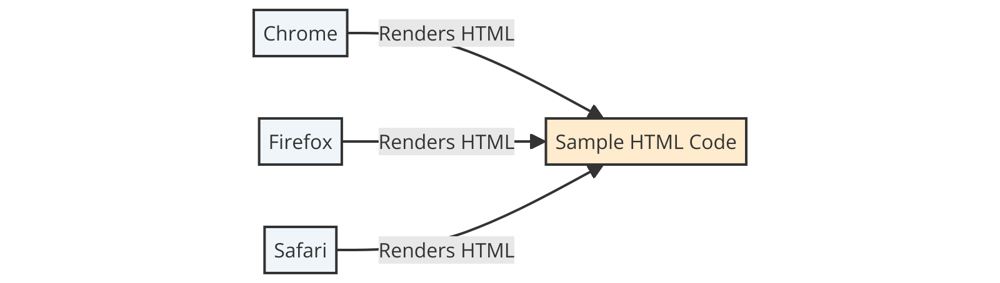
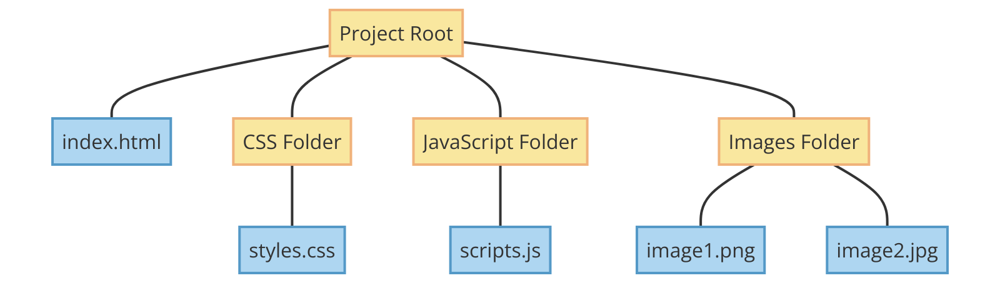
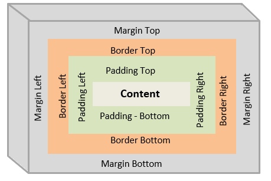

# Awesome HTML Book: HyperText Markup Language (HTML)


[](https://discord.gg/RFjtXKfJy3)

## Table of Contents

- [Introduction to HTML](#introduction-to-html)
  - [What is HTML?](#what-is-html)
    - [Brief History of HTML and Its Evolution](#brief-history-of-html-and-its-evolution)
    - [Understanding the Role of HTML in Web Development](#understanding-the-role-of-html-in-web-development)
    - [Overview of Web Browsers and How They Interpret HTML](#overview-of-web-browsers-and-how-they-interpret-html)
      - [Example: Basic HTML Structure](#example-basic-html-structure)
  - [Setting Up the Environment](#setting-up-the-environment)
    - [Installing and Configuring a Text Editor](#installing-and-configuring-a-text-editor)
      - [Installing Your Chosen Editor](#installing-your-chosen-editor)
    - [Understanding the File Structure for Web Projects](#understanding-the-file-structure-for-web-projects)
      - [Setting Up a Basic File Structure](#setting-up-a-basic-file-structure)
      - [Example: Setting Up a Basic HTML File Structure](#example-setting-up-a-basic-html-file-structure)
  - [Basics of Document Object Model (DOM)](#basics-of-document-object-model-dom)
    - [Exploring the DOM in a Browser](#exploring-the-dom-in-a-browser)
    - [Example: Exploring the DOM](#example-exploring-the-dom)
- [Basic Structure of an HTML Document](#basic-structure-of-an-html-document)
  - [Anatomy of an HTML Document](#anatomy-of-an-html-document)
    - [Example: Basic Anatomy of an HTML Document](#example-basic-anatomy-of-an-html-document)
  - [Declaration, Head, and Body Sections](#declaration-head-and-body-sections)
    - [The `<!DOCTYPE>` Declaration](#the-doctype-declaration)
    - [The `<meta charset="UTF-8" />`](#the-meta-charsetutf-8-)
    - [The `<head>` Section](#the-head-section)
    - [The `<body>` Section](#the-body-section)
  - [Understanding DOCTYPE](#understanding-doctype)
    - [Example: HTML5 DOCTYPE](#example-html5-doctype)
    - [Example: Creating a Simple HTML Page](#example-creating-a-simple-html-page)
- [Essential HTML Tags](#essential-html-tags)
  - [Headings (`<h1>` to `<h6>`)](#headings-h1-to-h6)
    - [Example: Using Headings](#example-using-headings)
  - [Paragraphs and Text Formatting (bold, italic, underline, more)](#paragraphs-and-text-formatting-bold-italic-underline-more)
    - [Example: Paragraphs and Formatting](#example-paragraphs-and-formatting)
  - [Creating Lists](#creating-lists)
    - [Example: Lists in HTML](#example-lists-in-html)
  - [Hyperlinks (`<a>`)](#hyperlinks-a)
    - [Example: Creating a Hyperlink](#example-creating-a-hyperlink)
  - [Displaying Images (``)](#displaying-images-img)
    - [Example: Embedding an Image](#example-embedding-an-image)
  - [Creating Tables (`<table>`, `<tr>`, `<td>`, `<th>`)](#creating-tables-table-tr-td-th)
    - [Example: A Simple Table](#example-a-simple-table)
  - [Line Breaks (`<br>`) and Horizontal Rules (`<hr>`)](#line-breaks-br-and-horizontal-rules-hr)
    - [Example: Using Line Breaks and Horizontal Rules](#example-using-line-breaks-and-horizontal-rules)
  - [Summary: Essential HTML Tags](#summary-essential-html-tags)
- [Forms and User Input](#forms-and-user-input)
  - [Structure of an HTML Form](#structure-of-an-html-form)
    - [Example: Basic Form Syntax](#example-basic-form-syntax)
  - [Text Inputs, Radio Buttons, Checkboxes](#text-inputs-radio-buttons-checkboxes)
    - [Example: Text Inputs](#example-text-inputs)
    - [Example: Radio Buttons](#example-radio-buttons)
    - [Example: Checkboxes](#example-checkboxes)
  - [Select Menus and Option Elements](#select-menus-and-option-elements)
    - [Example: Creating Select Menus](#example-creating-select-menus)
  - [Submit and Reset Buttons](#submit-and-reset-buttons)
    - [Example: Submit Button](#example-submit-button)
    - [Example: Reset Button](#example-reset-button)
  - [Form Validation Basics](#form-validation-basics)
  - [Advanced Form Features](#advanced-form-features)
    - [Example: File Uploads](#example-file-uploads)
    - [Example: HTML5 Input Types](#example-html5-input-types)
  - [Styling Forms](#styling-forms)
    - [CSS Techniques for Forms](#css-techniques-for-forms)
  - [Best Practices in Form Design](#best-practices-in-form-design)
    - [UX Design](#ux-design)
      - [Clarity in Form Fields](#clarity-in-form-fields)
      - [Logical Structure and Order](#logical-structure-and-order)
      - [Simplicity and Minimalism](#simplicity-and-minimalism)
      - [Responsive Design](#responsive-design)
      - [Clear Action Buttons](#clear-action-buttons)
      - [Providing Instant Feedback](#providing-instant-feedback)
      - [Error Handling and Messages](#error-handling-and-messages)
      - [Accessibility](#accessibility)
    - [Security Practices](#security-practices)
      - [Client-side Validation](#client-side-validation)
      - [Sensitive Data Handling](#sensitive-data-handling)
      - [Cross-Site Scripting (XSS) Protection](#cross-site-scripting-xss-protection)
      - [Cross-Site Request Forgery (CSRF) Protection](#cross-site-request-forgery-csrf-protection)
      - [CAPTCHA for Spam Prevention](#captcha-for-spam-prevention)
    - [Summary: Best Practices in Form Design](#summary-best-practices-in-form-design)
  - [Practical Examples and Exercises](#practical-examples-and-exercises)
    - [Step-by-Step Guide: Building a Comprehensive Registration Form](#step-by-step-guide-building-a-comprehensive-registration-form)
      - [Step 1: Basic Form Structure](#step-1-basic-form-structure)
      - [Step 2: Adding Text Inputs](#step-2-adding-text-inputs)
      - [Step 3: Password Field](#step-3-password-field)
      - [Step 4: Date of Birth Field](#step-4-date-of-birth-field)
      - [Step 5: Dropdown List for Selection](#step-5-dropdown-list-for-selection)
      - [Step 6: Radio Buttons for Gender](#step-6-radio-buttons-for-gender)
      - [Step 7: Checkboxes for Interests](#step-7-checkboxes-for-interests)
      - [Step 8: Terms and Conditions Checkbox](#step-8-terms-and-conditions-checkbox)
      - [Step 9: Submit Button](#step-9-submit-button)
      - [Step 10: Client-Side Validation using JavaScript](#step-10-client-side-validation-using-javascript)
      - [Conclusion: Step-by-Step Guide: Building a Comprehensive Registration Form](#conclusion-step-by-step-guide-building-a-comprehensive-registration-form)
    - [Step-by-Step Guide: Dynamic Form with JavaScript](#step-by-step-guide-dynamic-form-with-javascript)
      - [Step 1: Basic HTML Structure](#step-1-basic-html-structure)
      - [Step 2: Adding User Choice](#step-2-adding-user-choice)
      - [Step 3: JavaScript for Dynamic Interaction](#step-3-javascript-for-dynamic-interaction)
      - [Step 4: Submit Button](#step-4-submit-button)
      - [Explanation of the Dynamic Behavior](#explanation-of-the-dynamic-behavior)
      - [Conclusion: Step-by-Step Guide: Dynamic Form with JavaScript](#conclusion-step-by-step-guide-dynamic-form-with-javascript)
  - [Summary: Forms and User Input](#summary-forms-and-user-input)
- [HTML5 and Semantic Elements](#html5-and-semantic-elements)
  - [Introduction to Semantic Elements](#introduction-to-semantic-elements)
  - [Semantic Markup: The Backbone of the Modern Web](#semantic-markup-the-backbone-of-the-modern-web)
  - [The Importance of Semantic Markup](#the-importance-of-semantic-markup)
    - [Enhancing Web Accessibility](#enhancing-web-accessibility)
    - [The SEO Advantage](#the-seo-advantage)
    - [Technical Aspects and Challenges](#technical-aspects-and-challenges)
    - [Advanced Techniques and Considerations](#advanced-techniques-and-considerations)
    - [Comprehensive Best Practices](#comprehensive-best-practices)
    - [Summary: The Importance of Semantic Markup](#summary-the-importance-of-semantic-markup)
  - [Commonly Used Semantic Elements](#commonly-used-semantic-elements)
    - [The `<article>` Element](#the-article-element)
    - [The `<section>` Element](#the-section-element)
    - [The `<nav>` Element](#the-nav-element)
    - [The `<header>` Element](#the-header-element)
    - [The `<footer>` Element](#the-footer-element)
  - [Best Practices for Using Semantic Elements](#best-practices-for-using-semantic-elements)
  - [Challenges and Considerations](#challenges-and-considerations)
  - [Practical Applications and Real-World Scenarios](#practical-applications-and-real-world-scenarios)
    - [Example: Semantic SPA Structure](#example-semantic-spa-structure)
      - [Enhancing Accessibility and SEO in SPAs](#enhancing-accessibility-and-seo-in-spas)
    - [Example: Article with Microdata for Rich Snippets](#example-article-with-microdata-for-rich-snippets)
    - [Impact on SEO and User Experience](#impact-on-seo-and-user-experience)
  - [Evolution and Future Trends in HTML5 and Semantic Elements](#evolution-and-future-trends-in-html5-and-semantic-elements)
    - [Increased Emphasis on Accessibility](#increased-emphasis-on-accessibility)
      - [Example: Using ARIA (Accessible Rich Internet Applications) Attributes](#example-using-aria-accessible-rich-internet-applications-attributes)
    - [Semantic Elements for Complex Web Applications](#semantic-elements-for-complex-web-applications)
      - [Example: Speculative `<toolbar>` Semantic Element](#example-speculative-toolbar-semantic-element)
    - [Integration with Emerging Web Technologies](#integration-with-emerging-web-technologies)
      - [Example: Using Custom Elements with Semantic Meaning](#example-using-custom-elements-with-semantic-meaning)
    - [Enhanced Support for Machine Learning and AI](#enhanced-support-for-machine-learning-and-ai)
      - [Example: Speculative `<ai-content>` Element](#example-speculative-ai-content-element)
    - [Conclusion: Evolution and Future Trends in HTML5 and Semantic Elements](#conclusion-evolution-and-future-trends-in-html5-and-semantic-elements)
  - [SEO and Semantic HTML](#seo-and-semantic-html)
    - [Example: Semantic Headings](#example-semantic-headings)
    - [Example: Semantic Navigation](#example-semantic-navigation)
    - [Benefits of Semantic HTML for SEO](#benefits-of-semantic-html-for-seo)
    - [Accessibility Implications](#accessibility-implications)
      - [Semantic HTML for Accessibility](#semantic-html-for-accessibility)
        - [Example: Proper Heading Structure](#example-proper-heading-structure)
        - [Example: Form Labels and Inputs](#example-form-labels-and-inputs)
        - [Example: Use of `<nav>` and `<nav>` Landmarks](#example-use-of-nav-and-nav-landmarks)
      - [ARIA Roles and Attributes](#aria-roles-and-attributes)
        - [Example: ARIA Role for a Live Region](#example-aria-role-for-a-live-region)
        - [Example: ARIA Role for a Slider](#example-aria-role-for-a-slider)
      - [Conclusion: Accessibility Implications](#conclusion-accessibility-implications)
    - [Case Study: Semantic HTML in Large-Scale Web Applications](#case-study-semantic-html-in-large-scale-web-applications)
      - [Background](#background)
        - [Implementation: Homepage Structure](#implementation-homepage-structure)
        - [Implementation: Product Listing with Semantic Markup](#implementation-product-listing-with-semantic-markup)
      - [Benefits of Semantic HTML](#benefits-of-semantic-html)
      - [Conclusion: Case Study: Semantic HTML in Large-Scale Web Applications](#conclusion-case-study-semantic-html-in-large-scale-web-applications)
  - [Summary: HTML5 and Semantic Elements](#summary-html5-and-semantic-elements)
- [Advanced HTML Features](#advanced-html-features)
  - [Multimedia Integration Elements](#multimedia-integration-elements)
    - [Audio Element](#audio-element)
    - [Video Element](#video-element)
  - [Canvas for Graphics](#canvas-for-graphics)
  - [Geolocation](#geolocation)
  - [Web Storage](#web-storage)
    - [Local Storage](#local-storage)
    - [Session Storage](#session-storage)
  - [Drag and Drop](#drag-and-drop)
  - [Iframes](#iframes)
  - [SVG (Scalable Vector Graphics)](#svg-scalable-vector-graphics)
  - [Data Attributes](#data-attributes)
  - [Summary: Advanced HTML Features](#summary-advanced-html-features)
- [CSS Integration with HTML](#css-integration-with-html)
  - [Basics of Cascading Style Sheets (CSS)](#basics-of-cascading-style-sheets-css)
    - [Selectors](#selectors)
    - [Properties and Values](#properties-and-values)
    - [Box Model](#box-model)
    - [CSS Comments](#css-comments)
  - [Types of CSS (Inline, Internal, External)](#types-of-css-inline-internal-external)
    - [Inline CSS](#inline-css)
    - [Internal (Embedded) CSS](#internal-embedded-css)
    - [External CSS](#external-css)
  - [CSS Frameworks](#css-frameworks)
  - [CSS Preprocessors](#css-preprocessors)
  - [Flexbox and Grid Layouts](#flexbox-and-grid-layouts)
    - [Flexbox](#flexbox)
    - [Grid Layouts](#grid-layouts)
  - [Conclusion: CSS Integration with HTML](#conclusion-css-integration-with-html)
- [Introduction to JavaScript with HTML](#introduction-to-javascript-with-html)
  - [Embedding JavaScript in HTML](#embedding-javascript-in-html)
    - [Pros and Cons of Inline Scripting](#pros-and-cons-of-inline-scripting)
  - [External JavaScript Files](#external-javascript-files)
    - [Pros and Cons of External Files](#pros-and-cons-of-external-files)
  - [DOM Manipulation](#dom-manipulation)
    - [Advanced DOM Manipulation Techniques](#advanced-dom-manipulation-techniques)
  - [Event Handling](#event-handling)
    - [Advanced Event Handling](#advanced-event-handling)
  - [Summary: Introduction to JavaScript with HTML](#summary-introduction-to-javascript-with-html)
- [Building Responsive Web Designs](#building-responsive-web-designs)
  - [Responsive Design Principles](#responsive-design-principles)
    - [Mobile-First Approach](#mobile-first-approach)
      - [Key Principles of Mobile-First Design](#key-principles-of-mobile-first-design)
      - [Benefits of Mobile-First Design](#benefits-of-mobile-first-design)
      - [Implementation Tips](#implementation-tips)
    - [Flexible Layouts and Units](#flexible-layouts-and-units)
      - [Flexible Layouts](#flexible-layouts)
        - [Fluid Grids](#fluid-grids)
        - [Media Queries](#media-queries)
      - [Flexible Units](#flexible-units)
        - [Percentage (%)](#percentage-)
        - [Viewport Width (vw) and Viewport Height (vh)](#viewport-width-vw-and-viewport-height-vh)
        - [Viewport Settings](#viewport-settings)
        - [Em (em)](#em-em)
      - [Benefits and Considerations](#benefits-and-considerations)
    - [Content Prioritization](#content-prioritization)
      - [Importance of Content Prioritization](#importance-of-content-prioritization)
      - [Techniques for Content Prioritization](#techniques-for-content-prioritization)
        - [Visual Hierarchy](#visual-hierarchy)
        - [Content Reorganization](#content-reorganization)
      - [Benefits of Content Prioritization](#benefits-of-content-prioritization)
    - [Optimized Images and Media](#optimized-images-and-media)
      - [Importance of Optimized Images and Media](#importance-of-optimized-images-and-media)
      - [Best Practices for Optimized Images and Media](#best-practices-for-optimized-images-and-media)
        - [Choose the Right File Format](#choose-the-right-file-format)
        - [Optimizing Compression](#optimizing-compression)
        - [Lazy Loading](#lazy-loading)
        - [Serving Responsive Images](#serving-responsive-images)
        - [Enable Browser Caching](#enable-browser-caching)
        - [Video Optimization](#video-optimization)
        - [Audio Optimization](#audio-optimization)
      - [Benefits of Optimized Images and Media](#benefits-of-optimized-images-and-media)
    - [Testing and Iteration](#testing-and-iteration)
      - [Testing](#testing)
        - [Responsive Design Testing](#responsive-design-testing)
        - [Tools for Responsive Testing](#tools-for-responsive-testing)
      - [Iteration](#iteration)
      - [Benefits of Testing and Iteration in Responsive Web Design](#benefits-of-testing-and-iteration-in-responsive-web-design)
    - [Conclusion: Responsive Design Principles](#conclusion-responsive-design-principles)
  - [Fluid Layouts with CSS Flexbox](#fluid-layouts-with-css-flexbox)
    - [Key Concepts of Flexbox](#key-concepts-of-flexbox)
  - [Responsive Grid Layouts with CSS Grid](#responsive-grid-layouts-with-css-grid)
    - [Key Concepts of CSS Grid](#key-concepts-of-css-grid)
  - [Media Queries for Responsive Design](#media-queries-for-responsive-design)
  - [Conclusion: Building Responsive Designs](#conclusion-building-responsive-designs)
- [Web Accessibility](#web-accessibility)
  - [Importance and Principles of Web Accessibility](#importance-and-principles-of-web-accessibility)
  - [ARIA (Accessible Rich Internet Applications) Labels and Roles](#aria-accessible-rich-internet-applications-labels-and-roles)
  - [Accessibility Features in HTML5](#accessibility-features-in-html5)
- [SEO Basics with HTML](#seo-basics-with-html)
  - [Understanding SEO and Its Importance](#understanding-seo-and-its-importance)
  - [HTML Tags and Attributes Important for SEO](#html-tags-and-attributes-important-for-seo)
    - [Code Example: Image Alt Attribute](#code-example-image-alt-attribute)
    - [Code Example: Semantic HTML Elements](#code-example-semantic-html-elements)
    - [Conclusion: HTML Tags and Attributes Important for SEO](#conclusion-html-tags-and-attributes-important-for-seo)
  - [Meta Tags and SEO Best Practices](#meta-tags-and-seo-best-practices)
    - [Code Example: Meta Keywords Tag](#code-example-meta-keywords-tag)
    - [Code Example: Viewport Meta Tag](#code-example-viewport-meta-tag)
    - [Conclusion: Meta Tags and SEO Best Practices](#conclusion-meta-tags-and-seo-best-practices)
  - [Additional SEO Techniques and Best Practices](#additional-seo-techniques-and-best-practices)
- [HTML Best Practices and Performance Optimization](#html-best-practices-and-performance-optimization)
  - [HTML Best Practices](#html-best-practices)
    - [Semantic Markup](#semantic-markup)
      - [Code Example: Semantic Markup](#code-example-semantic-markup)
    - [Form Enhancements](#form-enhancements)
      - [Code Example: Form Enhancements](#code-example-form-enhancements)
    - [Multimedia Integration](#multimedia-integration)
      - [Code Example: Multimedia Integration](#code-example-multimedia-integration)
    - [Mobile Optimization](#mobile-optimization)
      - [Code Example: Mobile Optimization](#code-example-mobile-optimization)
    - [Accessibility Features](#accessibility-features)
      - [Code Example: Accessibility Features](#code-example-accessibility-features)
    - [Code Organization and Commenting](#code-organization-and-commenting)
    - [HTML Performance Optimization Techniques](#html-performance-optimization-techniques)
      - [Code Example: HTML Minification and Compression](#code-example-html-minification-and-compression)
      - [Code Example: Lazy Loading of Images](#code-example-lazy-loading-of-images)
      - [Minimizing HTTP Requests](#minimizing-http-requests)
      - [Code Example: CSS and JavaScript Optimization](#code-example-css-and-javascript-optimization)
  - [Conclusion: HTML Best Practices and Perfomance Optimization](#conclusion-html-best-practices-and-perfomance-optimization)
- [HTML5 APIs and Advanced Features](#html5-apis-and-advanced-features)
  - [Overview of HTML5 APIs](#overview-of-html5-apis)
    - [Geolocation API](#geolocation-api)
    - [Web Storage API](#web-storage-api)
    - [Canvas API](#canvas-api)
    - [Web Workers](#web-workers)
    - [WebSocket API](#websocket-api)
    - [Drag and Drop API](#drag-and-drop-api)
    - [Audio and Video API](#audio-and-video-api)
    - [File API](#file-api)
    - [WebRTC API](#webrtc-api)
    - [Media Capture and Streams API](#media-capture-and-streams-api)
    - [Offline Applications and Service Workers](#offline-applications-and-service-workers)
      - [Example: Implementing Offline Capabilities with Service Workers](#example-implementing-offline-capabilities-with-service-workers)
      - [Example: Caching Assets for Offline Use](#example-caching-assets-for-offline-use)
      - [Example: Offline Data Synchronization](#example-offline-data-synchronization)
  - [Conclusion: HTML5 APIs and Advanced Features](#conclusion-html5-apis-and-advanced-features)
- [Conclusion and Next Steps](#conclusion-and-next-steps)
  - [Recap of Advanced HTML and HTML5 APIs](#recap-of-advanced-html-and-html5-apis)
  - [Pathways for Further Learning in Web Development](#pathways-for-further-learning-in-web-development)
  - [Joining Developer Communities and Continuing Education](#joining-developer-communities-and-continuing-education)
- [Common Challenges and Debugging Tips](#common-challenges-and-debugging-tips)
  - [Cross-Browser Compatibility](#cross-browser-compatibility)
  - [Permission Errors](#permission-errors)
  - [Security Restrictions](#security-restrictions)
  - [Network Connectivity Issues](#network-connectivity-issues)
  - [Performance Optimization Tools](#performance-optimization-tools)
  - [Error Handling and Debugging Tools](#error-handling-and-debugging-tools)
  - [Community Support and Documentation](#community-support-and-documentation)
  - [Continuous Testing and Iteration](#continuous-testing-and-iteration)
  - [Summary: Common Challenges and Debugging Tips](#summary-common-challenges-and-debugging-tips)
- [Conclusion: HyperText Markup Language (HTML) Course](#conclusion-hypertext-markup-language-html-course)
- [Additional Resources and Reading Materials](#additional-resources-and-reading-materials)
  - [Online Tutorials and Guides](#online-tutorials-and-guides)
  - [Books and Publications](#books-and-publications)
  - [Community Forums and Discussion Platforms](#community-forums-and-discussion-platforms)
  - [Developer Tools and Extensions](#developer-tools-and-extensions)
  - [Online Courses and Learning Platforms](#online-courses-and-learning-platforms)

## Introduction to HTML

### What is HTML?

HTML, which stands for HyperText Markup Language, is the standard language used to create and design documents on the World Wide Web. As the backbone of all web pages, HTML allows us to structure content with elements such as headings, paragraphs, lists, links, and images. Unlike programming languages that provide logic and functionality, HTML is a markup language that defines the structure and layout of web content.

#### Brief History of HTML and Its Evolution

| | 
|:--:| 
| *A timeline graphic showing key milestones in the history of HTML, from HTML 1.0 to HTML5.* |

The journey of HTML began in the early 1990s, devised by Tim Berners-Lee, a physicist at the CERN research facility in Switzerland. Initially created to facilitate information sharing between scientists across different universities and institutes, HTML has evolved significantly over the years. Key milestones include:

- HTML 2.0 (1995): The first standard version, which set the core features of HTML.
- HTML 4.01 (1999): Introduced more robust features for modern web design.
- XHTML (2000): A hybrid between HTML and XML, offering more strict syntax rules.
- HTML5 (2014): The latest major version, bringing enhanced support for multimedia, graphics, and mobile-friendly features.

These developments were guided by organizations such as the World Wide Web Consortium (W3C) and the Web Hypertext Application Technology Working Group (WHATWG), playing pivotal roles in standardizing HTML.

#### Understanding the Role of HTML in Web Development


|:--:| 
| *HTML, CSS, JavaScript Interaction Diagram: A Venn diagram illustrating how HTML, CSS, and JavaScript overlap and interact in web development.* |

HTML is a key component of the web development ecosystem, used in conjunction with Cascading Style Sheets (CSS) and JavaScript. While HTML lays out the structure of the page, CSS is used for styling, and JavaScript for adding interactivity and dynamic content. This combination is essential in creating a diverse range of web applications, from simple static websites to complex interactive platforms.

#### Overview of Web Browsers and How They Interpret HTML


|:--:| 
| *Browser Rendering: showing how a sample HTML code is rendered in different browsers (Chrome, Firefox, Safari).* |

Web browsers like Google Chrome, Mozilla Firefox, Safari, and Microsoft Edge are the tools through which users interact with HTML documents. Each browser interprets HTML code to display web pages. Understanding how different browsers parse and render HTML is crucial for developers to ensure consistency and compatibility across the web. This section can delve into the concept of browser rendering engines, cross-browser compatibility issues, and the importance of following web standards to minimize inconsistencies.

##### Example: Basic HTML Structure

Below is an example of a basic HTML document structure:

```html
<!DOCTYPE html>
<html lang="en">
  <head>
    <meta charset="UTF-8" />
    <title>My First HTML Page</title>
  </head>
  <body>
    <h1>Hello, World!</h1>
    <p>This is my first HTML page.</p>
  </body>
</html>
```

[](https://codesandbox.io/p/sandbox/001-basic-html-structure-7gq85k)

[^1]CodeSandbox: Basic HTML Structure.

[^1]:[CodeSandbox: Basic HTML Structure](https://7gq85k.csb.app/), last access: May 11, 2024.

This code demonstrates a simple HTML page structure with the essential elements: `<!DOCTYPE html>`, `<html>`, `<head>`, `<meta>`, `<title>` and `<body>`.

### Setting Up the Environment

#### Installing and Configuring a Text Editor

Before diving into HTML coding, it's essential to choose and set up a text editor - a basic tool where you will write and edit your HTML code. There are several popular editors suited for web development, each with its unique features and advantages:

- **Visual Studio Code (VS Code)**: A versatile and widely-used editor by Microsoft, known for its extensive extension library, integrated terminal, and Git control.
- **Sublime Text**: Known for its speed and efficiency, Sublime Text offers a distraction-free coding environment with a vast array of keyboard shortcuts.
- **Atom**: Developed by GitHub, Atom is a highly customizable editor with a friendly interface, ideal for beginners and experienced developers alike.

##### Installing Your Chosen Editor

- Provide step-by-step instructions for downloading and installing the chosen text editor.
- Highlight the importance of familiarizing oneself with the basic features and user interface of the editor.

#### Understanding the File Structure for Web Projects


|:--:| 
| *Web Project File Structure Diagram: A flowchart or tree diagram showing a typical web project's file structure, including HTML, CSS, JavaScript files, and a folder for images.* |

Organizing files and folders properly is crucial in web development. A basic project might include separate HTML, CSS, and JavaScript files, along with a directory for images and other media.

Proper organization of web project files is crucial for maintainability and scalability. A typical HTML project might include:

- **HTML Files**: The core files with a .html extension where the HTML code is written.
- **CSS Files**: Separate files (usually with a .css extension) for styling.
- **JavaScript Files**: Files containing JavaScript code, usually with a .js extension.
- **Images and Multimedia**: A folder dedicated to storing images, videos, and other media assets.
- **Miscellaneous Files**: Other files like fonts, icons, or third-party libraries.

##### Setting Up a Basic File Structure

- Guide on creating a basic directory and file structure for a simple HTML project.
- Emphasize the importance of consistent naming conventions and organization.

##### Example: Setting Up a Basic HTML File Structure

Imagine you're creating a simple website. Here's how you might set up the files and folders:

1. **Create a Project Folder**: name it `MyFirstWebsite`.
2. **Add HTML, CSS, and JavaScript Files**: inside the folder, create three files:
   - `index.html` (for HTML content)
   - `styles.css` (for CSS styles)
   - `script.js` (for JavaScript code)

3. **Create Project Structure**: in your preferred text editor, like this one below:

```bash
MyFirstWebsite/
│
├── index.html
├── styles.css
└── script.js
```

4. **Write Basic HTML Code**: in `index.html`, you can start with a simple structure:

```html
<!DOCTYPE html>
<html>
  <head>
    <title>My First Website</title>
    <link rel="stylesheet" href="styles.css">
  </head>
  <body>
    <h1>Welcome to My Website</h1>
    <p>This is a paragraph on my first webpage.</p>
    <script src="script.js"></script>
  </body>
</html>
```

5. **Add Some Styles**: in `styles.css`, add some basic styling:

```css
body {
    font-family: Arial, sans-serif;
}

h1 {
    color: navy;
}
```

6. **Include a JavaScript File**: in `script.js`, write a simple script:

```javascript
document.addEventListener("DOMContentLoaded", function() {
    alert("Welcome to My First Website!");
});
```

[](https://codesandbox.io/p/sandbox/002-setting-up-a-basic-html-file-structure-hrm893)

[^2]CodeSandbox: Setting Up a Basic HTML File Structure.

[^2]:[CodeSandbox: Setting Up a Basic HTML File Structure](https://hrm893.csb.app/), last access: May 11, 2024.

### Basics of Document Object Model (DOM)


|:--:| 
| *Anatomy of an HTML Document: A labeled diagram showing the structure of an HTML document, with tags like <!DOCTYPE>, <html>, <head>, and <body>.* |

Understanding the Document Object Model (DOM) is fundamental in web development. It's a programming interface for HTML and XML documents that defines the logical structure of documents and the way a document is accessed and manipulated.

- **What is the DOM?**: An explanation of how the DOM represents a web page as a tree-like structure.
- **Interacting with the DOM**: An overview of how browsers create the DOM and how it can be manipulated with JavaScript to dynamically change HTML and CSS.

#### Exploring the DOM in a Browser

- Instructions on how to inspect the DOM using browser developer tools.
- Simple exercises to demonstrate the manipulation of the DOM elements.

#### Example: Exploring the DOM

Here's a simple exercise to manipulate the DOM using JavaScript:

1. **Add a Button in HTML**: in `index.html`, add a button element:

```html
<button id="changeColorButton">Change Color</button>
```

2. **JavaScript to Change Text Color**: in `script.js`, add a script to change the color of the paragraph when the button is clicked:

```javascript
document.getElementById("changeColorButton").addEventListener("click", function() {
    document.querySelector("p").style.color = "red";
});
```

[](https://codesandbox.io/p/sandbox/003-exploring-the-dom-8kyhj7)

[^3]CodeSandbox: Exploring the DOM.

[^3]:[CodeSandbox: Exploring the DOM](https://8kyhj7.csb.app/), last access: May 11, 2024.

This code selects the button with the ID `changeColorButton` and adds an event listener to it. When clicked, it changes the color of the first paragraph to red.

## Basic Structure of an HTML Document

The foundation of any web page is its HTML structure. Understanding this structure is crucial for effective web development.

### Anatomy of an HTML Document

An HTML document is structured with various elements, each serving a specific purpose. The basic components include the `<!DOCTYPE html>`, `<html>`, `<head>`, `<meta>`, `<title>` and `<body>` tags.

#### Example: Basic Anatomy of an HTML Document

```html
<!DOCTYPE html>
<html lang="en">
  <head>
    <meta charset="UTF-8" />
    <title>Document Title</title>
    <!-- Other head elements like links to CSS files, metadata go here -->
  </head>
  <body>
    <!-- Webpage content goes here -->
  </body>
</html>
```

[](https://codesandbox.io/p/sandbox/004-basic-anatomy-of-an-html-document-cqc9qw)

[^4]CodeSandbox: Basic Anatomy of an HTML Document.

[^4]:[CodeSandbox: Basic Anatomy of an HTML Document](https://cqc9qw.csb.app/), last access: May 12, 2024.

### Declaration, Head, and Body Sections

Understanding each section of an HTML document is important for structuring web content correctly.

#### The `<!DOCTYPE>` Declaration

The `<!DOCTYPE>` declaration is not an HTML tag; it is an instruction to the web browser about the HTML version being used. For HTML5, it is simply declared as `<!DOCTYPE html>`.

#### The `<meta charset="UTF-8" />`

That's an encoding method for correctly displaying local languages characters. Technically, it's related to ASCII, which is outside the scope of this book.

#### The `<head>` Section

The `<head>` section contains meta-information about the document, such as its title, character set, viewport settings, links to CSS files, and other metadata.

#### The `<body>` Section

The `<body>` section encloses the actual content of the webpage, such as text, images, links, tables, lists, and other elements.

### Understanding DOCTYPE

The DOCTYPE declaration should be the very first thing in an HTML document, before the `<html>` tag. The DOCTYPE declaration is not case sensitive.

#### Example: HTML5 DOCTYPE

```html
<!DOCTYPE html>
<!-- This is the standard declaration for HTML5 documents -->
```

#### Example: Creating a Simple HTML Page

1. **Create a File**: name it `index.html`.
2. **Write Basic HTML Code**: add the following basic structure:

```html
<!DOCTYPE html>
<html lang="en">
  <head>
    <meta charset="UTF-8" />
    <title>Simple Page</title>
  </head>
  <body>
    <h1>Hello, World!</h1>
    <p>This is a simple HTML page.</p>
  </body>
</html>
```

[](https://codesandbox.io/p/sandbox/005-creating-a-simple-html-page-gkxq6z)

[^5]CodeSandbox: Creating a Simple HTML Page.

[^5]:[CodeSandbox: Creating a Simple HTML Page](https://gkxq6z.csb.app/), last access: May 12, 2024.

## Essential HTML Tags

Understanding and effectively using HTML tags is fundamental to web development. This section delves deeper into some of the most commonly used HTML tags, providing detailed explanations and comprehensive code examples.

### Headings (`<h1>` to `<h6>`)

Headings are used to define the hierarchy and importance of content on a web page. The tags `<h1>` through `<h6>` represent different levels of headings, `<h1>` being the highest level.

#### Example: Using Headings

```html
<h1>Main Title of the Page</h1>
<h2>Subsection Title</h2>
<h3>Sub-subsection Title</h3>
<h4>Sub-sub-subsection Title</h4>
<h5>Sub-sub-sub-subsection Title</h5>
<h6>Sub-sub-sub-sub-subsection Title</h6>
```

[](https://codesandbox.io/p/sandbox/006-using-headings-6p6kkp)

[^6]CodeSandbox: Using Headings.

[^6]:[CodeSandbox: Using Headings](https://6p6kkp.csb.app/), last access: May 12, 2024.

### Paragraphs and Text Formatting (bold, italic, underline, more)

The `<p>` tag defines a paragraph. Other tags like `<strong>`, `<em>`, `<mark>`, `<small>`, and `<del>` are used for emphasizing or altering the standard presentation of text.

#### Example: Paragraphs and Formatting

```html
<p>This is a standard paragraph.</p>
<p>This paragraph contains <strong>bold text</strong>, <em>italic text</em>, <mark>highlighted text</mark>, <small>smaller text</small>, and <del>deleted text</del>.</p>
```

[](https://codesandbox.io/p/sandbox/007-paragraphs-and-formatting-hcdvjw)

[^7]CodeSandbox: Paragraphs and Formatting.

[^7]:[CodeSandbox: Paragraphs and Formatting](https://hcdvjw.csb.app/), last access: May 13, 2024.

### Creating Lists

There are three types of lists in HTML: ordered lists (`<ol>`), unordered lists (`<ul>`), and description lists (`<dl>`).

#### Example: Lists in HTML

```html
<!-- Ordered List -->
<ol>
    <li>First item</li>
    <li>Second item</li>
</ol>

<!-- Unordered List -->
<ul>
    <li>Bullet item</li>
    <li>Another bullet item</li>
</ul>

<!-- Description List -->
<dl>
    <dt>Term 1</dt>
    <dd>Definition 1</dd>
    <dt>Term 2</dt>
    <dd>Definition 2</dd>
</dl>
```

[](https://codesandbox.io/p/sandbox/008-lists-in-html-xlyz8s)

[^8]CodeSandbox: Lists in HTML.

[^8]:[CodeSandbox: Lists in HTML](https://xlyz8s.csb.app/), last access: May 13, 2024.

### Hyperlinks (`<a>`)

Hyperlinks, defined with the `<a>` tag, are crucial for navigation, allowing users to jump to different pages or sections within a page or to an external site.

#### Example: Creating a Hyperlink

```html
<!-- Linking to an external site -->
<a href="https://www.example.com">Visit Example.com</a>
<!-- Hyperlink opening in a new tab -->
<a href="https://www.example.com" target="_blank">Visit Example.com in a new tab</a>
<!-- Linking to an email address -->
<a href="mailto:someone@example.com">Send Email</a>
<!-- Linking to a phone number -->
<a href="tel:+1234567890">Call Us</a>
```

[](https://codesandbox.io/p/sandbox/009-creating-a-hyperlink-fqmf24)

[^9]CodeSandbox: Creating a Hyperlink.

[^9]:[CodeSandbox: Creating a Hyperlink](https://fqmf24.csb.app/), last access: May 13, 2024.

### Displaying Images (``)

The `` tag embeds images into your HTML document. Attributes like `src`, `alt`, `width`, and `height` play crucial roles in how the image is displayed and accessed.

#### Example: Embedding an Image

```html
<!-- Image with specified width and height -->

```

[](https://codesandbox.io/p/sandbox/010-embedding-an-image-cp8ht6)

[^10]CodeSandbox: Embedding an Image.

[^10]:[CodeSandbox: Embedding an Image](https://cp8ht6.csb.app/), last access: May 13, 2024.

### Creating Tables (`<table>`, `<tr>`, `<td>`, `<th>`)

Tables are created with `<table>`, and their structure is defined using `<tr>` for rows, `<td>` for data cells, and `<th>` for header cells.

#### Example: A Simple Table

```html
<table border="1">
    <tr>
        <th>Header 1</th>
        <th>Header 2</th>
    </tr>
    <tr>
        <td>Data Cell 1</td>
        <td>Data Cell 2</td>
    </tr>
    <!-- Additional rows and cells can be added here -->
</table>
```

[](https://codesandbox.io/p/sandbox/011-a-simple-table-jxrk65)

[^11]CodeSandbox: A Simple Table.

[^11]:[CodeSandbox: A Simple Table](https://jxrk65.csb.app/), last access: May 13, 2024.


### Line Breaks (`<br>`) and Horizontal Rules (`<hr>`)

The `<br>` tag inserts a single line break, useful for content separation within the same paragraph. The `<hr>` tag creates a horizontal line, useful for thematic breaks in content.

#### Example: Using Line Breaks and Horizontal Rules

```html
<p>This is a paragraph.<br>Here is a new line in the same paragraph.</p>
<hr>
<p>This is another paragraph following a horizontal rule.</p>
```

[](https://codesandbox.io/p/sandbox/012-using-line-breaks-and-horizontal-rules-q3p3lx)

[^12]CodeSandbox: Using Line Breaks and Horizontal Rules.

[^12]:[CodeSandbox: Using Line Breaks and Horizontal Rules](https://q3p3lx.csb.app/), last access: May 13, 2024.

### Summary: Essential HTML Tags

In this section, we have covered the foundational HTML tags necessary for structuring web content. Understanding these tags and their proper usage is key to developing well-structured and accessible web pages.

## Forms and User Input

Understanding forms in HTML is crucial for interactive web applications. This section covers the creation and management of web forms, from basic structures to advanced functionalities.

### Structure of an HTML Form

Forms are essential for user interactions on websites. They are used to collect user inputs which can be sent to a server for processing.

#### Example: Basic Form Syntax

```html
<form action="/submit-form" method="post">
    <!-- Form elements go here -->
</form>
```

- `action`: The URL where the form data is sent.
- `method`: The HTTP method (GET or POST) used when submitting the form.

[](https://codesandbox.io/p/sandbox/013-basic-form-syntax-8grgqh)

[^13]CodeSandbox: Basic Form Syntax.

[^13]:[CodeSandbox: Basic Form Syntax](https://8grgqh.csb.app/), last access: May 15, 2024.

### Text Inputs, Radio Buttons, Checkboxes

Text inputs, radio buttons, and checkboxes are standard elements for forms.

#### Example: Text Inputs

```html
<input type="text" name="username" maxlength="15" placeholder="Enter username">
```

- Text fields for short, freeform text input.

[](https://codesandbox.io/p/sandbox/014-text-inputs-hgzcj8)

[^14]CodeSandbox: Text Inputs.

[^14]:[CodeSandbox: Text Inputs](https://hgzcj8.csb.app/), last access: May 22, 2024.

#### Example: Radio Buttons

```html
<input type="radio" name="gender" value="male" id="male">
<label for="male">Male</label>
<input type="radio" name="gender" value="female" id="female">
<label for="female">Female</label>
```

- For selecting one option from a set.

[](https://codesandbox.io/p/sandbox/015-radio-buttons-9ny4lk)

[^15]CodeSandbox: Radio Buttons.

[^15]:[CodeSandbox: Radio Buttons](https://9ny4lk.csb.app/), last access: May 22, 2024.

#### Example: Checkboxes

```html
<input type="checkbox" name="interest" value="coding" id="coding">
<label for="coding">Coding</label>
```

- For selecting multiple values from a set.

[](https://codesandbox.io/p/sandbox/016-checkboxes-8y2kr3)

[^16]CodeSandbox: Checkboxes.

[^16]:[CodeSandbox: Checkboxes](https://8y2kr3.csb.app/), last access: May 22, 2024.

### Select Menus and Option Elements

Select menus provide a drop-down list of options.

#### Example: Creating Select Menus

```html
<select name="country">
    <option value="usa">United States</option>
    <option value="canada">Canada</option>
    <!-- Additional options -->
</select>
```

[](https://codesandbox.io/p/sandbox/017-creating-select-menus-cjrj6p)

[^17]CodeSandbox: Creating Select Menus.

[^17]:[CodeSandbox: Creating Select Menus](https://cjrj6p.csb.app/), last access: May 22, 2024.

### Submit and Reset Buttons

Buttons to submit or reset the form data.

#### Example: Submit Button

```html
<input type="submit" value="Submit Form">
<!-- or -->
<button type="submit">Submit Form</button>
```

[](https://codesandbox.io/p/sandbox/018-submit-button-4g2k2t)

[^18]CodeSandbox: Submit Button.

[^18]:[CodeSandbox: Submit Button](https://4g2k2t.csb.app/), last access: May 22, 2024.

#### Example: Reset Button

```html
<input type="reset" value="Reset Form">
```

[](https://codesandbox.io/p/sandbox/019-reset-button-6tqsmk)

[^19]CodeSandbox: Reset Button.

[^19]:[CodeSandbox: Reset Button](https://6tqsmk.csb.app/), last access: May 22, 2024.

### Form Validation Basics

```html
<input type="email" name="email" required>
<input type="number" name="age" min="18" max="100">
```

[](https://codesandbox.io/p/sandbox/020-form-validation-basics-nzcplr)

[^20]CodeSandbox: Form Validation Basics.

[^20]:[CodeSandbox: Form Validation Basics](https://nzcplr.csb.app/), last access: May 22, 2024.

### Advanced Form Features

#### Example: File Uploads

```html
<input type="file" name="document">
```

[](https://codesandbox.io/p/sandbox/021-file-uploads-q82hj2)

[^21]CodeSandbox: File Uploads.

[^21]:[CodeSandbox: File Uploads](https://q82hj2.csb.app/), last access: May 22, 2024.


#### Example: HTML5 Input Types

```html
<input type="date" name="birthday">
```

[](https://codesandbox.io/p/sandbox/022-html5-input-types-sjwsrk)

[^22]CodeSandbox: HTML5 Input Types.

[^22]:[CodeSandbox: HTML5 Input Types](https://sjwsrk.csb.app/), last access: May 22, 2024.

### Styling Forms

CSS can be used to enhance the appearance of forms.

#### CSS Techniques for Forms

Styling input elements, buttons, and handling layout responsiveness.

### Best Practices in Form Design

- **UX Design**: Tips for effective layout, clear labels, and intuitive navigation.
- **Security Practices**: Emphasizing the importance of server-side validation.

#### UX Design

##### Clarity in Form Fields

- **Labeling**: Every form field should have a clear and concise label. Labels should be placed close to the corresponding input field for easy scanning.
- **Placeholder Text**: Use placeholder text to provide examples or hints but not as a replacement for labels. Remember, placeholders disappear once the user starts typing.

##### Logical Structure and Order

- **Grouping Related Fields**: Organize fields into logically grouped sections, if the form is lengthy. This helps users understand related fields and complete the form more efficiently.
- **Sequential Flow**: Arrange fields in a natural, predictable order (e.g., personal details followed by address information).

##### Simplicity and Minimalism

- **Minimal Required Fields**: Only ask for information that is absolutely necessary. Reducing the number of fields minimizes the effort required to fill out the form.
- **Avoiding Redundancy**: Do not ask users to repeat information unless absolutely necessary (like confirming an email or password).

##### Responsive Design

- Ensure that forms are easily accessible and usable across all devices, particularly on mobile screens. Input fields, labels, and buttons should adjust to various screen sizes without losing readability or functionality.

##### Clear Action Buttons

- **Distinctive Submit Button**: The submit button should be prominently displayed and easily identifiable.
- **Progressive Disclosure**: For longer forms, consider using a multi-step process with a clear indication of progress (like step indicators).

##### Providing Instant Feedback

- Implement real-time validation and provide immediate feedback, especially for critical fields like usernames or passwords. Indicate clearly whether the input is correct or what needs to be changed.

##### Error Handling and Messages

- **Clear Error Indication**: Errors should be indicated clearly and politely, ideally next to the field in question.
- **Constructive Error Messages**: Provide helpful and specific error messages, guiding users on how to correct the mistake.

##### Accessibility

- Ensure that the form is accessible to all users, including those with disabilities. This includes proper use of ARIA roles, ensuring keyboard navigability, and providing adequate contrast for readability.

#### Security Practices

##### Client-side Validation

- While client-side validation improves the user experience, it should not be relied upon for security. Always validate and sanitize inputs on the server side.

##### Sensitive Data Handling

- Use appropriate measures like SSL/TLS for data transmission. Be cautious with sensitive data like passwords and personal information.

##### Cross-Site Scripting (XSS) Protection

- Sanitize user input to prevent XSS attacks. Do not directly embed user input in your pages without proper sanitization.

##### Cross-Site Request Forgery (CSRF) Protection

- Implement anti-CSRF tokens to protect form submissions from CSRF attacks, where a malicious site can influence the interaction between a client and a server.

##### CAPTCHA for Spam Prevention

- If the form is publicly accessible, consider using CAPTCHAs or similar mechanisms to prevent automated spam submissions.

#### Summary: Best Practices in Form Design

This detailed guide covers essential best practices in form design, emphasizing user experience and security. By adhering to these practices, developers can create forms that are not only user-friendly and efficient but also secure and accessible, ensuring a positive and safe experience for all users.

### Practical Examples and Exercises

- **Building a Registration Form**: Comprehensive exercise to build a user registration form with various input types and validations.
- **Interactive Form with JavaScript**: Creating a dynamic form that updates based on user input, enhancing interactivity.

#### Step-by-Step Guide: Building a Comprehensive Registration Form

Creating a comprehensive registration form in HTML involves several steps, focusing on structuring the form, incorporating various input types, and implementing client-side validation. Below is a step-by-step guide to build such a form, complete with HTML and inline JavaScript for validation.

##### Step 1: Basic Form Structure

Start with the basic HTML structure for your form.

- **Purpose**: Establishes the foundation of the form.
- **Attributes**:
  - `action`: Specifies the server endpoint to process the form data.
  - `method`: Defines how data is sent (GET for retrieving data, POST for sending data).

```html
<form id="registrationForm" action="/submit-form" method="post">
    <!-- Form fields will be added here -->
</form>
```

##### Step 2: Adding Text Inputs

Include fields for basic user information.

- **Purpose**: Collects basic user information like name and email.
- **Attributes**:
  - `type="text"`: Standard input for text.
  - `type="email"`: Input specifically for email addresses, with built-in validation.

```html
<!-- Name Field -->
<label for="fullName">Full Name:</label>
<input type="text" id="fullName" name="fullName" required>

<!-- Email Field -->
<label for="email">Email:</label>
<input type="email" id="email" name="email" required>
```

##### Step 3: Password Field

Add a password field with complexity requirements.

- **Purpose**: Securely collects user password.
- **Attributes**:
  - `type="password"`: Hides input characters for security.
  - `pattern`: Ensures the password meets specific criteria (e.g., minimum length).

```html
<label for="password">Password:</label>
<input type="password" id="password" name="password" pattern=".{8,}" title="Must contain at least 8 or more characters" required>
```

##### Step 4: Date of Birth Field

Incorporate a date picker.

- **Purpose**: Collects date-specific data in a user-friendly format.
- **Attributes**:
  - `type="date"`: Provides a date picker for easy entry.

```html
<label for="dob">Date of Birth:</label>
<input type="date" id="dob" name="dob">
```

##### Step 5: Dropdown List for Selection

Include a selection dropdown, for example, for selecting a country.

- **Purpose**: Allows selection from predefined options in a compact form.
- **Attributes**:
  - `<select>`: Creates a dropdown list.
  - `<option>`: Defines the available options.

```html
<label for="country">Country:</label>
<select id="country" name="country">
    <option value="usa">United States</option>
    <option value="canada">Canada</option>
    <!-- Add other countries as needed -->
</select>
```

##### Step 6: Radio Buttons for Gender

Add radio buttons for gender selection.

- **Purpose**: Enables selection of a single option from a set.
- **Attributes**:
  - `type="radio"`: Defines radio buttons.
  - `name`: Groups radio buttons so only one can be selected at a time.

```html
<label>Gender:</label>
<input type="radio" id="male" name="gender" value="male">
<label for="male">Male</label>
<input type="radio" id="female" name="gender" value="female">
<label for="female">Female</label>
```

##### Step 7: Checkboxes for Interests

Include checkboxes for selecting multiple interests.

- **Purpose**: Allows multiple selections from a set of options.
- **Attributes**:
  - `type="checkbox"`: Defines a checkbox.

```html
<label>Interests:</label>
<input type="checkbox" id="coding" name="interests" value="coding">
<label for="coding">Coding</label>
<input type="checkbox" id="music" name="interests" value="music">
<label for="music">Music</label>
<!-- Add other interests as needed -->
```

##### Step 8: Terms and Conditions Checkbox

Add a required checkbox for terms and conditions.

- **Purpose**: Ensures the user agrees to terms before submitting.
- **Attributes**:
  - `required`: Makes agreement mandatory for form submission.

```html
<input type="checkbox" id="terms" name="terms" required>
<label for="terms">I agree to the Terms and Conditions</label>
```

##### Step 9: Submit Button

Include a submit button.

- **Purpose**: Submits the form data to the server.
- **Attributes**:
  - `type="submit"`: Defines a button for submitting the form.

```html
<button type="submit">Register</button>
```

##### Step 10: Client-Side Validation using JavaScript

Add inline JavaScript to enhance validation.

- **Purpose**: Enhances form validation before submission.
- **Functionality**: Uses JavaScript to ensure all required fields are filled and meet criteria. Prevents form submission if validation fails, providing immediate feedback to the user.

```html
<script>
document.getElementById("registrationForm").addEventListener("submit", function(event) {
    if (!this.checkValidity()) {
        event.preventDefault(); // Prevent form submission if validation fails
        alert("Please fill out the form correctly.");
    }
});
</script>
```

[](https://codesandbox.io/p/sandbox/023-building-a-comprehensive-registration-form-kk58h2)

[^23]CodeSandbox: Building a Comprehensive Registration Form.

[^23]:[CodeSandbox: Exploring the DOM](https://kk58h2.csb.app/), last access: May 22, 2024.

##### Conclusion: Step-by-Step Guide: Building a Comprehensive Registration Form

This guide outlines the steps to create a detailed registration form with various input types and client-side validation. This form can be further enhanced with CSS for styling and server-side validation for security. Remember, the action attribute in the form tag should point to a server-side script that can handle the form submission.

#### Step-by-Step Guide: Dynamic Form with JavaScript

Creating a dynamic form with JavaScript involves incorporating interactive elements that respond to user actions in real-time. Here's a step-by-step guide to building such a form:

##### Step 1: Basic HTML Structure

Start with a simple HTML form structure.

- **Purpose**: Sets up the foundational layout for the dynamic form.
- **Functionality**: Provides a container where dynamic content based on user interaction will be displayed.

```html
<form id="dynamicForm">
    <!-- Dynamic elements will be added here -->
</form>
```

##### Step 2: Adding User Choice

Let's add a dropdown that allows the user to choose an option, which will dynamically update the rest of the form.

- **Purpose**: Allows users to make a selection that determines the rest of the form's content.
- **Functionality**:
  - `<select>` Dropdown: Presents predefined options (e.g., 'Books', 'Movies').
On change, the user's choice triggers a JavaScript function to update the form dynamically.

```html
<label for="choice">Choose a Category:</label>
<select id="choice" name="choice">
    <option value="">Select...</option>
    <option value="books">Books</option>
    <option value="movies">Movies</option>
</select>

<div id="additionalFields">
    <!-- Additional fields will be populated here based on the choice -->
</div>
```

##### Step 3: JavaScript for Dynamic Interaction

Using JavaScript, we'll add event listeners to dynamically update the form.

- **Purpose**: Adds interactivity and real-time response to user selections.
- **Functionality**:
  - Event Listener: JavaScript listens for changes in the dropdown menu.
  - Conditional Rendering: Based on the user's selection (e.g., 'Books' or 'Movies'), JavaScript dynamically generates appropriate input fields (e.g., 'Author' for Books, 'Director' for Movies).
  - Inner HTML Manipulation: The script modifies the content of the `additionalFields` div, adding relevant fields in real time.

```html
<script>
document.getElementById("choice").addEventListener("change", function() {
    const value = this.value;
    const additionalFields = document.getElementById("additionalFields");

    additionalFields.innerHTML = ""; // Clear existing fields

    if (value === "books") {
        additionalFields.innerHTML = "<label for="author">Author:</label><input type="text" id="author" name="author">";
    } else if (value === "movies") {
        additionalFields.innerHTML = "<label for="director">Director:</label><input type="text" id="director" name="director">";
    }
});
</script>
```

##### Step 4: Submit Button

Add a submit button for the form.

- **Purpose**: Provides a mechanism to submit the form data.
- **Functionality**: When clicked, it triggers the form submission process (which would be handled by server-side code not shown in this guide).

```html
<button type="submit">Submit</button>
```

[](https://codesandbox.io/p/sandbox/024-dynamic-form-with-javascript-czrr4l)

[^24]CodeSandbox: Dynamic Form with JavaScript.

[^24]:[CodeSandbox: Dynamic Form with JavaScript](https://czrr4l.csb.app/), last access: May 24, 2024.

##### Explanation of the Dynamic Behavior

- **Initial Setup**: The form starts with a basic structure, including a dropdown for the user to make an initial choice.
- **User Interaction**: As the user selects an option from the dropdown, the JavaScript function is triggered.
- **Real-Time Updates**: The JavaScript function dynamically updates the form's content based on the user's selection. This update happens in the browser, without needing to reload the page, enhancing the user experience with immediate feedback.
- **Flexibility and Customization**: This approach allows for significant flexibility. For instance, different types of input fields can be added, or additional JavaScript logic can be implemented to handle more complex scenarios.
- **Final Submission**: The submit button remains constant, but the data it sends can vary depending on the user’s choices and the dynamically added fields.

##### Conclusion: Step-by-Step Guide: Dynamic Form with JavaScript

This example demonstrates a dynamic form that changes based on user input, showcasing the use of HTML and JavaScript for real-time interaction. The key aspect of this form is its ability to change in real-time based on user input, making it highly responsive and user-friendly. Such forms are useful in scenarios where user input dictates subsequent options or data fields, enhancing the overall usability and efficiency of the user interface. The form can be extended with more complex logic, validations, and styled with CSS for a more polished look.

### Summary: Forms and User Input

This section provides in-depth knowledge on creating and handling forms in HTML. By mastering these elements, you can create interactive and user-friendly web applications.

## HTML5 and Semantic Elements

HTML5 introduced a range of semantic elements that provide meaningful structure to web content, making it more accessible and understandable both to browsers and developers.

### Introduction to Semantic Elements

Semantic elements clearly describe their meaning in a human- and machine-readable way. Elements like `<article>`, `<footer>`, `<header>`, `<nav>`, and `<section>` make the structure of a document more readable and accessible.

### Semantic Markup: The Backbone of the Modern Web

HTML5 semantic markup is a cornerstone of modern web development, emphasizing the importance of using HTML elements that convey the meaning of the information they encapsulate. This approach moves beyond the visual presentation to enrich the web's semantic layer, making content more understandable to both machines and humans.

- **The Role of Context in Semantic Markup**: Every semantic element is chosen based on the context it provides to the content. This context is crucial for assistive technologies to interpret the purpose and relevance of content, enabling users with disabilities to navigate and understand web content more effectively.

### The Importance of Semantic Markup

- **Accessibility**: Screen readers and other assistive technologies rely on semantic elements to provide a better experience for users with disabilities.
- **SEO**: Search engines use semantic elements to understand the structure and content of web pages more effectively, improving site visibility in search results.
- **Maintainability**: Semantic HTML makes code easier to read and maintain.

#### Enhancing Web Accessibility

The strategic use of semantic elements directly influences the accessibility of web content. These elements serve as signposts for assistive technologies, outlining the structure of web documents in a meaningful way.

- **Semantic Landmarks for Screen Readers**: Elements like `<article>`, `<aside>`, and `<nav>` act as landmarks for screen readers, offering shortcuts to significant sections of the page, thus improving the browsing experience for visually impaired users.
- **HTML5 and ARIA Integration**: While HTML5 semantic elements naturally embody many ARIA roles, the explicit addition of ARIA attributes to these elements can provide more detailed descriptions and states of interactive components for assistive tools.

#### The SEO Advantage

Semantic HTML5 elements are pivotal in SEO strategies, as they contribute to clearer content structuring, which search engines favor when crawling and indexing web pages.

- **Semantic Elements as SEO Signals**: Elements like `<header>`, `<footer>`, and `<main>` help search engines understand the layout and hierarchy of a page, potentially boosting its ranking for relevant queries.
- **Enhancing Content Discoverability**: Properly structured content using semantic elements is more likely to be accurately indexed by search engines, improving the content's visibility and discoverability.

#### Technical Aspects and Challenges

Implementing HTML5 semantic elements involves understanding their technical aspects and addressing various challenges, from browser compatibility to the nuances of semantic integrity.

- **Browser Compatibility Considerations**: Although modern browsers have robust support for HTML5 elements, developers must implement fallback strategies for older browsers, using shivs or polyfills to ensure compatibility.
- **Maintaining Semantic Integrity**: As developers incorporate more complex JavaScript-driven interactions and dynamic content loading, maintaining the semantic integrity of the document becomes a challenge, requiring careful planning and testing.

#### Advanced Techniques and Considerations

Beyond basic usage, advanced techniques involving HTML5 semantic elements can further enhance the functionality and user experience of web applications.

- **Dynamic Content and Semantic Elements**: Leveraging JavaScript and AJAX to dynamically update semantic elements without losing the overall semantic structure of the page requires meticulous attention to how content changes affect the document’s outline and accessibility features.
- **Semantic Elements in Web Components**: With the advent of Web Components, integrating semantic HTML5 elements within custom elements can help maintain semantic clarity and accessibility in component-based architectures.

#### Comprehensive Best Practices

Adopting comprehensive best practices for using HTML5 semantic elements is essential for developing accessible, SEO-friendly, and maintainable web applications.

- **Semantic HTML5 in Responsive Design**: Ensure that semantic elements are used consistently across different device sizes, maintaining their semantic properties in responsive layouts.
- **Accessibility Testing**: Regularly perform accessibility audits using tools and manual testing to ensure that the use of semantic elements effectively supports users with disabilities.

#### Summary: The Importance of Semantic Markup

This detailed exploration into HTML5 semantic elements highlights their fundamental role in enhancing the semantic web, improving accessibility, and optimizing content for search engines. By understanding and implementing these elements thoughtfully, developers can create more meaningful, accessible, and discoverable web content. The nuanced understanding of these elements' roles, challenges, and best practices is key to leveraging the full potential of HTML5 in modern web development.

### Commonly Used Semantic Elements

#### The `<article>` Element

```html
<article>
  <h2>Article Title</h2>
  <p>Article content...</p>
</article>
```

[](https://codesandbox.io/p/sandbox/025-the-article-element-tcc2rz)

[^25]CodeSandbox: The `<article>` Element.

[^25]:[CodeSandbox: The `<article>` Element](https://tcc2rz.csb.app/), last access: May 25, 2024.

**Usage**: Represents a self-contained composition that’s suitable for syndication. Example: a forum post, a magazine or newspaper article.

#### The `<section>` Element

```html
<section>
  <h2>Section Heading</h2>
  <p>Section content...</p>
</section>
```

[](https://codesandbox.io/p/sandbox/026-the-section-element-djdp6h)

[^26]CodeSandbox: The `<section>` Element.

[^26]:[CodeSandbox: The `<section>` Element](https://djdp6h.csb.app/), last access: May 26, 2024.

**Usage**: Defines sections of a document, such as chapters, headers, footers, or any other sections of the document.

#### The `<nav>` Element

```html
<nav>
  <ul>
    <li><a href="#">Home</a></li>
    <li><a href="#">About</a></li>
    <li><a href="#">Contact</a></li>
  </ul>
</nav>
```

[](https://codesandbox.io/p/sandbox/027-the-nav-element-3mqmnr)

[^27]CodeSandbox: The `<nav>` Element.

[^27]:[CodeSandbox: The `<nav>` Element](https://3mqmnr.csb.app/), last access: May 26, 2024.

**Usage**: Designed for major navigation blocks, like the primary site navigation.

#### The `<header>` Element

```html
<header>
  <h1>Welcome to My Website</h1>
  <p>Your main site introduction here...</p>
</header>
```

[](https://codesandbox.io/p/sandbox/028-the-header-element-2mcn2c)

[^28]CodeSandbox: The `<header>` Element.

[^28]:[CodeSandbox: The `<header>` Element](https://2mcn2c.csb.app/), last access: May 26, 2024.

**Usage**: Usually contains introductory content or a set of navigational links.

#### The `<footer>` Element

```html
<footer>
  <p>Contact information: <a href="mailto:someone@example.com">someone@example.com</a>.</p>
</footer>
```

[](https://codesandbox.io/p/sandbox/029-the-footer-element-2hcsgy)

[^29]CodeSandbox: The `<footer>` Element.

[^29]:[CodeSandbox: The `<footer>` Element](https://2hcsgy.csb.app/), last access: May 26, 2024.

**Usage**: Represents the footer of a document or a section, typically containing authorship information, copyright notices, contact information, and links to privacy policies.

### Best Practices for Using Semantic Elements

- **Use semantic elements to improve accessibility**: Screen readers use semantic elements to navigate and interpret the content structure.
- **Do not use semantic elements for styling purposes only**: Utilize semantic elements for their intended purpose rather than for visual presentation, which should be handled with CSS.
- **Nested structure**: Semantic elements can be nested within each other appropriately (e.g., an `<article>` can contain sections).

### Challenges and Considerations

- **Browser Support**: While modern browsers support semantic elements well, some older browsers may require additional CSS or JavaScript to correctly display semantic elements.
- **Overuse**: Avoid using semantic elements unnecessarily or incorrectly, as misuse can lead to confusion and reduce the effectiveness of the document structure.

### Practical Applications and Real-World Scenarios

- **Semantic HTML in Single Page Applications (SPAs)**: Investigate the challenges and strategies for maintaining semantic integrity in SPAs where content is dynamically loaded and manipulated. This includes using ARIA roles and properties to maintain accessibility when the semantic structure is altered via JavaScript.

- **Microdata and Rich Snippets**: Dive into the implementation of microdata within semantic elements to create rich snippets. Rich snippets enhance the information presented in search results, improving click-through rates and user engagement. The synergy between microdata and semantic elements exemplifies how semantics extend beyond document structure into the realm of search engine interactions.

#### Example: Semantic SPA Structure

Creating Single Page Applications (SPAs) with semantic HTML involves ensuring that the application maintains a logical structure and accessibility standards despite the dynamic nature of its content. This can be challenging since SPAs typically load a single HTML page and dynamically update that page's content using JavaScript, which can obscure the semantic structure from search engines and assistive technologies.

Here's a basic example of how to structure an SPA with semantic HTML, incorporating ARIA roles for enhanced accessibility. This example assumes the use of a JavaScript framework like React, Angular, Vue, or similar, but the concepts are broadly applicable.

```html
<!DOCTYPE html>
<html lang="en">
  <head>
    <meta charset="UTF-8" />
    <title>SPA with Semantic HTML</title>
  </head>
  <body>
    <header role="banner">
      <nav role="navigation">
        <ul>
          <li><a href="#home" onclick="loadHome()">Home</a></li>
          <li><a href="#about" onclick="loadAbout()">About</a></li>
          <li><a href="#contact" onclick="loadContact()">Contact</a></li>
        </ul>
      </nav>
    </header>

    <main role="main" id="mainContent">
      <!-- Dynamic content loaded here based on navigation -->
    </main>

    <footer role="contentinfo">
      <p>© 2024 Semantic SPA. All rights reserved.</p>
    </footer>

    <script src="app.js"></script>
  </body>
</html>
```

In `app.js`, you might have functions that dynamically load content into the `<main>` element based on user actions:

```javascript
function loadHome() {
    document.getElementById("mainContent").innerHTML = "<h1>Welcome to Our SPA</h1><p>This is the home page content.</p>";
    // Additional scripting to enhance accessibility and SEO
}

function loadAbout() {
    document.getElementById("mainContent").innerHTML = "<h1>About Us</h1><p>Learn more about our mission and values.</p>";
    // Additional scripting to enhance accessibility and SEO
}

function loadContact() {
    document.getElementById("mainContent").innerHTML = "<h1>Contact Us</h1><p>Contact details and form.</p>";
    // Additional scripting to enhance accessibility and SEO
}
```

[](https://codesandbox.io/p/sandbox/030-semantic-spa-structure-d969pp)

[^30]CodeSandbox: Semantic SPA Structure.

[^30]:[CodeSandbox: Semantic SPA Structure](https://d969pp.csb.app/), last access: May 28, 2024.

- **Navigation**: Use `<nav>` for navigation links. It helps screen readers and search engines understand the structure of your navigation.
- **Content Sections**: Use `<header>`, `<main>`, and `<footer>` to define areas of your page. This helps with document structure and accessibility.
- **Dynamic Content Loading**: Although the content within `<main role="main" id="mainContent">` is loaded dynamically, maintaining semantic structure within dynamically loaded content is crucial.
- **Accessibility**: Ensure that dynamic content changes are communicated to assistive technologies using ARIA roles and properties.

##### Enhancing Accessibility and SEO in SPAs

- **ARIA Roles**: Use ARIA roles to explicitly define the roles of different parts of your SPA. This helps assistive technologies understand the structure of your application.
- **Dynamic Content Loading**: When loading content dynamically, ensure that the focus is managed appropriately for keyboard and screen reader users. For example, setting focus to newly loaded content or providing skip links.
- **Progressive Enhancement**: Consider server-side rendering (SSR) or static site generation (SSG) as part of your SPA architecture. This ensures that the initial load of your SPA contains semantic HTML content, which is beneficial for both SEO and users with JavaScript disabled.
- **History API**: Use the History API to manage browser history and URLs in your SPA. This ensures users can bookmark and share URLs, and also helps with SEO by maintaining consistent URLs for different views of your application.

This example demonstrates a basic SPA structure that incorporates semantic HTML and ARIA roles to maintain accessibility and improve SEO. While SPAs are heavily reliant on JavaScript for rendering content, applying these principles helps ensure that the application remains accessible and discoverable.

#### Example: Article with Microdata for Rich Snippets

Microdata and rich snippets enhance the information presented in search results, making content more attractive and informative to users. By embedding microdata within HTML content, you provide additional context to search engines, which can then display this data as rich snippets.

Here's an example of how to use microdata in an HTML document to define an article, incorporating elements that search engines can use to generate rich snippets.

```html
<!DOCTYPE html>
<html lang="en">
  <head>
    <meta charset="UTF-8" />
    <title>Microdata Example: Article</title>
  </head>
  <body>
    <article itemscope itemtype="http://schema.org/Article">
      <header>
        <h1 itemprop="headline">Exploring the Stars: The Future of Space Travel</h1>
        <p><time itemprop="datePublished" datetime="2024-05-04">May 4, 2024</time></p>
        <p>By <span itemprop="author">Alex Johnson</span></p>
      </header>

      

      <p itemprop="articleBody">As humanity looks towards the stars, the future of space travel seems more exciting than ever. With advancements in technology, what was once science fiction is becoming reality...</p>

      <footer>
        <p>Categories: <span itemprop="articleSection">Science, Space Exploration</span></p>
        <p itemprop="publisher" itemscope itemtype="http://schema.org/Organization">
            Published by: <span itemprop="name">AstroMag</span>
        </p>
      </footer>
    </article>
  </body>
</html>
```

[](https://codesandbox.io/p/sandbox/031-article-with-microdata-for-rich-snippets-36f5kf)

[^31]CodeSandbox: Article with Microdata for Rich Snippets.

[^31]:[CodeSandbox: Article with Microdata for Rich Snippets](https://36f5kf.csb.app/), last access: May 28, 2024.

- **`itemscope` and `itemtype`**: These attributes specify that the content within the `<article>` element relates to a particular type (Article) defined in the Schema.org vocabulary.
- **`itemprop`**: This attribute assigns values to properties of the item. For example, `itemprop="headline"` assigns the heading text to the headline property of the Article.
- **`datetime`**: The `<time>` element with a `datetime` attribute provides a machine-readable date, which is crucial for events, publications, and other time-sensitive content.
- **Publisher Information**: Additional details about the publisher can be included using nested itemscope and itemtype attributes, further enriching the data provided to search engines.

#### Impact on SEO and User Experience

Implementing microdata like this can lead to the generation of rich snippets in search engine results, which may include:

- The title of the article.
- A thumbnail image.
- The publication date.
- The author's name.

Rich snippets stand out more in search results, potentially increasing click-through rates and providing users with more immediate information about the content of the page before they click through.

This example demonstrates how to use microdata within an HTML document to describe an article according to the Schema.org specification. By doing so, you enhance the ability of search engines to understand and display the content of your pages in search results, thereby improving SEO and enriching the user experience with more informative search results.

### Evolution and Future Trends in HTML5 and Semantic Elements

|  | 
|:--:| 
| *Evolution and Future Trends in HTML5 and Semantic Elements.* |

The evolution of HTML5 and its semantic elements represents a significant leap forward in web development. As we look toward the future, it's clear that the emphasis on semantics, accessibility, and machine-readable code will continue to shape the development of HTML standards and practices. In this section, we'll explore some of the current trends and future directions in the use of semantic HTML, including code examples to illustrate these concepts.

#### Increased Emphasis on Accessibility

Accessibility is becoming increasingly important in web development. Future HTML specifications are likely to introduce more semantic elements and attributes that make it easier for developers to create websites that are accessible to everyone, including people with disabilities.

##### Example: Using ARIA (Accessible Rich Internet Applications) Attributes

```html
<div role="navigation" aria-label="Main navigation">
    <ul>
        <li><a href="/home">Home</a></li>
        <li><a href="/about">About Us</a></li>
        <li><a href="/services">Services</a></li>
        <li><a href="/contact">Contact</a></li>
    </ul>
</div>
```

[](https://codesandbox.io/p/sandbox/032-using-aria-accessible-rich-internet-applications-attributes-883g8q)

[^32]CodeSandbox: Using ARIA (Accessible Rich Internet Applications) Attributes.

[^32]:[CodeSandbox: Using ARIA (Accessible Rich Internet Applications) Attributes](https://883g8q.csb.app/), last access: May 28, 2024.

This code demonstrates how ARIA roles and attributes can be used alongside semantic elements to enhance accessibility. The `role` and `aria-label` attributes provide additional context for assistive technologies, making the website's navigation more accessible.

#### Semantic Elements for Complex Web Applications

As web applications become more complex, there's a growing need for semantic elements that can describe more specific parts of an application. Future developments might include new elements for components like toolbars, notifications, and more complex forms.

##### Example: Speculative `<toolbar>` Semantic Element

```html
<toolbar>
    <button aria-label="New document"></button>
    <button aria-label="Open file"></button>
    <button aria-label="Save"></button>
</toolbar>
```

[](https://codesandbox.io/p/sandbox/033-speculative-toolbar-semantic-element-wfkyhq)

[^33]CodeSandbox: Speculative `<toolbar>` Semantic Element.

[^33]:[CodeSandbox: Speculative `<toolbar>` Semantic Element](https://wfkyhq.csb.app/), last access: May 28, 2024.

Although the `<toolbar>` element doesn't exist in HTML at the time of writing, this example illustrates how future semantic elements could provide clearer meaning to common UI components in web applications.

#### Integration with Emerging Web Technologies

Semantic HTML is also likely to evolve in tandem with emerging web technologies, such as Web Components, to allow for more modular and reusable code.

##### Example: Using Custom Elements with Semantic Meaning

```html
<custom-dropdown>
    <option value="1">Option 1</option>
    <option value="2">Option 2</option>
    <option value="3">Option 3</option>
</custom-dropdown>
```

[](https://codesandbox.io/p/sandbox/034-using-custom-elements-with-semantic-meaning-ln6g7r)

[^34]CodeSandbox: Using Custom Elements with Semantic Meaning.

[^34]:[CodeSandbox: Using Custom Elements with Semantic Meaning](https://ln6g7r.csb.app/), last access: May 28, 2024.

This example shows how custom elements, part of the Web Components spec, can be used to create semantically meaningful widgets that enhance the user interface while maintaining clean and understandable code.

#### Enhanced Support for Machine Learning and AI

The future of HTML5 and semantic elements might also see enhanced support for machine learning and AI directly within the browser. This could involve semantic elements that are specifically designed to be processed and understood by AI algorithms, improving the way content is indexed, searched, and interacted with.

##### Example: Speculative `<ai-content>` Element

Though hypothetical, this example showcases how future semantic elements could integrate AI functionalities directly into the markup, offering a new layer of interactivity and personalization for web content.

#### Conclusion: Evolution and Future Trends in HTML5 and Semantic Elements

The evolution of HTML5 and its semantic elements is poised to continue influencing the web development landscape profoundly. By embracing accessibility, integrating with modern web technologies, and potentially incorporating AI and machine learning, future developments in HTML semantics promise to make the web more inclusive, intelligent, and interconnected. As we speculate on these future trends, it's clear that the foundational principles of semantic HTML will remain crucial for delivering meaningful, accessible, and efficient web experiences.

### SEO and Semantic HTML

Semantic HTML plays a crucial role in SEO (Search Engine Optimization) by providing search engines with structured and meaningful content. Properly structured content is more likely to rank higher in search results. Here are some code examples illustrating the use of Semantic HTML for SEO.

#### Example: Semantic Headings

```html
<!DOCTYPE html>
<html lang="en">
  <head>
    <meta charset="UTF-8" />
    <title>SEO and Semantic HTML</title>
  </head>
  <body>
    <header>
      <h1>Welcome to My Blog</h1>
    </header>

    <main>
      <article>
        <h2>How to Optimize Your Website for SEO</h2>
        <p>Search engine optimization is crucial for online visibility...</p>
      </article>
      <article>
        <h2>The Importance of Quality Content</h2>
        <p>Creating valuable and relevant content...</p>
      </article>
    </main>

    <footer>
      <p>© 2024 My Blog. All rights reserved.</p>
    </footer>
  </body>
</html>
```

[](https://codesandbox.io/p/sandbox/035-semantic-headings-l8v69w)

[^35]CodeSandbox: Semantic Headings.

[^35]:[CodeSandbox: Semantic Headings](https://l8v69w.csb.app/), last access: May 29, 2024.

- In this example, we use semantic headings (`<h1>` and `<h2>`) to structure the content. Search engines give more weight to text within headings, so using them appropriately can improve SEO.
- The main content is enclosed in `<article>` elements, which provide context to search engines that this is valuable, standalone content.

#### Example: Semantic Navigation

```html
<nav>
    <ul>
        <li><a href="/home">Home</a></li>
        <li><a href="/about">About Us</a></li>
        <li><a href="/services">Services</a></li>
        <li><a href="/contact">Contact</a></li>
    </ul>
</nav>
```

[](https://codesandbox.io/p/sandbox/036-semantic-navigation-9lnsgj)

[^36]CodeSandbox: Semantic Navigation.

[^36]:[CodeSandbox: Semantic Navigation](https://9lnsgj.csb.app/), last access: May 29, 2024.

In this navigation menu, we use a `<nav>` element to signify its purpose. Search engines understand that navigation menus are crucial for user experience.

Using a list (`<ul>`) for menu items and anchor tags (`<a>`) for links is not only semantically appropriate but also helps search engines recognize the structure of the navigation.

#### Benefits of Semantic HTML for SEO

- **Improved Readability**: Semantic HTML makes your content more readable, which is not only important for users but also for search engines trying to understand your content.
- **Structured Content**: Properly structured content using semantic elements helps search engines identify the hierarchy and relationships between different parts of your webpage.
- **Keyword Optimization**: Semantic headings and tags can help you naturally incorporate relevant keywords into your content, which can improve your search engine ranking.
- **Rich Snippets**: Semantic HTML can enable rich snippets in search results, providing additional information and making your listings more attractive.

In summary, using Semantic HTML not only enhances the user experience but also boosts your website's SEO by providing clear structure and context to search engines. It's an essential practice for anyone looking to improve their website's visibility in search results.

#### Accessibility Implications

##### Semantic HTML for Accessibility

Semantic HTML plays a crucial role in making web content more accessible to all users, including those with disabilities. By using semantic elements properly, you can convey meaning and structure to assistive technologies. Here are some code examples that illustrate accessibility implications:

###### Example: Proper Heading Structure

```html
<h1>Main Heading</h1>
<p>Introduction to the topic...</p>
<h2>Subheading 1</h2>
<p>Details about subtopic 1...</p>
<h2>Subheading 2</h2>
<p>Details about subtopic 2...</p>
```

[](https://codesandbox.io/p/sandbox/037-proper-heading-structure-x22m79)

[^37]CodeSandbox: Proper Heading Structure.

[^37]:[CodeSandbox: Proper Heading Structure](https://x22m79.csb.app/), last access: May 29, 2024.

- In this example, we use `<h1>` for the main heading and `<h2>` for subheadings. This creates a clear hierarchy that screen readers can interpret. Proper heading structure helps users with visual impairments understand the content's organization.

###### Example: Form Labels and Inputs

```html
<form>
    <label for="username">Username:</label>
    <input type="text" id="username" name="username" aria-describedby="username-help">
    <p id="username-help">Your username must be unique.</p>

    <label for="password">Password:</label>
    <input type="password" id="password" name="password" aria-describedby="password-help">
    <p id="password-help">Password should be at least 8 characters long.</p>

    <button type="submit">Submit</button>
</form>
```

[](https://codesandbox.io/p/sandbox/038-form-labels-and-inputs-3rm7jk)

[^38]CodeSandbox: Form Labels and Inputs.

[^38]:[CodeSandbox: Form Labels and Inputs](https://3rm7jk.csb.app/), last access: May 29, 2024.

- Labels associated with form inputs using the `for` attribute and `id` linkage ensure that screen readers announce labels when users focus on input fields.
- The `aria-describedby` attribute links form inputs to additional descriptive information, making it easier for screen reader users to understand input requirements.

###### Example: Use of `<nav>` and `<nav>` Landmarks

```html
<nav>
    <ul>
        <li><a href="/home">Home</a></li>
        <li><a href="/about">About Us</a></li>
        <li><a href="/services">Services</a></li>
        <li><a href="/contact">Contact</a></li>
    </ul>
</nav>
```

[](https://codesandbox.io/p/sandbox/039-use-of-nav-and-nav-landmarks-85hjqc)

[^39]CodeSandbox: Use of `<nav>` and `<nav>` Landmarks.

[^39]:[CodeSandbox: Use of `<nav>` and `<nav>` Landmarks](https://85hjqc.csb.app/), last access: May 29, 2024.

The `<nav>` element is used to represent the navigation menu. Screen readers can identify this landmark and provide shortcuts for users to navigate to the navigation content.

##### ARIA Roles and Attributes

In addition to semantic HTML elements, ARIA (Accessible Rich Internet Applications) roles and attributes can enhance accessibility. Here are some code examples demonstrating ARIA usage:

###### Example: ARIA Role for a Live Region

```html
<div role="status" aria-live="polite">
    The weather forecast for today is sunny with a high of 78°F.
</div>
```

[](https://codesandbox.io/p/sandbox/040-aria-role-for-a-live-region-6vyl6n)

[^40]CodeSandbox: ARIA Role for a Live Region.

[^40]:[CodeSandbox: ARIA Role for a Live Region](https://6vyl6n.csb.app/), last access: May 29, 2024.

The `role="status"` attribute signifies that this element provides live updates. The `aria-live="polite"` attribute informs screen readers to politely announce changes without interrupting the user.

###### Example: ARIA Role for a Slider

```html
<label for="slider">Select a value:</label>
<input type="range" id="slider" name="slider" min="0" max="100" step="1" value="50" aria-label="Value Selector">
```

[](https://codesandbox.io/p/sandbox/041-aria-role-for-a-slider-gsjppj)

[^41]CodeSandbox: ARIA Role for a Slider.

[^41]:[CodeSandbox: ARIA Role for a Slider](https://gsjppj.csb.app/), last access: May 29, 2024.

The `role="slider"` attribute indicates that this input element behaves as a slider. This is essential for users who rely on assistive technologies to understand the purpose of the input.

##### Conclusion: Accessibility Implications

These code examples showcase how HTML5's semantic elements and ARIA roles and attributes can significantly improve web accessibility. By using proper headings, labeling form elements, structuring content with semantic elements, and adding ARIA roles and attributes, web developers can create web applications that are inclusive and usable by a wide range of users, regardless of their abilities. Consideration of accessibility implications is a fundamental aspect of modern web development, ensuring that the web is accessible to all.

#### Case Study: Semantic HTML in Large-Scale Web Applications

In this case study, we delve into the use of semantic HTML in the development of large-scale web applications, highlighting the benefits it brings in terms of accessibility, SEO, and maintainability. We examine a hypothetical large-scale web application — an e-commerce platform named "EcoShop". The focus is on how the application utilizes semantic HTML to improve its structure, along with code examples demonstrating practical implementations of semantic elements in complex web interfaces.

##### Background

"EcoShop" is a comprehensive e-commerce platform that offers a wide range of eco-friendly products. The platform is designed to provide an exceptional user experience, catering to users with various accessibility needs and ensuring that the content is discoverable through search engines. The development team prioritized the use of semantic HTML to achieve these goals, integrating it into the fabric of the application's frontend architecture.

###### Implementation: Homepage Structure

The homepage of "EcoShop" is structured to provide a clear hierarchy and meaning, using semantic HTML elements to delineate different sections of the page.

```html
<!DOCTYPE html>
<html lang="en">
  <head>
    <meta charset="UTF-8" />
    <title>EcoShop - Eco-Friendly Products</title>
  </head>
  <body>
    <header>
      <nav>
        <ul>
          <li><a href="/products">Products</a></li>
          <li><a href="/about">About Us</a></li>
          <li><a href="/contact">Contact</a></li>
        </ul>
      </nav>
    </header>

    <main>
      <section id="featured-products">
        <h2>Featured Products</h2>
          <div class="product-list">
            <!-- Product items dynamically loaded here -->
          </div>
      </section>
      <section id="sustainability-goals">
        <h2>Our Sustainability Goals</h2>
        <p>At EcoShop, we are committed to reducing environmental impact...</p>
      </section>
    </main>

    <footer>
      <p>© 2024 EcoShop. All rights reserved.</p>
    </footer>
  </body>
</html>
```

[](https://codesandbox.io/p/sandbox/042-homepage-structure-tq6vp3)

[^42]CodeSandbox: Homepage Structure.

[^42]:[CodeSandbox: Homepage Structure](https://tq6vp3.csb.app/), last access: May 29, 2024.

###### Implementation: Product Listing with Semantic Markup

For the product listing, "EcoShop" employs `<article>` tags to semantically represent each product, improving the SEO and making the site more accessible.

```html
<article class="product-item">
    <h3>Biodegradable Bamboo Toothbrush</h3>
    <p>A sustainable alternative to plastic toothbrushes...</p>
    <footer>
        <button>Add to Cart</button>
    </footer>
</article>
```

[](https://codesandbox.io/p/sandbox/043-product-listing-with-semantic-markup-6sngw9)

[^43]CodeSandbox: Product Listing with Semantic Markup.

[^43]:[CodeSandbox: Product Listing with Semantic Markup](https://6sngw9.csb.app/), last access: May 29, 2024.

##### Benefits of Semantic HTML

- **Accessibility**: Using semantic elements, such as `<header>`, `<nav>`, `<main>`, `<section>`, `<article>`, and `<footer>`, improves the site's accessibility. Screen readers and other assistive technologies can better understand the page structure, making it easier for users with disabilities to navigate the site.
- **SEO**: Semantic markup helps search engines understand the content and structure of web pages, improving the site's visibility in search results. For instance, product names wrapped in `<h3>` tags within `<article>` elements are more likely to be correctly indexed as important content.
- **Maintainability**: A well-structured document using semantic HTML is easier to maintain and update. Developers can quickly understand the layout and purpose of different sections, facilitating faster updates and enhancements.

##### Conclusion: Case Study: Semantic HTML in Large-Scale Web Applications

The case study of "EcoShop" demonstrates the significant advantages of incorporating semantic HTML into large-scale web applications. By thoughtfully applying semantic elements, the development team was able to create a platform that is accessible, SEO-friendly, and easy to maintain. This approach not only enhances the user experience but also contributes to the broader goals of sustainability and inclusivity in the digital space. Through practical examples and real-world application, this case study underscores the importance of semantic HTML in modern web development, especially for large-scale projects where structure and meaning play a crucial role in success.

### Summary: HTML5 and Semantic Elements

This section has explored the critical role of semantic elements in HTML5, demonstrating their importance in creating structured, accessible, and SEO-friendly web content. Through practical examples, we've seen how to implement these elements correctly, highlighting best practices and common considerations. Embracing semantic markup is a key step in modern web development, ensuring that content is both accessible and meaningful.

## Advanced HTML Features

This section provides comprehensive explanations and code examples for each feature.

### Multimedia Integration Elements

#### Audio Element

The `<audio>` element in HTML5 is a powerful tool for embedding audio content directly into web pages. It offers extensive customization options for controlling audio playback.

```html
<audio controls>
    <source src="audio.mp3" type="audio/mpeg">
    Your browser does not support the audio element.
</audio>
```

[](https://codesandbox.io/p/sandbox/044-audio-element-hmf35t)

[^44]CodeSandbox: Audio Element.

[^44]:[CodeSandbox: Audio Element](https://hmf35t.csb.app/), last access: May 29, 2024.

- The `<audio>` element is used to include audio content within a webpage.
- The `controls` attribute adds a built-in audio player with play, pause, volume, and seek controls for user interaction.
- Inside the `<audio>` element, the `<source>` element is used to specify the audio source file (src) and its type (type). This allows different formats to be provided for browser compatibility.
- The "Your browser does not support the audio element" message serves as a fallback for browsers that do not support the `<audio>` element, ensuring content accessibility.

#### Video Element

The `<video>` element, similar to the `<audio>` element, enables the integration of video content with customization and control over video playback.

```html
<video controls width="400" height="300">
    <source src="video.mp4" type="video/mp4">
    Your browser does not support the video element.
</video>
```

[](https://codesandbox.io/p/sandbox/045-video-element-yx2ytt)

[^45]CodeSandbox: Video Element.

[^45]:[CodeSandbox: Video Element](https://yx2ytt.csb.app/), last access: May 29, 2024.

- The `<video>` element is employed for embedding video content in web pages.
- The `controls` attribute adds a video player interface with standard controls.
- The `width` and `height` attributes determine the video's dimensions.
- Inside the `<video>` element, the `<source>` element specifies the video source file (`src`) and its type (`type`) to provide compatibility across different browsers.
- As with the audio example, the "Your browser does not support the video element" message acts as a fallback for unsupported browsers.

### Canvas for Graphics

The `<canvas>` element is a powerful tool for creating graphics and animations directly within a web page.

```html
<canvas id="myCanvas" width="400" height="200" style="border:1px solid #000000;"></canvas>
```

On such an element, with the help of JavaScript, we can draw, for example, a circle.

```javascript
<script>
const c = document.getElementById("myCanvas");
const ctx = c.getContext("2d");
ctx.beginPath();
ctx.arc(95, 50, 40, 0, 2 * Math.PI);
ctx.stroke();
</script>
```

[](https://codesandbox.io/p/sandbox/046-canvas-for-graphics-wxtng3)

[^46]CodeSandbox: Canvas for Graphics.

[^46]:[CodeSandbox: Canvas for Graphics](https://wxtng3.csb.app/), last access: May 29, 2024.

- The `<canvas>` element provides an empty drawing area where dynamic graphics and animations can be rendered.
- The `id`, `width`, and `height` attributes are used to uniquely identify the canvas and specify its dimensions.
- JavaScript is utilized to draw and manipulate graphics within the canvas. This allows for the creation of charts, games, interactive visualizations, and more.

### Geolocation

HTML5's Geolocation API empowers web applications to access a user's geographical location, enabling location-aware features.

```html
<button onclick="getLocation()">Get Location</button>

<p id="demo"></p>

<script>
function getLocation() {
    if (navigator.geolocation) {
        navigator.geolocation.getCurrentPosition(showPosition);
    } else {
        document.getElementById("demo").innerHTML = "Geolocation is not supported by this browser.";
    }
}

function showPosition(position) {
    const latitude = position.coords.latitude;
    const longitude = position.coords.longitude;
    document.getElementById("demo").innerHTML = "Latitude: " + latitude + "<br>Longitude: " + longitude;
}
</script>
```

[](https://codesandbox.io/p/sandbox/047-geolocation-jkgprf)

[^47]CodeSandbox: Geolocation.

[^47]:[CodeSandbox: Geolocation](https://jkgprf.csb.app/), last access: June 4, 2024.

- The Geolocation API is accessed through JavaScript, typically initiated by user action.
- The `navigator.geolocation` object provides methods for obtaining the user's location.
- In the example, clicking the "Get Location" button triggers the `getLocation` function, which checks for geolocation support and, if available, retrieves the user's latitude and longitude.
- The obtained coordinates are displayed in the `p` element with the id "demo."

### Web Storage

Web Storage, comprising Local Storage and Session Storage, allows data to be stored locally in a user's browser. This enables web applications to work offline and provides a seamless user experience by preserving user data and preferences even when there is no internet connection. It also provides a valuable tool for caching, user preferences, and data persistence.

#### Local Storage

[](https://codesandbox.io/p/sandbox/048-local-storage-7wz96c)

[^48]CodeSandbox: Local Storage.

[^48]:[CodeSandbox: Local Storage](https://7wz96c.csb.app/), last access: June 4, 2024.

```html
<button onclick="saveData()">Save Data</button>

<p id="demo"></p>

<script>
document.getElementById("demo").innerHTML = localStorage.username;

function saveData() {
    localStorage.setItem("username", "John");
    document.getElementById("demo").innerHTML = localStorage.username;
}
</script>
```

- The `localStorage` object enables the storage of data as key-value pairs.
- In this instance, clicking the "Save Data" button invokes the `saveData` function, which stores the username "John" in local storage.
- Data stored in local storage remains accessible even after the browser is closed, offering long-term data persistence.

#### Session Storage

```html
<button onclick="saveSessionData()">Save Session Data</button>

<p id="demo"></p>

<script>
document.getElementById("demo").innerHTML = sessionStorage.theme;

function saveSessionData() {
    sessionStorage.setItem("theme", "light");
    document.getElementById("demo").innerHTML = sessionStorage.theme;
}
</script>
```

[](https://codesandbox.io/p/sandbox/049-session-storage-jlmh4x)

[^49]CodeSandbox: Session Storage.

[^49]:[CodeSandbox: Session Storage](https://jlmh4x.csb.app/), last access: June 4, 2024.

- `sessionStorage` functions similarly to `localStorage` but is limited to the duration of a browser session.
- In the code, clicking the "Save Session Data" button triggers the `saveSessionData` function, which stores the theme "light" in session storage.
- Session storage is useful for temporary data storage.

### Drag and Drop

HTML5 introduced native support for drag-and-drop interactions, allowing users to drag elements and drop them into designated areas.

```html
<div id="drag" draggable="true">Drag me!</div>
<div id="drop" ondrop="drop(event)" ondragover="allowDrop(event)">Drop here</div>

<script>
function allowDrop(event) {
    event.preventDefault();
}

function drop(event) {
    event.preventDefault();
    const data = event.dataTransfer.getData("text");
    event.target.appendChild(document.getElementById(data));
}
</script>
```

[](https://codesandbox.io/p/sandbox/050-drag-and-drop-hfgnpw)

[^50]CodeSandbox: Drag and Drop.

[^50]:[CodeSandbox: Drag and Drop](https://hfgnpw.csb.app/), last access: June 4, 2024.

- The `draggable="true"` attribute makes an element draggable.
- The `ondragover` and `ondrop` event handlers define drop behavior.
- In this example, you can drag the "Drag me!" element and drop it into the "Drop here" container.
- JavaScript functions control the behavior of the drag-and-drop interaction.

### Iframes

Iframes (Inline Frames) allow you to embed one HTML document within another. They are commonly used to include external content, such as videos, maps, or other web pages, into your own web page.

```html
<iframe src="https://www.youtube.com/embed/a3ICNMQW7Ok" width="800" height="600" frameborder="0" scrolling="auto"></iframe>
```

[](https://codesandbox.io/p/sandbox/051-iframes-l2fyl4)

[^51]CodeSandbox: Iframes.

[^51]:[CodeSandbox: Iframes](https://l2fyl4.csb.app/), last access: June 4, 2024.

- The `<iframe>` element is used to embed external content.
- The `src` attribute specifies the URL of the external content to be displayed within the iframe.
- The `width` and `height` attributes determine the dimensions of the iframe.
- The `frameborder` attribute controls whether a border is displayed around the iframe (set to "0" for no border).
- The `scrolling` attribute defines the scroll behavior of the iframe content.

### SVG (Scalable Vector Graphics)

SVG is a powerful XML-based vector image format that can be embedded directly into HTML documents. It allows for the creation of high-quality, resolution-independent graphics and animations.

```html
<svg width="100" height="100">
    <circle cx="50" cy="50" r="40" stroke="black" stroke-width="2" fill="red" />
</svg>
```

[](https://codesandbox.io/p/sandbox/052-svg-scalable-vector-graphics-3nx6c6)

[^52]CodeSandbox: SVG (Scalable Vector Graphics).

[^52]:[CodeSandbox: SVG (Scalable Vector Graphics)](https://3nx6c6.csb.app/), last access: June 5, 2024.

- The `<svg>` element is used to define an SVG container.
- The `width` and `height` attributes set the dimensions of the SVG canvas.
- Inside the SVG container, various elements like `<circle>` can be used to create shapes and graphics.
- In this example, a red circle with a black border is drawn.

### Data Attributes

Data attributes allow you to store custom data private to the page or application without needing extra non-standard attributes or external data storage. They are often used for JavaScript interaction or to provide additional information about HTML elements.

```html
<div id="product" data-product-id="12345" data-product-name="Widget" data-price="19.99"></div>
```

[](https://codesandbox.io/p/sandbox/053-data-attributes-ww7npw)

[^53]CodeSandbox: Data Attributes.

[^53]:[CodeSandbox: Data Attributes](https://ww7npw.csb.app/), last access: June 5, 2024.

- Data attributes are prefixed with "data-" and can store any custom data you want.
- In the example, a `div` element has three data attributes: `data-product-id`, `data-product-name`, and `data-price`, each storing specific information about a product.
- JavaScript can easily access and manipulate these data attributes, making them useful for dynamic web applications.

### Summary: Advanced HTML Features

These advanced HTML features empower web developers to create dynamic, multimedia-rich, and interactive web applications. Understanding how to utilize multimedia elements, canvas for graphics, geolocation, web storage, web workers, and drag-and-drop interactions is essential for building modern web applications that engage users and offer a richer user experience.

## CSS Integration with HTML

Cascading Style Sheets (CSS) serve as a cornerstone of web development, allowing developers to control the presentation and layout of HTML elements. In this section, we will dive deeper into various methods of integrating CSS with HTML for crafting visually appealing and responsive web pages.

### Basics of Cascading Style Sheets (CSS)

Cascading Style Sheets (CSS) are a fundamental aspect of web development, allowing developers to control the presentation and layout of HTML elements. This section explores the core concepts of CSS, including selectors, properties, values, and the box model.

#### Selectors

Selectors target HTML elements to apply styling. They can target elements based on their type, class, ID, attributes, or relationships with other elements.

```css
/* Element Selector */
p {
    color: blue;
}

/* Class Selector */
.title {
    font-size: 24px;
}

/* ID Selector */
#header {
    background-color: gray;
}
```

[](https://codesandbox.io/p/sandbox/054-selectors-sl9z4d)

[^54]CodeSandbox: Selectors.

[^54]:[CodeSandbox: Selectors](https://sl9z4d.csb.app/), last access: June 5, 2024.

- The `p` selector targets all `<p>` elements, setting their text color to blue.
- The `.title` selector targets elements with the class "title," applying a font size of 24 pixels.
- The `#header` selector targets the element with the ID "header," giving it a gray background color.

#### Properties and Values

CSS properties define the visual characteristics of HTML elements, while values specify the specific settings for those properties.

```css
/* Font Properties */
p {
    font-family: Arial, sans-serif;
    font-size: 16px;
    font-weight: bold;
}

/* Color Properties */
.title {
    color: #ff0000; /* Red */
}

/* Background Properties */
#header {
    background-color: #f0f0f0; /* Light Gray */
}
```

[](https://codesandbox.io/p/sandbox/055-properties-and-values-f4437y)

[^55]CodeSandbox: Properties and Values.

[^55]:[CodeSandbox: Properties and Values](https://f4437y.csb.app/), last access: June 5, 2024.

- Font properties control the appearance of text, such as font family, size, and weight.
- Color properties define the color of text and backgrounds using hexadecimal, RGB, or named colors.
- Background properties set the background color or image of elements.

#### Box Model

The CSS box model describes how elements are rendered on a web page, consisting of content, padding, border, and margin.


|:--:| 
| *CSS Box Model.* |


```css
/* Box Model Properties */
.box {
    width: 200px;
    height: 100px;
    padding: 20px;
    border: 2px solid #000;
    margin: 10px;
}
```

[](https://codesandbox.io/p/sandbox/056-box-model-pjx5ch)

[^56]CodeSandbox: Box Model.

[^56]:[CodeSandbox: Box Model](https://pjx5ch.csb.app/), last access: June 5, 2024.

- `width` and `height` set the dimensions of the content area.
- `padding` creates space between the content and the border.
- `border` defines the border around the content and padding.
- `margin` provides space between the element and surrounding elements.

#### CSS Comments

CSS comments are used to add notes or descriptions within the stylesheet. They are ignored by browsers and are only visible to developers.

```css
/* This is a CSS comment */
p {
    color: blue; /* Set text color to blue */
}
```

[](https://codesandbox.io/p/sandbox/057-css-comments-vny2rf)

[^57]CodeSandbox: CSS Comments.

[^57]:[CodeSandbox: CSS Comments](https://vny2rf.csb.app/), last access: June 11, 2024.

- CSS comments are denoted by `/* */`.
- Comments can be used to document code, provide context, or temporarily disable styles.

### Types of CSS (Inline, Internal, External)

#### Inline CSS

Inline CSS involves applying styles directly to individual HTML elements using the `style` attribute. While it offers precise control, it's typically used for small-scale styling due to its limited reusability.

```html
<p style="color: blue; font-size: 16px;">This is a blue paragraph with a font size of 16px.</p>
```

[](https://codesandbox.io/p/sandbox/058-inline-css-pptd9v)

[^58]CodeSandbox: Inline CSS.

[^58]:[CodeSandbox: Inline CSS](https://pptd9v.csb.app/), last access: June 11, 2024.

- Inline CSS is employed by adding a `style` attribute to an HTML element, allowing you to define CSS properties and values directly.
- This approach offers granular control but lacks reusability and can become unwieldy for larger projects.

#### Internal (Embedded) CSS

Internal CSS, also known as embedded CSS, involves placing CSS rules within a `<style>` element within the HTML `<head>` section. It applies styles to elements within the same HTML document.

```html
<!DOCTYPE html>
<html>
  <head>
    <meta charset="UTF-8" />
    <title>Internal (Embedded) CSS</title>
    <style>
        p {
            color: green;
            font-size: 18px;
        }
    </style>
  </head>
  <body>
    <p>This is a green paragraph with a font size of 18px.</p>
  </body>
</html>
```

[](https://codesandbox.io/p/sandbox/059-internal-embedded-css-n8rn6n)

[^59]CodeSandbox: Internal (Embedded) CSS.

[^59]:[CodeSandbox: Internal (Embedded) CSS](https://n8rn6n.csb.app/), last access: June 11, 2024.

- The `<style>` element resides within the HTML `<head>` section.
- CSS rules defined within the `<style>` element apply to HTML elements on the same page.
- Internal CSS offers more reusability compared to inline CSS but confines styles to a single HTML document.

#### External CSS

External CSS involves creating a separate CSS file with styles that can be reused across multiple HTML pages. HTML documents link to the external CSS file using the `<link>` element.

```html
<!DOCTYPE html>
<html>
  <head>
    <meta charset="UTF-8" />
    <title>External CSS</title>
    <link rel="stylesheet" type="text/css" href="styles.css">
  </head>
  <body>
    <p>This paragraph is styled using an external CSS file.</p>
  </body>
</html>
```

```css
/* styles.css */
p {
    color: purple;
    font-size: 20px;
}
```

[](https://codesandbox.io/p/sandbox/060-external-css-w9r4jj)

[^60]CodeSandbox: External CSS.

[^60]:[CodeSandbox: External CSS](https://w9r4jj.csb.app/), last access: June 11, 2024.

- The `<link>` element within the HTML `<head>` section links to an external CSS file named "styles.css."
- The "styles.css" file contains CSS rules that apply to HTML elements, such as `<p>` elements in this case.
- This approach promotes separation of concerns, making it easier to manage styles across multiple pages and ensuring consistency.

### CSS Frameworks

CSS frameworks like Bootstrap, Foundation, and Bulma provide pre-designed styles and components that can be easily integrated into HTML documents. These frameworks simplify responsive design and enhance the overall look and feel of web pages.

```html
<!DOCTYPE html>
<html>
  <head>
    <meta charset="UTF-8" />
    <title>CSS Frameworks</title>
    <link rel="stylesheet" href="https://cdn.jsdelivr.net/npm/bootstrap@latest/dist/css/bootstrap.min.css">
  </head>
  <body>
    <div class="container">
      <h1>Bootstrap Example</h1>
      <button class="btn btn-primary">Click Me</button>
    </div>
  </body>
</html>
```

[](https://codesandbox.io/p/sandbox/061-css-frameworks-tnxxzj)

[^61]CodeSandbox: CSS Frameworks.

[^61]:[CodeSandbox: CSS Frameworks](https://tnxxzj.csb.app/), last access: June 12, 2024.

- In this example, the Bootstrap CSS framework is linked via a Content Delivery Network (CDN) URL.
- Bootstrap classes like `container` and `btn btn-primary` are applied to HTML elements, providing predefined styles and components.
- CSS frameworks streamline the styling process and facilitate the creation of responsive web pages while maintaining consistency.

### CSS Preprocessors

CSS preprocessors like Sass and Less extend CSS with advanced features like variables, nesting, and mixins. These preprocessors are translated into standard CSS before being used in HTML documents.

```css
// styles.sass
$primary-color: #007bff;

.button {
    background-color: $primary-color;
    color: white;
    padding: 10px 20px;
}
```

[](https://codesandbox.io/p/sandbox/062-css-preprocessors-lzkls6)

[^62]CodeSandbox: CSS Preprocessors.

[^62]:[CodeSandbox: CSS Preprocessors](https://lzkls6.csb.app/), last access: June 12, 2024.

- In this Sass example, a variable `$primary-color` is defined to store the primary button color.
- Sass features like variable usage and nesting are employed to create the button's styling.
- Preprocessors enhance CSS maintainability and allow for the reuse of styles, making them valuable for larger projects.

### Flexbox and Grid Layouts

Flexbox and Grid Layouts are modern CSS layout models that offer developers powerful tools for creating flexible and responsive web designs. Each layout system has its own strengths and use cases, allowing developers to choose the most suitable approach based on their specific layout requirements.

#### Flexbox

Flexbox, short for Flexible Box Layout, is a one-dimensional layout model that allows for the easy alignment and distribution of elements within a container. It excels at creating layouts in a single row or column, with the ability to adjust the size and position of items dynamically.

```css
.container {
    background-color: #ff0000;
    display: flex;
    justify-content: center;
    align-items: center;
}

.item {
    background-color: #f1f1f1;
    flex: 1;
    margin: 10px;
}
```

[](https://codesandbox.io/p/sandbox/063-flexbox-f4c853)

[^63]CodeSandbox: Flexbox.

[^63]:[CodeSandbox: Flexbox](https://f4c853.csb.app/), last access: June 12, 2024.

- The `display: flex;` property on the container establishes a flex container, enabling flexbox layout for its children.
- `justify-content: center;` horizontally centers the items within the container.
- `align-items: center;` vertically centers the items within the container.
- The `flex: 1;` property on each item allows them to grow and shrink to fill the available space evenly.
- Flexbox provides a powerful and intuitive way to create flexible and responsive layouts, especially for complex arrangements of elements in a single dimension.

#### Grid Layouts

Grid Layouts are a two-dimensional layout model that allows for the precise positioning and alignment of elements in rows and columns. It enables developers to create complex grid-based designs with ease, offering fine-grained control over both the layout and the spacing of elements.

```css
.container {
    background-color: #ff0000;
    display: grid;
    grid-template-columns: 1fr 1fr 1fr;
    grid-gap: 20px;
}

.item {
    background-color: #f1f1f1;
    padding: 20px;
}
```

[](https://codesandbox.io/p/sandbox/064-grid-layouts-nykj4p)

[^64]CodeSandbox: Grid Layouts.

[^64]:[CodeSandbox: Grid Layouts](https://nykj4p.csb.app/), last access: June 13, 2024.

- The `display: grid;` property on the container establishes a grid container, enabling grid layout for its children.
- `grid-template-columns: 1fr 1fr 1fr;` defines three equal-width columns in the grid.
- `grid-gap: 20px;` sets a gap of 20 pixels between grid items.
- Grid Layouts offer precise control over the placement and spacing of elements in both dimensions, making them ideal for creating complex and responsive layouts, such as those found in web applications and dashboards.


### Conclusion: CSS Integration with HTML

Understanding the diverse methods of integrating CSS with HTML is fundamental for effective web development. The choice of approach depends on the project's scale and requirements. Whether you opt for inline, internal, or external CSS, leverage CSS frameworks, or utilize CSS preprocessors, each method offers distinct advantages and can be combined to create visually stunning and responsive web pages. Ultimately, the goal is to craft web experiences that are both functional and visually appealing.

## Introduction to JavaScript with HTML

JavaScript serves as the backbone of dynamic web development, complementing HTML and CSS to create interactive and responsive web applications. In this comprehensive guide, we'll delve deeply into various aspects of integrating JavaScript with HTML, covering advanced concepts, techniques, and best practices to empower you in your web development endeavors.

### Embedding JavaScript in HTML

JavaScript code can be embedded directly within HTML documents using the `<script>` element. While this approach allows for inline scripting, it's often more suitable for smaller scripts or quick prototyping.

```html
<!DOCTYPE html>
<html>
  <head>
    <meta charset="UTF-8" />
    <title>Embedded JavaScript Example</title>
    <script>
        // Inline JavaScript code
        function greet() {
            alert("Hello, world!");
        }
    </script>
  </head>
  <body>
    <h1>Embedded JavaScript Example</h1>
    <button onclick="greet()">Click me</button>
  </body>
</html>
```

[](https://codesandbox.io/p/sandbox/065-embedded-javascript-example-2ch5rl)

[^65]CodeSandbox: Embedded JavaScript Example.

[^65]:[CodeSandbox: Embedded JavaScript Example](https://2ch5rl.csb.app/), last access: June 13, 2024.

- JavaScript code is included directly within the `<script>` tags in the `<head>` section of the HTML document.
- The `greet()` function is defined inline and is invoked when the button is clicked.

#### Pros and Cons of Inline Scripting

- **Pros**:
  - Quick and easy to implement.
  - Suitable for small scripts and simple interactions.
- **Cons**:
  - Mixing JavaScript with HTML can lead to code clutter and reduced readability.
  - Limited reusability and maintainability, especially for larger projects.

### External JavaScript Files

For larger projects or better code organization, it's common practice to separate JavaScript code into external files. This promotes modularity, reusability, and easier maintenance of codebases.

```html
<!DOCTYPE html>
<html>
  <head>
    <meta charset="UTF-8" />
    <title>External JavaScript Example</title>
    <script src="script.js"></script>
  </head>
  <body>
    <h1>External JavaScript Example</h1>
    <button onclick="greet()">Click me</button>
  </body>
</html>
```

In `script.js`, write a simple script:

```javascript
function greet() {
    alert("Hello, world!");
}
```

[](https://codesandbox.io/p/sandbox/066-external-javascript-example-sttc6x)

[^66]CodeSandbox: External JavaScript Example.

[^66]:[CodeSandbox: External JavaScript Example](https://sttc6x.csb.app/), last access: June 18, 2024.

- The JavaScript code is moved to an external file named `script.js`.
- The `<script>` tag in the HTML document references the external JavaScript file using the `src` attribute.

#### Pros and Cons of External Files

- **Pros**:
  - Separation of concerns: HTML focuses on structure, CSS on presentation, and JavaScript on behavior.
  - Improved maintainability: Changes to JavaScript code can be made independently without touching HTML files.
  - Better performance: External files can be cached by browsers, resulting in faster page load times.
- **Cons**:
  - Additional HTTP requests may impact initial page load time, especially for small scripts.

### DOM Manipulation

JavaScript interacts with HTML through the Document Object Model (DOM), a hierarchical representation of the HTML structure. DOM manipulation allows for dynamic updates to the content, structure, and style of web pages, enabling rich and interactive user experiences.

```html
<!DOCTYPE html>
<html>
  <head>
    <meta charset="UTF-8" />
    <title>DOM Manipulation Example</title>
  </head>
  <body>
    <h1 id="heading">JavaScript Example</h1>
    <button onclick="changeText()">Change Text</button>

    <script>
      function changeText() {
        document.getElementById("heading").textContent = "New Heading";
      }
    </script>
  </body>
</html>
```

[](https://codesandbox.io/p/sandbox/067-dom-manipulation-7k5drg)

[^67]CodeSandbox: DOM Manipulation.

[^67]:[CodeSandbox: DOM Manipulation](https://7k5drg.csb.app/), last access: June 18, 2024.

- The `changeText()` function modifies the text content of an `<h1>` element with the ID `heading` when the button is clicked.

#### Advanced DOM Manipulation Techniques

Advanced DOM manipulation techniques involve traversing the DOM tree, selecting elements dynamically, and applying changes efficiently.

```javascript
setTimeout(changeParagraphText, 5000);

function changeParagraphText() {
    // Select all paragraphs with a specific class and update their text content
    document.querySelectorAll("p.myClass").forEach((paragraph) => {
        paragraph.textContent = "New content";
    });
}
```

[](https://codesandbox.io/p/sandbox/068-advanced-dom-manipulation-techniques-mj9mr7)

[^68]CodeSandbox: Advanced DOM Manipulation Techniques.

[^68]:[CodeSandbox: Advanced DOM Manipulation Techniques](https://mj9mr7.csb.app/), last access: June 18, 2024.

### Event Handling

JavaScript enables developers to handle user interactions and browser events through event listeners. This allows for the creation of responsive and interactive web applications that respond to user actions in real-time.

```html
<!DOCTYPE html>
<html>
  <head>
    <meta charset="UTF-8" />
    <title>Event Handling Example</title>
  </head>
  <body>
    <button id="btn">Click me</button>

    <script>
      document.getElementById("btn").addEventListener("click", function() {
        alert("Button clicked!");
      });
    </script>
  </body>
</html>
```

[](https://codesandbox.io/p/sandbox/069-event-handling-rwd3qd)

[^69]CodeSandbox: Event Handling.

[^69]:[CodeSandbox: Event Handling](https://rwd3qd.csb.app/), last access: June 18, 2024.

- An event listener is added to the button element, listening for the 'click' event.
- When the button is clicked, an alert dialog is displayed.

#### Advanced Event Handling

Advanced event handling techniques involve event delegation, capturing and bubbling phases, and handling custom events.

```javascript
// Event delegation: Handling events on parent elements for dynamically created child elements
document.getElementById("parent").addEventListener("click", function(event) {
    alert("event.target.tagName is equal " + event.target.tagName);
    if (event.target.tagName === "BUTTON") {
        alert("Button clicked!");
    }
});
```

[](https://codesandbox.io/p/sandbox/070-advanced-event-handling-mcrl3w)

[^70]CodeSandbox: Advanced Event Handling.

[^70]:[CodeSandbox: Advanced Event Handling](https://mcrl3w.csb.app/), last access: June 18, 2024.

### Summary: Introduction to JavaScript with HTML

The integration of JavaScript with HTML unlocks endless possibilities for creating dynamic, interactive, and feature-rich web applications. Whether embedding JavaScript inline or linking to external files, leveraging DOM manipulation, or handling events, JavaScript empowers developers to craft compelling user experiences. By mastering these advanced techniques and best practices, you'll be well-equipped to tackle complex web development challenges and build modern, responsive web applications that delight users and drive engagement.

## Building Responsive Web Designs

Responsive web design is a crucial aspect of modern web development, ensuring that websites look and perform well on a wide range of devices and screen sizes. In this in-depth guide, we'll cover advanced techniques, best practices, and code examples for creating responsive web designs that provide optimal user experiences.

### Responsive Design Principles

Responsive design is more than just implementing flexible layouts and media queries. It involves understanding key principles and best practices to ensure that your website adapts effectively to different screen sizes and devices while maintaining a consistent user experience. Below are some essential principles to consider when designing responsively:

#### Mobile-First Approach

Adopting a mobile-first approach involves designing for mobile devices first, then progressively enhancing the design for larger screens. This ensures that the core content and functionality are optimized for smaller screens and slower connections, leading to a faster and more efficient user experience.

```css
/* Base styles for mobile devices */
.container {
    background-color: #ff0000;
    padding: 10px;
}

/* Additional styles for larger screens */
@media screen and (min-width: 768px) {
    .container {
        padding: 50px;
    }
}
```

[](https://codesandbox.io/p/sandbox/071-mobile-first-approach-fd8cvs)

[^71]CodeSandbox: Mobile-First Approach.

[^71]:[CodeSandbox: Mobile-First Approach](https://fd8cvs.csb.app/), last access: June 20, 2024.

- In this example, styles for smaller screens are defined first, followed by media queries to enhance the layout for larger screens.

##### Key Principles of Mobile-First Design

1. **Focus on Core Content**: Start by identifying the most critical content and functionalities that users need on mobile devices. This ensures that the core features are accessible and optimized for smaller screens.
2. **Performance Optimization**: Mobile devices often have slower internet connections and less powerful hardware. Designing for mobile-first encourages performance optimization techniques, such as minimizing file sizes, reducing HTTP requests, and prioritizing critical rendering paths.
3. **Progressive Enhancement**: Mobile-first design follows the principle of progressive enhancement, where the design is gradually enhanced with additional features and layouts for larger screens. This ensures that all users receive a baseline experience while taking advantage of advanced features on more capable devices.
4. **Responsive Layouts**: Mobile-first design emphasizes responsive layouts that adapt fluidly to different screen sizes and orientations. By starting with a mobile layout, designers can create flexible grids, fluid typography, and scalable images that look great on any device.
5. **Improved User Experience**: Designing for mobile-first often leads to a more streamlined and focused user experience. By prioritizing essential content and simplifying navigation, mobile-first designs can reduce clutter and friction, resulting in a more intuitive and enjoyable user experience.

##### Benefits of Mobile-First Design

1. **Better Performance**: Optimizing for mobile-first typically results in faster load times and improved performance, benefiting users on all devices, including desktops.
2. **Enhanced Accessibility**: Prioritizing core content and features on mobile devices can improve accessibility for all users, including those with slower internet connections or disabilities.
3. **Future-Proofing**: As mobile usage continues to rise, designing for mobile-first ensures that your website is well-prepared for the growing number of mobile users.
4. **Improved SEO**: Mobile-first design aligns with search engine algorithms that prioritize mobile-friendly websites, potentially leading to better search engine rankings.
5. **Smoother Scaling**: Starting with a mobile layout ensures that the design scales smoothly to larger screens, reducing the need for extensive redesigns or adjustments.

##### Implementation Tips

1. **Content Strategy**: Prioritize essential content and functionalities for mobile devices, focusing on simplicity and clarity.
2. **Responsive Design**: Use CSS media queries and flexible layouts to create responsive designs that adapt seamlessly to different screen sizes.
3. **Performance Optimization**: Optimize images, scripts, and other assets for mobile devices to improve load times and overall performance.
4. **User Testing**: Regularly test your mobile designs on a variety of devices and screen sizes to identify any usability issues or compatibility issues.

#### Flexible Layouts and Units

Flexible layouts enable web pages to adjust their structure and content dynamically based on the size of the viewport. This ensures that the design remains visually pleasing and functional across a wide range of devices, from smartphones to desktop computers.

##### Flexible Layouts

###### Fluid Grids

A fluid grid layout adjusts its column widths and spacing proportionally based on the viewport width. This ensures that the layout remains balanced and visually appealing across different screen sizes.

```css
.container {
    background-color: #ff0000;
    width: 90%; /* Set container width to 90% of the viewport */
    margin: 0 auto; /* Center the container */
}

.column {
    background-color: #f1f1f1;
    float: left;
    width: 30%; /* Set column width to 30% of the container */
    margin-right: 5%; /* Add 5% margin between columns */
}

/* Apply clearfix to clear floats */
.container:after {
    content: "";
    display: table;
    clear: both;
}
```

[](https://codesandbox.io/p/sandbox/072-fluid-grids-qxh5zz)

[^72]CodeSandbox: Fluid Grids.

[^72]:[CodeSandbox: Fluid Grids](https://qxh5zz.csb.app/), last access: June 20, 2024.

###### Media Queries

Media queries allow you to apply specific styles based on the characteristics of the viewport, such as its width or orientation. This enables you to create responsive designs that adapt to different screen sizes.

```css
.column {
    background-color: #f1f1f1;
}

/* Apply styles for screens larger than 768px */
@media screen and (min-width: 768px) {
    .column {
        width: 45%; /* Adjust column width for larger screens */
    }
}
```

[](https://codesandbox.io/p/sandbox/073-media-queries-dwprjz)

[^73]CodeSandbox: Media Queries.

[^73]:[CodeSandbox: Media Queries](https://dwprjz.csb.app/), last access: June 20, 2024.

##### Flexible Units

###### Percentage (%)

Percentage units allow you to define dimensions, margins, and padding relative to the size of the parent container. This ensures that elements scale proportionally with the layout.

```css
.container {
    background-color: #ff0000;
    width: 90%; /* Set container width to 90% of the viewport */
}

.column {
    background-color: #f1f1f1;
    width: 50%; /* Set column width to 50% of the container */
}
```

[](https://codesandbox.io/p/sandbox/074-percentage-ct6wzy)

[^74]CodeSandbox: Percentage (%).

[^74]:[CodeSandbox: Percentage (%)](https://ct6wzy.csb.app/), last access: June 20, 2024.

###### Viewport Width (vw) and Viewport Height (vh)

Viewport units represent a percentage of the viewport's width or height, allowing you to create responsive designs based on the size of the viewport.

```css
.text {
    background-color: #ff0000;
    font-size: 5vw; /* Set font size to 5% of the viewport width */
}

.box {
    background-color: #f1f1f1;
    width: 50vw; /* Set box width to 50% of the viewport width */
    height: 50vh; /* Set box height to 50% of the viewport height */
}
```

[](https://codesandbox.io/p/sandbox/075-viewport-width-vw-and-viewport-height-vh-ckqpy3)

[^75]CodeSandbox: Viewport Width (vw) and Viewport Height (vh).

[^75]:[CodeSandbox: Viewport Width (vw) and Viewport Height (vh)](https://ckqpy3.csb.app/), last access: June 25, 2024.

###### Viewport Settings

Let's have an example of Responsive Meta Tag.

```html
<!DOCTYPE html>
<html lang="en">
  <head>
    <meta charset="UTF-8" />
    <meta name="viewport" content="width=device-width, initial-scale=1.0" />
    <title>Viewport Settings</title>
  </head>
  <body style="background-color: grey">
    <!-- Content -->
  </body>
</html>
```

[](https://codesandbox.io/p/sandbox/076-viewport-settings-7gjptw)

[^76]CodeSandbox: Viewport Settings.

[^76]:[CodeSandbox: Viewport Settings](https://7gjptw.csb.app/), last access: June 25, 2024.

- The `viewport` meta tag is included in the `<head>` section of the HTML document.
- The `width=device-width` property sets the width of the viewport to the device's screen width.
- The `initial-scale=1.0` property sets the initial zoom level to 100%, preventing automatic zooming on mobile devices.
- This ensures that the webpage is rendered responsively across devices, adapting to the screen size and providing an optimal viewing experience.

###### Em (em)

The em unit represents the font size of the element's parent container. It is commonly used for defining dimensions, margins, padding, and font sizes in a flexible and scalable manner.

```css
.container {
    font-size: 16px; /* Set base font size to 16 pixels */
}

.text {
    font-size: 1.5em; /* Set font size to 1.5 times the parent container's font size */
}
```

[](https://codesandbox.io/p/sandbox/077-em-em-gw6ctx)

[^77]CodeSandbox: Em (em).

[^77]:[CodeSandbox: Em (em)](https://gw6ctx.csb.app/), last access: June 25, 2024.

##### Benefits and Considerations

- **Device Agnosticism**: Flexible layouts and units ensure that designs adapt seamlessly to various devices and screen sizes, providing a consistent user experience across platforms.
- **Future-Proofing**: By designing with flexibility in mind, websites are better equipped to handle new devices and screen resolutions as they emerge, reducing the need for frequent redesigns.
- **Improved Accessibility**: Flexible designs cater to users with different screen sizes, resolutions, and abilities, ensuring inclusivity and usability for all.
- **Simplified Maintenance**: Using relative units reduces the need for manual adjustments and fixes, making maintenance and updates easier and more efficient.
- **Enhanced User Experience**: Media queries and viewport settings enable designers to create responsive designs that adapt seamlessly to different devices and screen sizes, providing users with an optimal browsing experience.
- **Cross-Device Compatibility**: By leveraging these techniques, you can ensure that your website looks and functions correctly across a wide range of devices, from smartphones and tablets to desktop computers and beyond.
- **Performance Optimization**: While media queries are essential for responsive design, excessive use or overly complex queries can impact performance, especially on slower devices. It's essential to balance design flexibility with performance considerations to ensure optimal page load times.

By incorporating flexible layouts and units into your web design workflow, you can create adaptable and user-friendly websites that deliver a superior user experience across devices and screen sizes. These techniques empower designers to create designs that are not only visually appealing but also accessible, future-proof, and easy to maintain.

#### Content Prioritization

Content prioritization is crucial in responsive web design to ensure that the most important content is presented prominently, regardless of the device or screen size. Let's explore how to prioritize content effectively with code examples and explanations:

##### Importance of Content Prioritization

In responsive web design, not all content is equally important or relevant to users. By prioritizing content strategically, designers can ensure that users are presented with the most essential information first, leading to better user engagement and conversion rates.

```html
<div class="header">
    <h1>Main Heading</h1>
    <nav class="menu">
        <ul>
            <li><a href="#">Home</a></li>
            <li><a href="#">About</a></li>
            <li><a href="#">Services</a></li>
            <li><a href="#">Contact</a></li>
        </ul>
    </nav>
</div>
```

[](https://codesandbox.io/p/sandbox/078-importance-of-content-prioritization-8h7t4q)

[^78]CodeSandbox: Importance of Content Prioritization.

[^78]:[CodeSandbox: Importance of Content Prioritization](https://8h7t4q.csb.app/), last access: June 25, 2024.

- In this example, the main heading (`<h1>`) is placed at the top of the page within the `.header` container.
- The navigation menu (`<nav>`) is positioned below the main heading, making it easily accessible but secondary to the main content.
- By prioritizing the main heading over the navigation menu, users are immediately drawn to the primary message or purpose of the page.

##### Techniques for Content Prioritization

###### Visual Hierarchy

Visual hierarchy plays a critical role in content prioritization, guiding users' attention to the most important elements on the page. Techniques such as typography, color contrast, and spacing can be used to establish a clear visual hierarchy and emphasize key content.

```css
h1 {
    font-size: 24px; /* Large font size for main heading */
}

h2 {
    font-size: 20px; /* Medium font size for subheadings */
}

p.paragraph-normal {
    font-size: 16px; /* Standard font size for body text */
}

p.paragraph-bolded {
    font-size: 16px; /* Standard font size for body text */
    font-weight: bold; /* Bold font weight for emphasis */
}
```

[](https://codesandbox.io/p/sandbox/079-visual-hierarchy-rqvhyf)

[^79]CodeSandbox: Visual Hierarchy.

[^79]:[CodeSandbox: Visual Hierarchy](https://rqvhyf.csb.app/), last access: June 25, 2024.

- In this example, different font sizes are applied to headings (`<h1>`, `<h2>`) and paragraphs (`<p>`), creating a clear visual distinction between different levels of content.
- The main heading (`<h1>`) is styled with a larger font size and bold font weight to make it stand out as the most important element on the page.

###### Content Reorganization

Reorganizing content based on its importance and relevance to users can help ensure that critical information is presented prominently, especially on small screens where space is limited. This may involve consolidating or prioritizing content blocks, rearranging elements, or providing alternative layouts for different devices.

```css
@media screen and (max-width: 768px) {
    .menu {
        display: none; /* Hide navigation menu on small screens */
    }
}
```

[](https://codesandbox.io/p/sandbox/080-content-reorganization-xr6npx)

[^80]CodeSandbox: Content Reorganization.

[^80]:[CodeSandbox: Content Reorganization](https://xr6npx.csb.app/), last access: June 25, 2024.

- In this example, the navigation menu is hidden on small screens using a media query (`@media screen and (max-width: 768px)`).
- By hiding the navigation menu on small screens, more space is allocated for displaying the main content, ensuring a focused and streamlined user experience.

##### Benefits of Content Prioritization

- **Improved User Engagement**: By highlighting the most important content first, users are more likely to engage with and act upon the information presented to them.
- **Enhanced Readability**: Clear content prioritization enhances readability and comprehension, making it easier for users to consume and understand the content.
- **Better Conversion Rates**: Prioritizing key information and calls-to-action can lead to higher conversion rates, as users are guided towards desired actions more effectively.

By prioritizing content strategically and leveraging techniques such as visual hierarchy and content reorganization, designers can create responsive web designs that effectively communicate key messages and deliver a superior user experience across devices.

#### Optimized Images and Media

Optimizing images and media is a critical aspect of responsive web design, as it directly impacts the performance, user experience, and overall effectiveness of the website. Let's explore the importance of optimized images and media in responsive web design and discuss best practices for implementation.

##### Importance of Optimized Images and Media

- **Performance Optimization**: Large, uncompressed images and media files can significantly increase page load times, leading to slower performance and higher bounce rates, especially on mobile devices with limited bandwidth and processing power. Optimizing images and media reduces file sizes and improves loading speed, resulting in a faster and more responsive website.
- **Bandwidth Efficiency**: Optimized images and media consume less bandwidth when loading on mobile devices, making them more accessible to users with limited data plans or slower internet connections. By minimizing data transfer, optimized media contribute to a smoother and more efficient browsing experience.
- **User Experience Enhancement**: High-quality, visually appealing images and media enhance the user experience by engaging users and conveying information effectively. Optimized media ensure that images load quickly and display correctly across devices, preserving the integrity of the design and preventing layout distortions.
- **SEO Benefits**: Search engines consider page speed and mobile-friendliness as ranking factors, making optimized images and media essential for improving search engine visibility and driving organic traffic to the website. Faster-loading pages and better mobile performance contribute to higher search rankings and improved user engagement.

##### Best Practices for Optimized Images and Media

###### Choose the Right File Format

When selecting the appropriate file format for images and media, consider factors such as content type, compression efficiency, and browser/device compatibility.

```html
<!-- Example of using various image formats -->


<source src="image.webp" type="image/webp">
<source src="image.avif" type="image/avif">
<source src="image.jp2" type="image/jp2">
<source src="image.tiff" type="image/tiff">
```

[](https://codesandbox.io/p/sandbox/081-choose-the-right-file-format-swxx45)

[^81]CodeSandbox: Choose the Right File Format.

[^81]:[CodeSandbox: Choose the Right File Format](https://swxx45.csb.app/), last access: August 28, 2024.

- **JPEG (Joint Photographic Experts Group)**: Ideal for photographs and images with natural gradients, offering good compression with minimal loss of quality.
- **PNG (Portable Network Graphics)**: Suitable for images with transparency or sharp edges, providing lossless compression for high-quality graphics.
- **WebP**: A modern image format developed by Google, offering superior compression efficiency compared to JPEG and PNG.
- **AVIF (AV1 Image File Format)**: A next-generation image format based on AV1 video codec, providing excellent compression and image quality.
- **JP2 (JPEG 2000)**: Offers superior compression and image quality compared to traditional JPEG format, suitable for high-resolution images and archival purposes.
- **TIFF (Tagged Image File Format)**: Commonly used in professional photography and print industry, supporting lossless compression and high-quality images.

###### Optimizing Compression

Use image compression techniques to reduce file size without sacrificing quality. Utilize tools like Adobe Photoshop, ImageOptim, or online image compressors to optimize compression levels and achieve the optimal balance between file size and image quality.

```html
<!-- Example of optimizing compression with image optimization tools -->

```

[](https://codesandbox.io/p/sandbox/082-optimizing-compression-lwj6ct)

[^82]CodeSandbox: Optimizing Compression.

[^82]:[CodeSandbox: Optimizing Compression](https://lwj6ct.csb.app/), last access: September 2, 2024.

- **Image Optimization Tools**: Utilize image optimization tools like ImageOptim, TinyPNG, or Squoosh to reduce file size without compromising image quality.
- **Advanced Compression Algorithms**: Experiment with advanced compression algorithms such as Brotli, WebP, or JPEG XL to achieve optimal compression ratios and smaller file sizes while preserving visual fidelity.

###### Lazy Loading

Implement lazy loading techniques to defer the loading of images and media until they are needed, such as when they enter the viewport or are about to be scrolled into view. Lazy loading reduces initial page load times and prioritizes the loading of critical content, improving overall performance.

```html
<!-- Example of implementing lazy loading with the loading attribute -->

```

[](https://codesandbox.io/p/sandbox/083-lazy-loading-mfcf6s)

[^83]CodeSandbox: Lazy Loading.

[^83]:[CodeSandbox: Lazy Loading](https://mfcf6s.csb.app/), last access: September 2, 2024.

- **Loading Attribute**: Set the `loading="lazy"` attribute to enable lazy loading, allowing images to load dynamically as they become visible to the user.
- **Performance Benefits**: Lazy loading prioritizes the loading of visible content, enhancing the user experience and reducing unnecessary resource consumption, particularly on long-scrolling pages or image-heavy websites.

###### Serving Responsive Images

Serve responsive images that are appropriately sized for different screen resolutions and device pixel densities. Use `srcset` and `sizes` attributes or modern responsive image techniques (e.g., `<picture>` element, CSS media queries) to deliver the most suitable image version to each user based on their device characteristics.

```html
<!-- Example of serving responsive images with the srcset attribute -->

```

[](https://codesandbox.io/p/sandbox/084-serving-responsive-images-xxs4hy)

[^84]CodeSandbox: Serving Responsive Images.

[^84]:[CodeSandbox: Serving Responsive Images](https://xxs4hy.csb.app/), last access: September 2, 2024.

- **Srcset Attribute**: Use the srcset attribute to specify different image versions for various screen resolutions and pixel densities, ensuring crisp and clear images on devices with varying display capabilities.
- **Sizes Attribute**: Set the sizes attribute to define the image's display size based on viewport width, ensuring optimal rendering on different devices and screen sizes.

###### Enable Browser Caching

Configure server-side caching and leverage browser caching mechanisms to store images and media files locally on users' devices. Set appropriate cache-control headers to specify caching policies and expiration times, reducing server load and improving page load times for returning visitors.

```html
<!DOCTYPE html>
<html>
  <head>
    <meta charset="UTF-8" />
    <meta
      http-equiv="Cache-Control"
      content="no-cache, no-store, must-revalidate"
    />
     <meta http-equiv="Pragma" content="no-cache" />
    <meta http-equiv="Expires" content="0" />
    <title>Enable Browser Caching</title>
  </head>
  <body>
    <!-- Example of enabling browser caching with cache-control headers -->
    
  </body>
</html>
```

[](https://codesandbox.io/p/sandbox/085-enable-browser-caching-xl3wzp)

[^85]CodeSandbox: Enable Browser Caching.

[^85]:[CodeSandbox: Enable Browser Caching](https://xl3wzp.csb.app/), last access: September 2, 2024.

- **Cache-Control Headers**: Configure server-side caching and leverage browser caching mechanisms to store images locally on users' devices, reducing server load and improving page load times for returning visitors.
- **Optimization Techniques**: Employ techniques such as cache busting or versioning to ensure timely updates to cached images and prevent stale content delivery.

###### Video Optimization

Optimizing video files involves selecting the appropriate codecs and formats for efficient delivery and playback across different platforms and devices.

```html
<!-- Example of using various video formats -->
<video controls>
  <source src="video.mp4" type="video/mp4">
  <source src="video.webm" type="video/webm">
  <source src="video.ogg" type="video/ogg">
  <source src="video.av1" type="video/av1">
  <source src="video.hevc" type="video/hevc">
  Your browser does not support the video tag.
</video>
```

[](https://codesandbox.io/p/sandbox/086-video-optimization-688yvn)

[^86]CodeSandbox: Video Optimization.

[^86]:[CodeSandbox: Video Optimization](https://688yvn.csb.app/), last access: September 3, 2024.

- **MP4 (H.264)**: Widely supported video format with efficient compression and compatibility across browsers and devices.
- **WebM (VP9)**: An open and royalty-free video format developed by Google, offering high-quality compression and excellent browser support.
- **Ogg (Theora)**: Open-source video format providing good compression and playback compatibility with many browsers.
- **AV1**: Next-generation video codec offering significant improvements in compression efficiency compared to traditional codecs.
- **HEVC (H.265)**: High-Efficiency Video Coding format offering superior compression and quality, commonly used in high-definition video content.

###### Audio Optimization

Similar to video optimization, audio optimization involves selecting the appropriate codecs and formats for efficient delivery and playback.

```html
<!-- Example of using various audio formats -->
<audio controls>
  <source src="audio.mp3" type="audio/mpeg">
  <source src="audio.ogg" type="audio/ogg">
  <source src="audio.wav" type="audio/wav">
  <source src="audio.aac" type="audio/aac">
  <source src="audio.opus" type="audio/opus">
  Your browser does not support the audio tag.
</audio>
```

[](https://codesandbox.io/p/sandbox/087-audio-optimization-zy3cpv)

[^87]CodeSandbox: Audio Optimization.

[^87]:[CodeSandbox: Audio Optimization](https://zy3cpv.csb.app/), last access: September 3, 2024.

- **MP3**: Widely used audio format offering good compression and compatibility across browsers and devices.
- **Ogg Vorbis**: Open-source audio format providing high-quality compression and support in many web browsers.
- **WAV (Waveform Audio)**: Uncompressed audio format suitable for high-fidelity playback and professional audio production.
- **AAC (Advanced Audio Coding)**: Commonly used audio format offering high-quality compression and compatibility with Apple devices.
- **Opus**: Modern audio codec optimized for both speech and music, providing excellent compression efficiency and low-latency streaming support.

##### Benefits of Optimized Images and Media

- **Improved Performance**: Optimized images and media contribute to faster page load times, reduced bandwidth usage, and improved overall performance, resulting in a smoother and more responsive browsing experience for users.
- **Enhanced User Experience**: High-quality, visually appealing images and media engage users and convey information effectively, enhancing the overall user experience and fostering positive interactions with the website.
- **SEO Advantages**: Optimized images and media improve search engine rankings by enhancing page speed, mobile-friendliness, and user engagement metrics, ultimately driving more organic traffic and improving online visibility.
- **Cost Savings**: Optimized images and media reduce bandwidth usage and server resources, leading to lower hosting costs and improved scalability for websites with high traffic volumes.
- **Broader compatibility**: Expanding the range of supported formats ensures broader compatibility and optimal performance for images, videos, and audio content across diverse web platforms and devices.

In summary, optimizing images and media is a critical aspect of responsive web design that directly impacts performance, user experience, and search engine visibility. By following best practices for image and media optimization and implementing efficient techniques for delivery and rendering, designers and developers can create fast, engaging, and visually appealing websites that deliver exceptional experiences across all devices and screen sizes.

#### Testing and Iteration

Regularly test your responsive designs across various devices, browsers, and screen sizes to identify any issues and ensure consistent user experiences. Utilize browser developer tools, device emulators, and real devices to simulate different viewing environments and interactions.

##### Testing

###### Responsive Design Testing

- **Device Compatibility**: Ensure that the website renders correctly on different devices, including smartphones, tablets, laptops, and desktops. Test across various screen sizes, resolutions, and aspect ratios.
- **Cross-Browser Testing**: Verify that the website displays consistently across different web browsers (e.g., Chrome, Firefox, Safari, Edge) and browser versions. Pay attention to rendering differences and potential layout issues.
- **Orientation Testing**: Test the website in both portrait and landscape orientations on mobile devices to ensure that the layout adapts appropriately to changes in screen orientation.
- **Performance Testing**: Evaluate the website's performance on mobile networks and slower devices. Assess load times, page speed, and responsiveness to ensure optimal performance for mobile users.

###### Tools for Responsive Testing

- **Responsive Design Mode**: Built-in browser developer tools (e.g., Chrome DevTools, Firefox Responsive Design Mode) provide features for testing responsiveness by simulating different screen sizes and device characteristics.
- **Online Testing Platforms**: Platforms like BrowserStack, CrossBrowserTesting, and LambdaTest offer cloud-based testing environments with access to various devices, browsers, and operating systems for comprehensive responsive testing.

##### Iteration

- **User Feedback Analysis**: Gather feedback from users across different devices and screen sizes to identify usability issues, navigation challenges, and areas for improvement in the responsive design.
- **Performance Optimization**: Analyze performance metrics and user behavior data to identify opportunities for optimizing the responsive design, such as reducing page load times and improving rendering performance.
- **Content Prioritization**: Iterate on content layout and prioritization based on user engagement metrics and usability testing results. Ensure that the most important content is prominently displayed and accessible across devices.
- **Agile Development**: Embrace agile methodologies like Scrum or Kanban to facilitate continuous iteration and improvement of the responsive design. Break down tasks into smaller increments (sprints) and regularly review and adapt the design based on feedback.
- **A/B Testing**: Conduct A/B tests to compare different design variations and determine which performs better in terms of user engagement, conversion rates, and overall user experience. Use testing results to inform iterative design decisions.

##### Benefits of Testing and Iteration in Responsive Web Design

- **Optimized User Experience**: Testing and iteration ensure that the website provides a seamless and consistent user experience across all devices, leading to higher user satisfaction and engagement.
- **Improved Performance**: Iterative optimization of the responsive design results in faster load times, improved rendering performance, and better overall performance on mobile devices.
- **Enhanced Conversion Rates**: By continuously refining the responsive design based on testing results and user feedback, websites can improve conversion rates and drive business objectives more effectively.

In summary, testing and iteration are essential practices in responsive web design, enabling designers and developers to create websites that are user-friendly, performant, and optimized for a wide range of devices and screen sizes. By incorporating these practices into the development process, teams can deliver high-quality responsive designs that meet the needs of modern users.

#### Conclusion: Responsive Design Principles

By adhering to responsive design principles such as the mobile-first approach, flexible layouts, content prioritization, optimized media, and thorough testing, you can create web experiences that are accessible, usable, and visually appealing across a wide range of devices. Embrace these principles in your design process to deliver exceptional user experiences and stay ahead in today's multi-device landscape.

### Fluid Layouts with CSS Flexbox

CSS Flexbox is a powerful layout model that enables flexible and responsive designs. It provides a more efficient way to distribute space and align items within a container, making it ideal for creating fluid layouts that adapt to different screen sizes.

#### Key Concepts of Flexbox

- **Flex Container**: Any container with the `display: flex;` property becomes a flex container. It allows you to control the layout of its children, known as flex items.
- **Flex Items**: Children of a flex container are called flex items. Flex items can grow, shrink, or maintain their size to fill the available space within the flex container.

```html
<!DOCTYPE html>
<html lang="en">
  <head>
    <meta charset="UTF-8" />
    <title>Flexbox Layout</title>
    <style>
      .container {
         background-color: #ff0000;
        display: flex;
        justify-content: space-between;
        align-items: center;
      }
      .item {
        background-color: #f1f1f1;
        flex: 1 1 auto;
        margin: 10px;
        padding: 20px;
      }
    </style>
  </head>
  <body>
    <div class="container">
      <div class="item">Item 1</div>
      <div class="item">Item 2</div>
      <div class="item">Item 3</div>
    </div>
  </body>
</html>
```

[](https://codesandbox.io/p/sandbox/088-key-concepts-of-flexbox-zpmyxf)

[^88]CodeSandbox: Key Concepts of Flexbox.

[^88]:[CodeSandbox: Key Concepts of Flexbox](https://zpmyxf.csb.app/), last access: September 4, 2024.

- The `.container` class creates a flex container with `display: flex;`.
- `justify-content: space-between;` evenly distributes the flex items along the main axis with space between them.
- `align-items: center;` aligns the flex items along the cross axis.

### Responsive Grid Layouts with CSS Grid

CSS Grid Layout provides a powerful way to create responsive grid-based layouts. It allows for precise control over column and row placement, making it suitable for complex and multi-column layouts.

#### Key Concepts of CSS Grid

- **Grid Container**: Any element with `display: grid;` becomes a grid container. It defines the grid context for its children.
- **Grid Items**: Children of a grid container are placed within the grid cells. Grid items can span multiple rows and columns.

```html
<!DOCTYPE html>
<html lang="en">
  <head>
    <meta charset="UTF-8" />
    <title>CSS Grid Layout</title>
    <style>
      .container {
        background-color: #ff0000;
        display: grid;
        grid-template-columns: repeat(auto-fit, minmax(200px, 1fr));
        grid-gap: 20px;
      }
      .item {
         background-color: #f1f1f1;
         padding: 20px;
      }
    </style>
  </head>
  <body>
    <div class="container">
      <div class="item">Item 1</div>
      <div class="item">Item 2</div>
      <div class="item">Item 3</div>
    </div>
  </body>
</html>
```

[](https://codesandbox.io/p/sandbox/089-key-concepts-of-css-grid-fnt88c)

[^89]CodeSandbox: Key Concepts of CSS Grid.

[^89]:[CodeSandbox: Key Concepts of CSS Grid](https://fnt88c.csb.app/), last access: September 4, 2024.

- The `.container` class creates a grid container with `display: grid;`.
- `grid-template-columns: repeat(auto-fit, minmax(200px, 1fr));` defines responsive grid columns with a minimum width of 200px and a maximum width of 1fr (fraction of available space).
- `grid-gap: 20px;` sets the gap between grid items.

### Media Queries for Responsive Design

Media queries are essential for creating responsive designs that adapt to different screen sizes and device orientations. They allow you to apply specific styles based on the characteristics of the user's device, such as screen width, height, and resolution.

```css
@media screen and (max-width: 768px) {
    .container {
        flex-direction: column;
    }
    .item {
        background-color: #f1f1f1;
        width: 100%;
    }
}
```

[](https://codesandbox.io/p/sandbox/090-media-queries-for-responsive-design-5pr5ll)

[^90]CodeSandbox: Media Queries for Responsive Design.

[^90]:[CodeSandbox: Media Queries for Responsive Design](https://5pr5ll.csb.app/), last access: September 4, 2024.

- The media query targets screens with a maximum width of 768px.
- Within the media query, the layout changes to a single column with `flex-direction: column;`.
- The width of grid items is set to `100%` to occupy the full width of the container.

### Conclusion: Building Responsive Designs

Building responsive web designs requires a combination of flexible layouts, grid systems, and media queries to ensure optimal viewing experiences across various devices and screen sizes. By mastering CSS Flexbox, CSS Grid, and media queries, you can create responsive designs that adapt seamlessly to the user's device, providing an optimal user experience.

## Web Accessibility

By adhering to web accessibility principles and leveraging technologies like ARIA and HTML5, developers can create inclusive digital experiences that accommodate diverse user needs and preferences. Ensuring web accessibility is not only a legal and ethical requirement but also essential for providing equal access to information and services for all users.

### Importance and Principles of Web Accessibility

Web accessibility is crucial for ensuring that websites and web applications are usable by people with disabilities, providing them with equal access to information and services. The following principles guide web accessibility:

- **Perceivable**: Information and user interface components must be presented in ways that users can perceive. This includes providing alternative text for images, captions for videos, and text transcripts for audio content to accommodate users with visual or auditory impairments.
- **Operable**: Users must be able to operate the interface effectively. This involves ensuring that all functionality is accessible via keyboard navigation, allowing users to interact with web content without relying on a mouse. Additionally, time-based interactions should have sufficient time limits to accommodate users who may require more time to complete tasks.
- **Understandable**: Content and operation of the interface must be understandable to users. This includes using clear and concise language, providing consistent navigation structures, and ensuring that error messages are descriptive and easy to understand. Users should be able to predict the outcome of their interactions with web content.
- **Robust**: Content must be robust enough to be interpreted reliably by a wide variety of user agents, including assistive technologies like screen readers. This involves using valid HTML markup, adhering to accessibility standards and best practices, and ensuring compatibility with assistive technologies.

```html
<nav>
  <ul>
    <li><a href="#">Home</a></li>
    <li><a href="#">About</a></li>
    <li><a href="#">Contact</a></li>
  </ul>
</nav>
```

[](https://codesandbox.io/p/sandbox/091-importance-and-principles-of-web-accessibility-qtxl9q)

[^91]CodeSandbox: Importance and Principles of Web Accessibility.

[^91]:[CodeSandbox: Importance and Principles of Web Accessibility](https://qtxl9q.csb.app/), last access: September 6, 2024.

- In this code snippet, semantic HTML elements like `<nav>`, `<ul>`, and `<li>` are used to create a navigational menu.
- By using semantic elements, screen readers can interpret the structure of the navigation and convey it to users with disabilities more effectively.

### ARIA (Accessible Rich Internet Applications) Labels and Roles

Accessible Rich Internet Applications (ARIA) attributes and roles provide additional semantics to HTML elements, making them more accessible to assistive technologies like screen readers. ARIA attributes can be used to supplement existing HTML elements with additional accessibility information.

```html
<button role="button" aria-label="Close">X</button>
```

- The `role="button"` attribute indicates that the `<button>` element functions as a button.
- The `aria-label="Close"` attribute provides a descriptive label for the button, ensuring that screen reader users understand its purpose.

[](https://codesandbox.io/p/sandbox/092-aria-accessible-rich-internet-applications-labels-and-roles-vd3t4c)

[^92]CodeSandbox: ARIA (Accessible Rich Internet Applications) Labels and Roles.

[^92]:[CodeSandbox: ARIA (Accessible Rich Internet Applications) Labels and Roles](https://vd3t4c.csb.app/), last access: September 6, 2024.

### Accessibility Features in HTML5

HTML5 introduces several features and elements that support web accessibility, making it easier for developers to create accessible web content. These features include semantic markup, form validation, and media accessibility.

```html
<main>
  <article>
    <h2>Web Accessibility</h2>
    <p>Web accessibility ensures that websites and web applications are usable by people with disabilities.</p>
  </article>
</main>
```

[](https://codesandbox.io/p/sandbox/093-accessibility-features-in-html5-zwjmnz)

[^93]CodeSandbox: Accessibility Features in HTML5.

[^93]:[CodeSandbox: Accessibility Features in HTML5](https://zwjmnz.csb.app/), last access: September 6, 2024.

- Semantic elements like `<main>`, `<article>`, and `<h2>` are used to structure the content of the web page.
- Screen readers can interpret the semantic structure and convey it to users with disabilities more effectively, improving accessibility.

## SEO Basics with HTML

This section delves into essential principles and practices of Search Engine Optimization (SEO) with a focus on HTML elements and attributes to improve a website's visibility and ranking on search engine results pages (SERPs).

### Understanding SEO and Its Importance

Search Engine Optimization (SEO) is a multifaceted discipline aimed at improving a website's visibility and ranking on search engine results pages (SERPs). Key aspects of understanding SEO and its importance include:

- **Visibility and Traffic**: Higher search engine rankings lead to increased visibility and organic traffic, resulting in more potential customers or visitors to the website.
- **User Experience**: SEO techniques often overlap with principles of good user experience (UX), such as clear navigation, relevant content, and fast page load times, enhancing overall user satisfaction.
- **Credibility and Trust**: Websites that rank higher on SERPs are perceived as more credible and trustworthy by users, leading to increased brand authority and recognition.

### HTML Tags and Attributes Important for SEO

HTML provides a wide range of tags and attributes that can positively impact a website's SEO performance. In addition to the title tag, heading tags, and meta tags discussed earlier, here are some more HTML elements important for SEO:

- **Image Alt Attribute**: The `alt` attribute specifies alternative text for an image, which is displayed if the image fails to load or for users who use screen readers. Descriptive and relevant alt text can improve accessibility and help search engines understand the content of images.
- **Link Anchor Text**: The anchor text of a link provides context about the linked page's content. Using descriptive anchor text with relevant keywords helps search engines understand the topic and context of the linked page.
- **Semantic HTML Elements**: Semantic HTML elements like `<header>`, `<nav>`, `<main>`, `<article>`, `<section>`, and `<footer>` provide structure and meaning to web content, making it easier for search engines to understand the layout and organization of a page.
- **Structured Data Markup**: Adding structured data markup using schema.org vocabulary helps search engines understand the content of a web page better. This can enhance search results with rich snippets, knowledge graphs, and other interactive elements.
- **Canonical Tag**: The canonical tag (`<link rel="canonical">`) specifies the preferred URL for a web page, particularly useful for avoiding duplicate content issues and consolidating link equity across multiple URLs.

#### Code Example: Image Alt Attribute

```html

```

[](https://codesandbox.io/p/sandbox/094-image-alt-attribute-fgcs54)

[^94]CodeSandbox: Image Alt Attribute.

[^94]:[CodeSandbox: Image Alt Attribute](https://fgcs54.csb.app/), last access: September 6, 2024.

- In this example, the `alt` attribute provides alternative text for the image, describing its content and context. This helps improve accessibility for users who cannot see the image and provides valuable information to search engines for indexing.

#### Code Example: Semantic HTML Elements

```html
<header>
  <h1>Website Name</h1>
  <nav>
    <ul>
      <li><a href="#">Home</a></li>
      <li><a href="#">About</a></li>
      <li><a href="#">Contact</a></li>
    </ul>
  </nav>
</header>
<main>
  <article>
    <h2>Article Title</h2>
    <p>This is the content of the article...</p>
  </article>
</main>
<footer>
  <p>&copy; 2024 Website Name. All rights reserved.</p>
</footer>
```

[](https://codesandbox.io/p/sandbox/095-semantic-html-elements-ncm57v)

[^95]CodeSandbox: Semantic HTML Elements.

[^95]:[CodeSandbox: Semantic HTML Elements](https://ncm57v.csb.app/), last access: September 6, 2024.

- Semantic HTML elements like `<header>`, `<nav>`, `<main>`, `<article>`, and `<footer>` provide meaningful structure to the web page, making it easier for search engines to understand the purpose and context of different sections.

#### Conclusion: HTML Tags and Attributes Important for SEO

By utilizing these HTML tags and attributes effectively, webmasters can optimize their web pages for better search engine visibility, accessibility, and user experience, ultimately improving their website's performance in search engine rankings.

### Meta Tags and SEO Best Practices

By utilizing these HTML tags and attributes effectively, webmasters can optimize their web pages for better search engine visibility, accessibility, and user experience, ultimately improving their website's performance in search engine rankings:

- **Meta Keywords Tag**: Although not as impactful as it once was, the `<meta name="keywords">` tag allows you to specify keywords relevant to the content of the page. While search engines like Google may not give as much weight to meta keywords, other search engines may still use them as a ranking factor.
- **Viewport Meta Tag**: The viewport meta tag (`<meta name="viewport">`) controls the viewport settings and how a webpage is displayed on different devices and screen sizes. Optimizing the viewport meta tag for mobile devices can improve the mobile-friendliness of a website, which is a significant ranking factor for search engines like Google.
- **Robots Meta Tag**: The robots meta tag (`<meta name="robots">`) instructs search engine crawlers on how to index and follow links on a webpage. By using directives like "noindex" or "nofollow," webmasters can control whether a page should be indexed in search results and whether its links should be followed by search engine crawlers.
- **Open Graph and Twitter Cards**: Open Graph meta tags and Twitter Cards allow webmasters to control how content is displayed when shared on social media platforms like Facebook and Twitter. By optimizing these meta tags, webmasters can ensure that shared content appears correctly and attracts more engagement on social media.

#### Code Example: Meta Keywords Tag

```html
<meta name="keywords" content="SEO, HTML, meta tags, keywords" />
```

[](https://codesandbox.io/p/sandbox/096-meta-keywords-tag-ykmyqn)

[^96]CodeSandbox: Meta Keywords Tag.

[^96]:[CodeSandbox: Meta Keywords Tag](https://ykmyqn.csb.app/), last access: September 7, 2024.

- While the `<meta name="keywords">` tag may not carry as much weight as it once did, it still provides a way to specify relevant keywords for the page's content. Including relevant keywords can still be beneficial, especially for other search engines that may use them as a ranking factor.

#### Code Example: Viewport Meta Tag

```html
<meta name="viewport" content="width=device-width, initial-scale=1.0" />
```

[](https://codesandbox.io/p/sandbox/097-viewport-meta-tag-zzj7nh)

[^97]CodeSandbox: Viewport Meta Tag.

[^97]:[CodeSandbox: Viewport Meta Tag](https://zzj7nh.csb.app/), last access: September 7, 2024.

- The viewport meta tag ensures that the webpage is displayed correctly and responsively on different devices and screen sizes. Setting the initial scale to 1.0 ensures that the page is rendered at the correct zoom level on mobile devices.

#### Conclusion: Meta Tags and SEO Best Practices

By implementing these meta tags and SEO best practices, webmasters can optimize their web pages for improved search engine visibility, user experience, and social media engagement, ultimately driving more traffic and achieving better rankings in search results.

### Additional SEO Techniques and Best Practices

In addition to HTML and Meta tags and attributes, there are several other SEO techniques and best practices that webmasters can implement to further enhance their website's visibility and ranking:

- **Structured Data Markup**: Implementing structured data markup using schema.org vocabulary can enhance search engine understanding of webpage content, leading to rich snippets, knowledge panels, and other interactive elements in search results.
- **Internal Linking Strategies**: Developing internal linking strategies can help distribute link equity throughout a website and improve the crawlability and indexability of web pages.
- **Mobile Optimization**: Optimizing websites for mobile devices, including responsive design, mobile-friendly content, and mobile-specific SEO techniques, can improve rankings in mobile search results and enhance user experience.
- **Local SEO**: Implementing local SEO strategies, such as optimizing Google My Business profiles, local keyword targeting, and obtaining local citations, can improve visibility in local search results and attract relevant local traffic.
- **Site Speed Optimization**: Improving website speed and performance through techniques such as optimizing images, minimizing CSS and JavaScript files, and leveraging browser caching can positively impact search engine rankings and user experience.
- **SEO Tools and Analytics**: Utilizing SEO tools and analytics platforms, such as Google Analytics, Google Search Console, and third-party SEO tools, can provide valuable insights into website performance and opportunities for optimization.

## HTML Best Practices and Performance Optimization

This section delves into advanced techniques and strategies for crafting efficient, maintainable HTML code and optimizing website performance. By following these best practices, web developers can create websites that load quickly, rank higher in search engine results, and provide an exceptional user experience.

### HTML Best Practices

Adhering to HTML best practices ensures that web pages are well-structured, accessible, and easy to maintain. In addition to the previously mentioned practices, here are some more HTML best practices.

#### Semantic Markup

Semantic HTML elements provide meaning to the structure of a webpage, making it easier for search engines to understand and index the content, as well as improving accessibility for users with assistive technologies. By using semantic elements like `<header>`, `<nav>`, `<main>`, `<section>`, `<article>`, and `<footer>`, developers can create more meaningful and well-organized web pages.

##### Code Example: Semantic Markup

```html
<!DOCTYPE html>
<html lang="en">
  <head>
    <meta charset="UTF-8" />
    <title>Semantic HTML5 Example</title>
  </head>
  <body>
    <header>
      <h1>Website Header</h1>
      <nav>
        <ul>
          <li><a href="#">Home</a></li>
          <li><a href="#">About</a></li>
          <li><a href="#">Contact</a></li>
        </ul>
      </nav>
    </header>
    <main>
      <section>
        <h2>Main Content Section</h2>
          <article>
            <h3>Article Title</h3>
            <p>Article content goes here...</p>
          </article>
      </section>
    </main>
    <footer>
      <p>&copy; 2024 Your Website. All rights reserved.</p>
    </footer>
  </body>
</html>
```

[](https://codesandbox.io/p/sandbox/098-semantic-markup-t9dcrs)

[^98]CodeSandbox: Semantic Markup.

[^98]:[CodeSandbox: Semantic Markup](https://t9dcrs.csb.app/), last access: September 8, 2024.

#### Form Enhancements

HTML5 introduces new input types and attributes to enhance form usability and validation. By utilizing input types such as `email`, `url`, `tel`, and attributes like `required`, `placeholder`, and `pattern`, developers can create more user-friendly and robust web forms that provide better feedback and guidance to users.

##### Code Example: Form Enhancements

```html
<form>
    <label for="email">Email:</label>
    <input type="email" id="email" name="email" required>
    <label for="password">Password:</label>
    <input type="password" id="password" name="password" required>
    <button type="submit">Submit</button>
</form>
```

[](https://codesandbox.io/p/sandbox/099-form-enhancements-2pv533)

[^99]CodeSandbox: Form Enhancements.

[^99]:[CodeSandbox: Form Enhancements](https://2pv533.csb.app/), last access: September 8, 2024.

#### Multimedia Integration

The `<audio>` and `<video>` elements in HTML5 allow developers to embed audio and video content directly into web pages without relying on third-party plugins like Flash. This enables seamless playback experiences for users across different browsers and devices, improving accessibility and user engagement.

##### Code Example: Multimedia Integration

```html
<video controls>
    <source src="video.mp4" type="video/mp4">
    Your browser does not support the video tag.
</video>
```

[](https://codesandbox.io/p/sandbox/100-multimedia-integration-zlskc5)

[^100]CodeSandbox: Multimedia Integration.

[^100]:[CodeSandbox: Multimedia Integration](https://zlskc5.csb.app/), last access: September 8, 2024.

#### Mobile Optimization

With the increasing usage of mobile devices for accessing the web, it's essential to optimize web pages for mobile viewing. HTML5 provides features like responsive design, touch events, and viewport meta tags to ensure that web pages are rendered correctly and provide optimal user experiences on smartphones and tablets.

##### Code Example: Mobile Optimization

```html
<meta name="viewport" content="width=device-width, initial-scale=1.0" />
```

[](https://codesandbox.io/p/sandbox/101-mobile-optimization-mmrlcx)

[^101]CodeSandbox: Mobile Optimization.

[^101]:[CodeSandbox: Mobile Optimization](https://mmrlcx.csb.app/), last access: September 9, 2024.

#### Accessibility Features

Accessibility is an important aspect of web development, ensuring that web content is usable by all users, including those with disabilities. HTML5 provides features like landmark roles, ARIA attributes, and semantic elements that improve accessibility and make web content more accessible to users with assistive technologies.

##### Code Example: Accessibility Features

```html
<button aria-label="Close">X</button>
```

[](https://codesandbox.io/p/sandbox/102-accessibility-features-2tk54j)

[^102]CodeSandbox: Accessibility Features.

[^102]:[CodeSandbox: Accessibility Features](https://2tk54j.csb.app/), last access: September 9, 2024.

#### Code Organization and Commenting

- **Modular Code Structure**: Organize HTML code into modular components or templates to promote code reuse, maintainability, and scalability. Break down complex pages into smaller, manageable sections and include them using server-side or client-side includes.
- **Descriptive Comments**: Use descriptive comments strategically throughout the HTML code to provide context, explain complex sections, and document important information such as the purpose of specific elements, their intended behavior, and any potential issues or considerations.

```html
<!DOCTYPE html>
<html lang="en">
  <head>
    <meta charset="UTF-8" />
    <title>Optimized Website</title>
  </head>
  <body>
    <!-- Header -->
    <header>
      <h1>Website Header</h1>
      <nav>
        <ul>
          <li><a href="#">Home</a></li>
          <li><a href="#">About</a></li>
          <li><a href="#">Contact</a></li>
        </ul>
      </nav>
    </header>

    <!-- Main Content -->
    <main>
      <section>
        <h2>Main Section</h2>
        <p>This is the main content section of the page.</p>
      </section>
    </main>

    <!-- Footer -->
    <footer>
      <p>&copy; 2024 Optimized Website. All rights reserved.</p>
    </footer>
  </body>
</html>
```

[](https://codesandbox.io/p/sandbox/103-code-organization-and-commenting-722xxt)

[^103]CodeSandbox: Code Organization and Commenting.

[^103]:[CodeSandbox: Code Organization and Commenting](https://722xxt.csb.app/), last access: September 9, 2024.

- In this example, the HTML code is organized into distinct sections (header, main content, footer), making it easier to understand and maintain. Comments are used to provide context and describe the purpose of each section.

#### HTML Performance Optimization Techniques

Performance optimization is crucial for delivering fast and responsive web experiences. By minimizing HTTP requests, optimizing resource delivery, and using techniques like lazy loading and asynchronous loading, developers can improve page load times, reduce bandwidth usage, and enhance overall performance. Optimizing HTML for performance involves implementing various techniques to reduce file size, minimize render-blocking resources, and improve load times. Below are additional code examples for HTML performance optimization:

```html
<!DOCTYPE html>
<html lang="en">
  <head>
    <meta charset="UTF-8" />
    <title>Optimized Website</title>
    <link rel="preload" href="styles.css" as="style">
    <link rel="preload" href="script.js" as="script">
  </head>
  <body>
    <!-- Content of the web page -->
    <h1>Hello, World!</h1>
    <p>Welcome to our optimized website.</p>
  </body>
</html>
```

In `script.js`, write a simple script:

```javascript
document.addEventListener("DOMContentLoaded", function () {
    alert("Welcome to My First Website!");
});
```

In `styles.css`, add simple styling:

```css
body {
    font-family: Arial, sans-serif;
}

h1 {
    color: navy;
}
```

[](https://codesandbox.io/p/sandbox/104-html-performance-optimization-techniques-qm3w7j)

[^104]CodeSandbox: HTML Performance Optimization Techniques.

[^104]:[CodeSandbox: HTML Performance Optimization Techniques](https://qm3w7j.csb.app/), last access: September 10, 2024.

- In this example, the `<link rel="preload">` tag is used to prioritize the loading of critical resources (CSS and JavaScript files) by indicating their importance and specifying the `as` attribute to define the resource type.
- **There is a problem with this example in CodeSandbox environment to get it fully working, it's just for your information how it should work, sorry for that. Follow https://github.com/codesandbox/codesandbox-client/issues/8610 for more information.**

##### Code Example: HTML Minification and Compression

```html
<!DOCTYPE html><html lang="en"><head><meta charset="UTF-8" /><title>Optimized Website</title></head><body><h1>Hello, World!</h1><p>Welcome to our optimized website.</p></body></html>
```

[](https://codesandbox.io/p/sandbox/105-html-minification-and-compression-vdpynt)

[^105]CodeSandbox: HTML Minification and Compression.

[^105]:[CodeSandbox: HTML Minification and Compression](https://vdpynt.csb.app/), last access: September 11, 2024.

- This example demonstrates a minified HTML document where unnecessary whitespace, comments, and redundant attributes have been removed to reduce file size and improve load times.

##### Code Example: Lazy Loading of Images

```html
<h1>Hello, World!</h1>

<p>Welcome to our optimized website.</p>
```

[](https://codesandbox.io/p/sandbox/106-lazy-loading-of-images-mx2q9r)

[^106]CodeSandbox: Lazy Loading of Images.

[^106]:[CodeSandbox: Lazy Loading of Images](https://mx2q9r.csb.app/), last access: September 12, 2024.

- The `loading="lazy"` attribute is applied to the `` tag, instructing the browser to lazily load the image when it enters the viewport, reducing initial page load times and improving performance.

##### Minimizing HTTP Requests

- **CSS and JavaScript Optimization**: Combine and minify CSS and JavaScript files to reduce the number of HTTP requests required to fetch external resources. Use tools like CSS preprocessors (e.g., Sass, Less) and JavaScript bundlers (e.g., Webpack, Parcel) to optimize and bundle assets efficiently.
- **Image Sprites**: Combine multiple small images into a single sprite sheet and use CSS background positioning to display specific images, reducing the number of HTTP requests needed to load individual images.

##### Code Example: CSS and JavaScript Optimization

```html
<!DOCTYPE html>
<html lang="en">
  <head>
    <meta charset="UTF-8" />
    <title>CSS and JavaScript Optimization</title>
    <link rel="stylesheet" href="styles.min.css">
  </head>
  <body>
    <h1>Welcome to My Website</h1>
    <p>This is a paragraph on my first webpage.</p>

    <script src="scripts.min.js" defer></script>
  </body>
</html>
```

In `script.js`, write a simple script and take note of the minified code, which can be achieved using multiple JavaScript minifiers:

```javascript
document.addEventListener("DOMContentLoaded",function(){alert("Welcome to My First Website!")});
```

In `styles.css`, add simple styling and take note of the minified code, which can be achieved using multiple CSS minifiers:

```css
body{font-family:Arial,sans-serif}h1{color:navy}
```

[](https://codesandbox.io/p/sandbox/107-css-and-javascript-optimization-nz9jsn)

[^107]CodeSandbox: CSS and JavaScript Optimization.

[^107]:[CodeSandbox: CSS and JavaScript Optimization](https://nz9jsn.csb.app/), last access: September 29, 2024.

- In this example, CSS and JavaScript files are minified and combined into single files (`styles.min.css` and `scripts.min.js`) to minimize the number of HTTP requests required for fetching external resources, thereby improving page load times.

### Conclusion: HTML Best Practices and Perfomance Optimization

By following these HTML5 best practices and incorporating the provided code examples, developers can create modern, efficient, and accessible web applications that provide superior user experiences across various platforms and devices.

## HTML5 APIs and Advanced Features

By exploring and mastering these HTML5 APIs and advanced features, developers can unlock new possibilities and create immersive, interactive, and feature-rich web applications that rival native counterparts. These APIs provide the foundation for building modern web applications with enhanced functionality, performance, and user experience.

### Overview of HTML5 APIs

HTML5 introduces a multitude of APIs that empower developers to create sophisticated web applications with enhanced functionality and interactivity. These APIs cover various aspects such as geolocation, multimedia handling, offline storage, real-time communication, and more. By leveraging these APIs, developers can build robust and feature-rich web applications that rival native applications in terms of capabilities and performance.

#### Geolocation API

The Geolocation API enables web applications to access the user's geographic location, providing valuable information for location-based services and applications. Developers can use this API to retrieve the user's current position, monitor changes in position over time, and calculate distance and direction between locations. This functionality opens up possibilities for location-aware features such as mapping, local search, navigation, and location-based notifications.

```html
<p>Latitude: <span id="latitude"></span></p>
<p>Longitude: <span id="longitude"></span></p>

<script>
  if (navigator.geolocation) {
    navigator.geolocation.getCurrentPosition(
      function (position) {
        document.getElementById("latitude").innerHTML =
          position.coords.latitude;
        document.getElementById("longitude").innerHTML =
          position.coords.longitude;
        },
      function (error) {
        alert("Error getting geolocation: " + error.message);
      }
    );
  } else {
    alert("Geolocation is not supported by this browser");
  }
</script>
```

[](https://codesandbox.io/p/sandbox/108-geolocation-api-443vqt)

[^108]CodeSandbox: Geolocation API.

[^108]:[CodeSandbox: Geolocation API](https://443vqt.csb.app/), last access: September 30, 2024.

- The code above demonstrates how to use the Geolocation API to retrieve the user's current position.
- If the browser supports geolocation, the `getCurrentPosition()` method is called to asynchronously obtain the user's position.
- Upon successful retrieval, the `position` object contains latitude and longitude coordinates, which can be accessed via the `coords` property.
- Error handling is implemented to handle cases where geolocation is not supported or the user denies permission.

#### Web Storage API

The Web Storage API provides a mechanism for storing key-value pairs locally within the user's browser, enabling persistent data storage across sessions. This API includes two storage mechanisms: `localStorage` and `sessionStorage`, each with its own scope and lifetime. Developers can use web storage to store user preferences, cached data, application state, and other data that needs to persist between page reloads.

```javascript
// Store data in local storage
localStorage.setItem("username", "John");

// Retrieve data from local storage
const username = localStorage.getItem("username");
alert("Username: " + username);
```

[](https://codesandbox.io/p/sandbox/109-web-storage-api-729wnm)

[^109]CodeSandbox: Web Storage API.

[^109]:[CodeSandbox: Web Storage API](https://729wnm.csb.app/), last access: September 30, 2024.

- The code above demonstrates how to use `localStorage` to store and retrieve data.
- The `setItem()` method is used to store a key-value pair ("username" and "John") in local storage.
- Later, the `getItem()` method retrieves the value associated with the "username" key, which is then alerted to the user.

#### Canvas API

The Canvas API provides a powerful set of drawing and graphics capabilities, allowing developers to create dynamic and interactive graphics directly within the browser. With the Canvas API, developers can draw shapes, paths, text, images, and even perform animations and transformations. This API is commonly used for creating charts, graphs, games, image editing tools, and other visually rich content.

The `<canvas>` element is a powerful tool for creating graphics and animations directly within a web page.

```html
<canvas id="myCanvas" width="400" height="200" style="border:1px solid #000000;"></canvas>
```

On such an element, with the help of JavaScript, we can draw, for example, a rectangle, and a circle.

```javascript
const canvas = document.getElementById("myCanvas");
const ctx = canvas.getContext("2d");

// Draw a red rectangle
ctx.fillStyle = "red";
ctx.fillRect(10, 10, 50, 50);

// Draw a blue circle
ctx.beginPath();
ctx.arc(100, 100, 30, 0, 2 * Math.PI);
ctx.fillStyle = "blue";
ctx.fill();
```

[](https://codesandbox.io/p/sandbox/110-canvas-api-lgtkpg)

[^110]CodeSandbox: Canvas API.

[^110]:[CodeSandbox: Canvas API](https://lgtkpg.csb.app/), last access: October 1, 2024.

- The code above demonstrates how to use the Canvas API to draw shapes on a canvas element.
- First, a canvas context (`2d`) is obtained from the canvas element.
- Then, a red rectangle and a blue circle are drawn using `fillRect()` and `arc()` methods, respectively.
- The `fillStyle` property is used to specify the fill color for each shape.

#### Web Workers

The Web Workers API enables concurrent execution of scripts in background threads, allowing for improved performance and responsiveness in web applications. Web workers run separately from the main UI thread, enabling tasks such as data processing, computation, and heavy calculations to be performed without blocking the user interface. This API is particularly useful for CPU-intensive tasks that would otherwise cause UI freezing or sluggishness.

```javascript
// Create a new web worker
const worker = new Worker("worker.js");

// Handle messages from the worker
worker.onmessage = function(event) {
  alert("Message from worker: " + event.data);
};

// Send a message to the worker
worker.postMessage("Hello from main thread!");
```

Additionally, a simple `worker.js` file:

```javascript
self.addEventListener("message", (e) => {
  self.postMessage(e.data);
});
```

[](https://codesandbox.io/p/sandbox/111-web-workers-snqmpz)

[^111]CodeSandbox: Web Workers.

[^111]:[CodeSandbox: Web Workers](https://snqmpz.csb.app/), last access: October 1, 2024.

- The code above demonstrates how to use web workers to perform tasks in background threads.
- First, a new web worker is created by passing the path to a worker script (`worker.js`).
- Event listeners are added to handle messages sent from the worker (`onmessage`) and errors (`onerror`).
- Messages can be sent to the worker using the `postMessage()` method, and responses can be received via the `onmessage` event handler.
- This enables tasks like data processing and heavy computations to be offloaded to a separate thread, preventing UI blocking.

#### WebSocket API

The WebSocket API enables full-duplex communication between web browsers and servers over a single, persistent connection. Unlike traditional HTTP requests, which are stateless and short-lived, WebSocket connections remain open indefinitely, allowing for real-time data exchange and low-latency communication. This API is commonly used for building real-time chat applications, multiplayer games, collaborative editing tools, and live data dashboards.

```javascript
// Create a WebSocket connection
const socket = new WebSocket("wss://echo.websocket.org");

// Handle connection open event
socket.onopen = function(event) {
  alert("WebSocket connected!");
};

// Handle message received from server
socket.onmessage = function(event) {
  alert("Message received: " + event.data);
};

// Send a message to the server
socket.send("Hello from client!");
```

[](https://codesandbox.io/p/sandbox/112-websocket-api-dypkvz)

[^112]CodeSandbox: WebSocket API.

[^112]:[CodeSandbox: WebSocket API](https://dypkvz.csb.app/), last access: October 2, 2024.

- The code above demonstrates how to establish a WebSocket connection with a server.
- Upon successful connection (`onopen` event), the client logs a message to the alert popup.
- Messages received from the server are handled via the `onmessage` event handler.
- Messages can be sent to the server using the `send()` method.

#### Drag and Drop API

The Drag and Drop API allows users to drag elements and drop them onto designated drop zones within a web page. This API provides a native way to implement drag-and-drop functionality without relying on external libraries or plugins. Developers can define draggable elements, specify drop targets, and handle drag-and-drop events to create intuitive and interactive user interfaces.

```html
<div id="draggable" draggable="true">Drag me!</div>
<div id="dropzone">Drop here!</div>

<script>
// Event listeners for draggable element
document.getElementById("draggable").addEventListener("dragstart", function(event) {
  event.dataTransfer.setData("text/plain", "Dragged text");
});

// Event listeners for drop zone
document.getElementById("dropzone").addEventListener("dragover", function(event) {
  event.preventDefault();
});
document.getElementById("dropzone").addEventListener("drop", function(event) {
  event.preventDefault();
  const data = event.dataTransfer.getData("text/plain");
  event.target.textContent = "Dropped: " + data;
});
</script>
```

[](https://codesandbox.io/p/sandbox/113-drag-and-drop-api-fsswsl)

[^113]CodeSandbox: Drag and Drop API.

[^113]:[CodeSandbox: Drag and Drop API](https://fsswsl.csb.app/), last access: October 2, 2024.

- The code above demonstrates how to implement drag-and-drop functionality using the Drag and Drop API.
- The `draggable` attribute is set to `true` on the draggable element, indicating that it can be dragged.
- Event listeners are added to handle the `dragstart` event for initiating the drag operation, and the `dragover` and `drop` events for defining drop targets and handling dropped elements.

#### Audio and Video API

The Audio and Video API allows web applications to embed and control audio and video content directly within the browser. This API provides a standard way to play, pause, seek, and manipulate multimedia elements, enhancing the multimedia capabilities of web applications. Developers can use the `<audio>` and `<video>` elements to embed media content and interact with it programmatically using JavaScript.

```html
<audio controls>
  <source src="audio.mp3" type="audio/mp3">
  Your browser does not support the audio tag.
</audio>

<video controls>
  <source src="video.mp4" type="video/mp4">
  Your browser does not support the video tag.
</video>
```

[](https://codesandbox.io/p/sandbox/114-audio-and-video-api-zzyzjg)

[^114]CodeSandbox: Audio and Video API.

[^114]:[CodeSandbox: Audio and Video API](https://zzyzjg.csb.app/), last access: October 6, 2024.

- The code above demonstrates how to use the `<audio>` and `<video>` elements to embed audio and video content.
- The `controls` attribute adds playback controls (play, pause, volume, etc.) to the media player.
- Multiple `<source>` elements can be included to provide alternative formats or sources for the media content, ensuring compatibility with different browsers and devices.

#### File API

The File API enables web applications to access and manipulate files on the user's local filesystem. This API allows developers to read file contents, handle file input from HTML forms, and perform file-related operations such as uploading, downloading, and processing. With the File API, developers can build file management features, file editors, image galleries, and more directly within the browser.

```html
<input type="file" id="fileInput" onchange="handleFile(event)">
<pre id="fileContents"></pre>

<script>
function handleFile(event) {
  const file = event.target.files[0];
  const reader = new FileReader();
  reader.onload = function(e) {
    document.getElementById("fileContents").textContent = e.target.result;
  };
  reader.readAsText(file);
}
</script>
```

[](https://codesandbox.io/p/sandbox/115-file-api-69c6jw)

[^115]CodeSandbox: File API.

[^115]:[CodeSandbox: File API](https://69c6jw.csb.app/), last access: October 6, 2024.

- The code above demonstrates how to use the File API to read the contents of a file selected by the user.
- When a file is selected using the `<input type="file">` element, the `onchange` event is triggered, calling the `handleFile()` function.
- Inside the `handleFile()` function, a `FileReader` object is created to read the contents of the selected file.
- The `onload` event of the `FileReader` is used to handle the successful reading of the file, and the contents are displayed in a `<pre>` element.

#### WebRTC API

The WebRTC (Web Real-Time Communication) API enables peer-to-peer communication between web browsers, allowing for real-time audio, video, and data transfer. This API enables features such as voice and video calling, screen sharing, file transfer, and multiplayer gaming directly within web applications, without the need for plugins or additional software. WebRTC facilitates secure, high-quality, and low-latency communication over the internet.

```html
<script>
navigator.mediaDevices.getUserMedia({ audio: true, video: true })
  .then(function(stream) {
    const videoElement = document.createElement("video");
    videoElement.srcObject = stream;
    document.body.appendChild(videoElement);
  })
  .catch(function(error) {
    alert("getUserMedia error: " + error);
  });
</script>
```

[](https://codesandbox.io/p/sandbox/116-webrtc-api-8kfdt8)

[^116]CodeSandbox: WebRTC API.

[^116]:[CodeSandbox: WebRTC API](https://8kfdt8.csb.app/), last access: October 7, 2024.

- The code above demonstrates how to use the WebRTC API to access the user's audio and video devices and display a live video stream in the browser.
- The `getUserMedia()` method is called on the `mediaDevices` object to request access to the user's microphone and camera.
- If the user grants permission, a media stream is obtained, which can then be attached to a `<video>` element's `srcObject` property to display the live video feed.

#### Media Capture and Streams API

The Media Capture and Streams API enables web applications to capture audio, video, and images from the user's device using the device's built-in camera and microphone. This API provides methods for accessing media devices, capturing media streams, and recording audio and video. It also allows for advanced features such as real-time audio and video processing and manipulation. The Media Capture and Streams API empowers developers to create rich multimedia experiences directly within the browser.

```html
<input type="file" accept="image/*" capture="camera">
```

[](https://codesandbox.io/p/sandbox/117-media-capture-and-streams-api-4s97wh)

[^117]CodeSandbox: Media Capture and Streams API.

[^117]:[CodeSandbox: Media Capture and Streams API](https://4s97wh.csb.app/), last access: October 7, 2024.

- The code above demonstrates how to use the Media Capture API to enable image capture from the device's camera.
- The `<input>` element has the `type` attribute set to `file` to create a file input control.
- The `accept` attribute specifies the file types that can be selected, in this case, only image files are allowed (`image/*`).
- The `capture` attribute instructs the browser to open the device's camera when the input is clicked, allowing the user to capture a photo directly from the camera.
- **If your device is a desktop computer, you'll likely get a typical file picker. Please use a mobile device for this example.**

#### Offline Applications and Service Workers

Offline Applications and Service Workers are integral parts of modern web development, enabling web applications to work offline and provide a seamless user experience even when the network connection is unreliable or non-existent. With these technologies, developers can cache application assets, handle network requests, and synchronize data in the background, allowing users to access content and perform tasks offline. Offline capabilities enhance reliability, performance, and user engagement, making web applications more versatile and resilient in various environments.

##### Example: Implementing Offline Capabilities with Service Workers

```javascript
const registerServiceWorker = async function () {
  if ("serviceWorker" in navigator) {
    try {
      const registration = await navigator.serviceWorker.register(
        "/service-worker.js",
          {
            scope: "/",
          }
      );
      if (registration.installing) {
        alert("Service Worker installing");
      } else if (registration.waiting) {
        alert("Service Worker installed");
      } else if (registration.active) {
        alert("Service Worker active with scope: " + registration.scope);
      }
    } catch (error) {
      alert(`Registration failed with ${error}`);
    }
  }
};

registerServiceWorker();
```

[](https://codesandbox.io/p/sandbox/118-implementing-offline-capabilities-with-service-workers-zjm7tx)

[^118]CodeSandbox: Implementing Offline Capabilities with Service Workers.

[^118]:[CodeSandbox: Implementing Offline Capabilities with Service Workers](https://zjm7tx.csb.app/), last access: October 8, 2024.

- The code above demonstrates how to register a Service Worker for offline capabilities.
- First, it checks if the browser supports Service Workers.
- If supported, it registers the Service Worker script (`service-worker.js` - what the script does is outside the scope of this book) using the `register()` method.
- The Service Worker script can intercept network requests, cache assets, and manage offline behavior.
- Please turn off your internet and reload the page; it will still load, showing the offline capabilities of the Service Worker.

##### Example: Caching Assets for Offline Use

```javascript
const addResourcesToCache = async (resources) => {
  const cache = await caches.open("v1");
  await cache.addAll(resources);
};

self.addEventListener("install", (event) => {
  event.waitUntil(
    addResourcesToCache([
      "/",
      "/index.html",
      "/style.css",
      "/script.js",
      "/example.png",
    ])
  );
});
```

In `script.js`, write a simple script:

```javascript
alert("to be cached script.js");
```

In `styles.css`, add simple styling:

```css
h1 {
    color: navy;
}
```

[](https://codesandbox.io/p/sandbox/119-caching-assets-for-offline-use-tmpq6w)

[^119]CodeSandbox: Caching Assets for Offline Use.

[^119]:[CodeSandbox: Caching Assets for Offline Use](https://tmpq6w.csb.app/), last access: October 11, 2024.

- The code above demonstrates how to cache assets for offline use using a Service Worker.
- During the Service Worker installation phase (`install` event), it opens a cache named `v1`.
- It then adds specified URLs (including HTML, CSS, JavaScript, and image files) to the cache using the `addAll()` method, embedded in `addResourcesToCache()`.
- The cached assets can be served from the cache when the user is offline, providing offline access to the application.

##### Example: Offline Data Synchronization

```javascript
const syncMessagesLater = async function () {
  const registration = await navigator.serviceWorker.ready;
    try {
      await registration.sync.register("sync-data");
      alert("Background Sync registered");
    } catch {
      alert("Background Sync could not be registered!");
    }
};

syncMessagesLater();
```

```javascript
self.addEventListener("sync", function(event) {
  if (event.tag === "sync-data") {
    event.waitUntil(syncData());
  }
});

function syncData() {
  // Perform data synchronization logic here
  alert("Syncing data...");
}
```

[](https://codesandbox.io/p/sandbox/120-offline-data-synchronization-5gpt4c)

[^120]CodeSandbox: Offline Data Synchronization.

[^120]:[CodeSandbox: Offline Data Synchronization](https://tmpq6w.csb.app/), last access: October 13, 2024.

- The code above demonstrates how to perform offline data synchronization using a background sync event (`sync` event).
- The `syncMessagesLater()` asynchronous function registers a background sync from a browsing context.
- When a sync event with the tag `sync-data` is triggered, it calls the `syncData()` function.
- Developers can implement custom synchronization logic inside the `syncData()` function to synchronize data with a server or local storage.

### Conclusion: HTML5 APIs and Advanced Features

By leveraging Offline Applications and Service Workers, developers can create web applications that remain functional and accessible even in challenging network conditions. These technologies empower developers to deliver reliable, resilient, and engaging user experiences, ultimately improving user satisfaction and retention.

## Conclusion and Next Steps

Congratulations on completing this comprehensive HTML course! You've learned a lot about advanced HTML features, HTML5 APIs, and practical web development techniques. Now, let's recap what you've learned and explore some pathways for further learning and community engagement in web development.

### Recap of Advanced HTML and HTML5 APIs

In this section, let's recap some of the key concepts and techniques you've learned throughout this course:

**Advanced HTML Features**:

- You've gained a deep understanding of semantic HTML elements and their importance for accessibility, SEO, and maintainability.
- You've explored advanced HTML features such as forms, multimedia elements, iframes, and SVG graphics.

**HTML5 APIs**:

- You've learned about various HTML5 APIs, including Geolocation, Web Storage, WebRTC, File, and Media Capture APIs.
- You've implemented these APIs in your projects to add powerful features like geolocation tracking, offline storage, real-time communication, and multimedia handling.

### Pathways for Further Learning in Web Development

Now that you've mastered advanced HTML and HTML5 APIs, here are some pathways you can explore to further enhance your skills in web development:

**Frontend Development**:

- Dive deeper into frontend frameworks and libraries like React.js, Vue.js, or Angular to build more dynamic and interactive user interfaces.
- Learn advanced CSS techniques, CSS preprocessors like Sass or Less, and responsive design principles for creating beautiful and responsive layouts.

**Backend Development**:

- Explore backend technologies such as Node.js, Express.js, Django, or Ruby on Rails to build robust server-side applications and APIs.
- Learn about databases, data modeling, and query languages like SQL or NoSQL to store and retrieve data efficiently.

**Full-Stack Development**:

- Combine your frontend and backend skills to become a full-stack developer capable of building end-to-end web applications.
- Practice integrating frontend and backend components, handling user authentication, and deploying applications to production environments.

### Joining Developer Communities and Continuing Education

Finally, consider joining developer communities and engaging in continuing education to stay updated with the latest trends and technologies in web development:

**Online Communities**:

- Join online forums, social media groups, and developer communities like Stack Overflow, GitHub, or Reddit to connect with fellow developers, ask questions, and share knowledge.
- Participate in hackathons, coding challenges, and open-source projects to collaborate with others and build your portfolio.

**Continuing Education**:

- Enroll in online courses, bootcamps, or workshops to deepen your knowledge in specific areas of web development or learn new technologies.
- Attend conferences, meetups, and webinars to network with industry professionals, attend talks, and gain insights into emerging trends and best practices.

By staying engaged with the developer community and continuing your education, you'll continue to grow as a web developer and keep pace with the ever-evolving landscape of web development.

## Common Challenges and Debugging Tips

In web development, encountering challenges and bugs is inevitable, but knowing how to troubleshoot and debug effectively can help you overcome these obstacles more efficiently. In this section, we'll explore some common challenges that developers may face when working with HTML5 APIs and provide practical debugging tips to address them.

### Cross-Browser Compatibility

- **Challenge**: HTML5 APIs may behave differently across various web browsers and versions, leading to inconsistencies and compatibility issues.
- **Debugging Tips**: Test your code across multiple browsers and versions to identify compatibility issues. Use feature detection techniques (e.g., Modernizr) to check for API support before using them. Consider using polyfills or fallback strategies to ensure consistent behavior across browsers.

### Permission Errors

- **Challenge**: Accessing certain APIs (e.g., Geolocation, Media Capture) may require user permission, and failing to obtain proper permissions can result in errors or unexpected behavior.
- **Debugging Tips**: Handle permission requests gracefully by providing clear and informative user prompts. Check for permission status before accessing APIs and handle permission denial scenarios gracefully, providing alternative workflows or error messages to the user.

### Security Restrictions

- **Challenge**: Some HTML5 APIs have security restrictions in place to prevent malicious behavior, such as cross-origin resource sharing (CORS) policies and secure contexts requirements.
- **Debugging Tips**: Familiarize yourself with security best practices and API-specific security considerations. Ensure your web application is served over HTTPS to access certain APIs (e.g., Geolocation, Media Capture) and adhere to browser security policies to avoid security-related errors.

### Network Connectivity Issues

- **Challenge**: Web applications relying on network-dependent APIs (e.g., Fetch, WebRTC) may experience issues due to network connectivity problems, such as slow or unreliable internet connections.
- **Debugging Tips**: Implement error handling and retry mechanisms for network requests to handle transient network failures gracefully. Provide informative error messages to users in case of network-related errors and suggest troubleshooting steps (e.g., checking internet connectivity, refreshing the page).

### Performance Optimization Tools

- **Challenge**: Poorly optimized code or inefficient use of APIs can impact the performance and responsiveness of web applications, leading to slow loading times and sluggish user experiences.
- **Debugging Tips**: Use browser developer tools (e.g., Chrome DevTools, Firefox Developer Tools) to profile and analyze performance bottlenecks. Optimize your code by minimizing DOM manipulation, reducing network requests, and caching data where possible. Leverage browser caching mechanisms and compression techniques to improve loading times.

### Error Handling and Debugging Tools

- **Challenge**: Identifying and diagnosing errors in complex web applications can be challenging without proper debugging tools and techniques.
- **Debugging Tips**: Utilize browser developer tools, including console logging, breakpoints, and network monitors, to debug JavaScript code and inspect network requests. Implement error logging and monitoring systems (e.g., Sentry, Rollbar) to capture and track runtime errors in production environments. Use browser extensions and plugins for additional debugging capabilities and performance profiling.

### Community Support and Documentation

- **Challenge**: Lack of documentation or community support for specific HTML5 APIs can hinder troubleshooting efforts and slow down development progress.
- **Debugging Tips**: Consult official API documentation, developer guides, and community forums (e.g., Stack Overflow, MDN Web Docs) for insights, examples, and solutions to common problems. Engage with developer communities and forums to seek help, share experiences, and learn from others' challenges and solutions.

### Continuous Testing and Iteration

- **Challenge**: Web development is an iterative process, and new features or changes may introduce unforeseen bugs or regressions that need to be addressed promptly.
- **Debugging Tips**: Implement automated testing (e.g., unit tests, integration tests) to validate code changes and catch regressions early in the development cycle. Set up continuous integration and deployment (CI/CD) pipelines to automate testing, build, and deployment processes, ensuring consistent code quality and reliability across releases.

### Summary: Common Challenges and Debugging Tips

Navigating through common challenges and debugging issues in HTML5 APIs requires a combination of technical knowledge, problem-solving skills, and effective debugging techniques. By understanding the potential pitfalls and employing proactive debugging strategies, you can streamline development workflows, improve code quality, and deliver robust and reliable web applications to your users. Keep experimenting, learning, and refining your debugging skills to become a more proficient and efficient web developer.

## Conclusion: HyperText Markup Language (HTML) Course

In conclusion, this course has equipped you with the knowledge and skills needed to build advanced web applications using HTML and HTML5 APIs. Whether you choose to specialize in frontend, backend, or full-stack development, remember to keep learning, practicing, and exploring new technologies to become a successful and well-rounded web developer.

Keep coding, and best of luck on your web development journey!

## Additional Resources and Reading Materials

In this section, we provide a curated list of additional resources and reading materials to further expand your knowledge of HTML5 APIs, web development best practices, and related topics. These resources cover a wide range of subjects, including in-depth tutorials, comprehensive guides, reference documentation, and community forums, to support your continued learning journey in web development.

### Online Tutorials and Guides

- **MDN Web Docs**: A comprehensive resource for web developers, offering detailed documentation, tutorials, and guides on HTML5 APIs, CSS, JavaScript, and more.
- **W3Schools HTML5 Tutorial**: Interactive tutorials covering various aspects of HTML5, including semantic elements, forms, multimedia, and APIs.
- **Google Developers Web Fundamentals**: A collection of guides and best practices from Google Developers, covering web development topics such as responsive design, performance optimization, and progressive web apps.

### Books and Publications

- **HTML5: The Missing Manual** by Matthew MacDonald: A comprehensive guide to HTML5, covering its features, APIs, and best practices for building modern web applications.
- **High Performance Web Sites** by Steve Souders: A practical guide to web performance optimization techniques, including tips for optimizing HTML, CSS, JavaScript, and network performance.
- **Responsive Web Design** by Ethan Marcotte: An essential resource for understanding responsive design principles and techniques for creating websites that adapt to different devices and screen sizes.

### Community Forums and Discussion Platforms

- **Stack Overflow**: A popular Q&A platform where developers can ask questions, share knowledge, and seek assistance on various web development topics, including HTML5 APIs and debugging.
- **Dev.to**: A community of developers sharing articles, tutorials, and insights on web development, programming languages, and technology trends.

### Developer Tools and Extensions

- **Chrome DevTools**: A set of web developer tools built into the Google Chrome browser, offering features for debugging, profiling, and analyzing web applications.
- **Firefox Developer Tools**: Similar to Chrome DevTools, Firefox Developer Tools provide a range of debugging and development features for Firefox users.

### Online Courses and Learning Platforms

- **Coursera**: Offers online courses and specializations in web development, including topics such as HTML5, CSS, JavaScript, and front-end frameworks.
- **Udemy**: Provides a variety of web development courses taught by industry professionals, covering HTML5 APIs, responsive design, and more.
